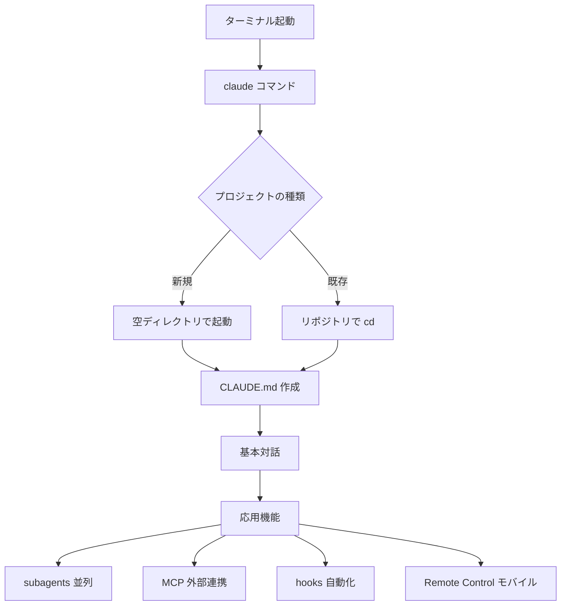
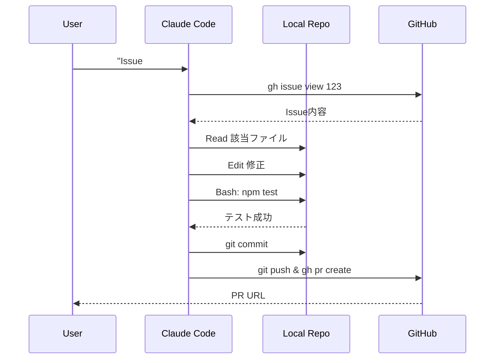
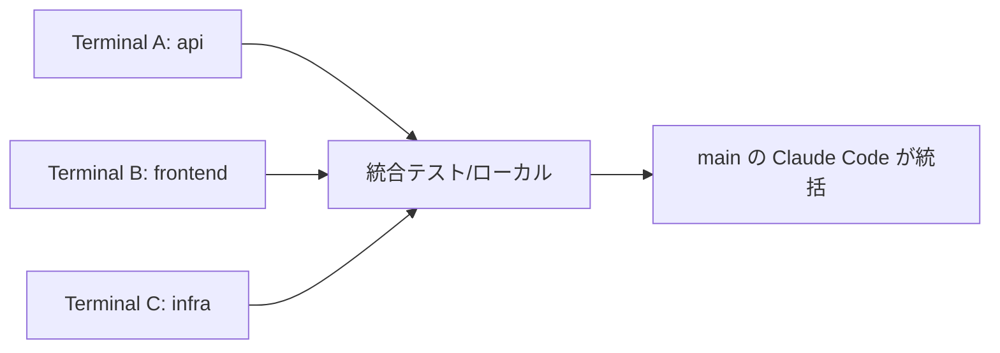
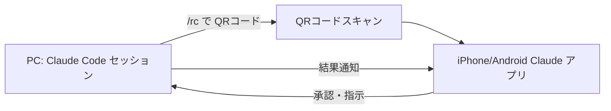
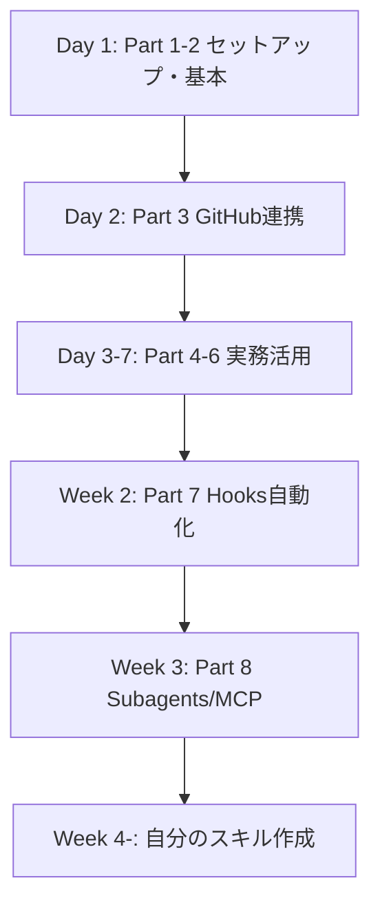

# Claude Code CLI 初心者向け完全マニュアル 2026（Windows対応版）

> 30分で「Web版でできなかった5つのこと」が手に入る実践ガイド — Windows ユーザー向けにターミナル指定を明確化

---

## 🌟 Part 0：はじめに — なぜCLIなのか

### Web版Claude AIではできなかった5つのこと

Web版（claude.ai）は便利ですが、**ローカル開発を本気でやるならCLI一択**です。理由は以下の5つ。

| # | Web版の限界 | CLIで解決する |
|---|-----------|-------------|
| 1 | ローカルファイルを直接編集できない | `Read/Write/Edit` ツールでファイルを直接操作 |
| 2 | 大規模リポジトリの全体を把握できない | プロジェクトディレクトリで起動、CLAUDE.md を読み込み |
| 3 | 並列処理ができない（1セッション1タスク） | **subagents** で複数タスクを同時実行 |
| 4 | 外部ツール（DB・GitHub・Slack）と連携できない | **MCP**（Model Context Protocol）で3,000+のツール接続 |
| 5 | CI/CDに組み込めない | **headless mode**（`--bare`）でスクリプト・GitHub Actions対応 |

### このマニュアルの読み方

- **Part 1-3（必須）**：とりあえず動かす（所要15分）
- **Part 4-7（応用）**：実務で生産性を上げる
- **Part 8-10（玄人）**：CLIの真価を引き出す

> 💡 **公式ドキュメント**：本書の各機能には [code.claude.com/docs](https://code.claude.com/docs/) の該当ページへの直リンクを付けています。最新仕様は必ず公式を確認してください。

### 全体像（Mermaid図）



---
## 🛠 Part 1：セットアップ — 3分でインストール完了

### 🪟 Windows ユーザー必読：どのターミナルを使うか

Windowsには複数のターミナルがあり、**操作によって使うべきターミナルが異なります**。迷わないために、まずこの早見表を確認してください。

| 操作 | 使うターミナル | 理由 |
|------|-------------|------|
| Claude Code のインストール | **PowerShell** | インストールスクリプトが .ps1 形式 |
| npm / winget コマンド | **PowerShell** | Windows標準パッケージ管理 |
| gh CLI のインストール | **PowerShell** | winget 経由 |
| git clone / commit / push | **Git Bash** | Unix系コマンドが安定動作 |
| Claude Code の起動 (`claude`) | **PowerShell** または **Git Bash** | どちらでも可 |
| Claude Code 起動後の日常操作 | **Claude Code 内部ターミナル** | ほぼすべてここで完結 |
| ccstatusline インストール | **PowerShell** | npm グローバルインストール |

**要点**：
- **インストール作業** → PowerShell
- **Git操作** → Git Bash
- **Claude Code 起動後** → Claude Code 内部ターミナル（Bashツール）にほぼ丸投げ
- **コマンドプロンプト（CMD）は原則不要**（パス区切り・Unix命令の非互換が多い）

> 💡 **Windows Terminal（Microsoft Store 無料）** をインストールすると、PowerShell・Git Bash・CMDをタブで切り替えられて便利です。

---

### 推奨インストール方法（Windows版 2026）

**Native Installer（推奨）** が2026年から正式推奨です。Node.js不要です。

#### Step 1：PowerShell でインストール

```powershell
# PowerShell で実行（管理者権限不要）
irm https://claude.ai/install.ps1 | iex
```

インストール後、**PowerShellを再起動**してからバージョン確認します。

#### Step 2：PATH が通っているか確認

```powershell
# PowerShell で実行
claude --version
```

エラーが出る場合は以下で手動確認・追加：

```powershell
# PowerShell でパスを確認
$env:PATH -split ";" | Where-Object { $_ -like "*claude*" -or $_ -like "*Anthropic*" }

# インストール先が表示されない場合：システム環境変数を開く
# [Windows設定] → [システム] → [詳細設定] → [環境変数] → PATH に追加
```

#### npm経由（Node.js 18以上がある場合の代替）

```powershell
# PowerShell で実行
npm install -g @anthropic-ai/claude-code
```

> ⚠️ **やってはいけないこと**：Linuxの `sudo npm install -g` に相当する、管理者権限での強制グローバルインストールは権限・セキュリティ問題を引き起こします。

---

### 前提：Git Bash のインストール（Gitコマンド用）

Git操作には **Git for Windows**（Git Bash 付属）が必要です。

1. [git-scm.com](https://git-scm.com/download/win) からインストーラーをダウンロード
2. インストール（デフォルト設定でOK）
3. スタートメニューから「Git Bash」を起動できることを確認

```bash
# Git Bash で確認
git --version
```

---

### システム要件（Windows）

| 項目 | 要件 |
|-----|------|
| OS | Windows 10 / 11（64bit） |
| ターミナル | PowerShell 5.1以上 ＋ Git Bash（Git for Windows） |
| Node.js | 18以上（npm経由の場合のみ） |
| ネット環境 | 必須（オフライン動作不可） |

### 初回認証

```powershell
# PowerShell または Git Bash で実行
claude
```

初回起動でブラウザが開き、Anthropicアカウントでログインします。**Pro / Max サブスクリプション**または**API Key**が必要です。

| 認証方式 | おすすめ層 | 月額目安 |
|---------|---------|---------|
| Pro サブスク | 個人開発者・学習用途 | $20 |
| Max 5x | 1日中使うエンジニア | $100 |
| Max 20x | パワーユーザー・多Agent並列 | $200 |
| API Key | 法人・従量課金重視 | 使用量 |

### モデル選択

```bash
claude
> /model
# Claude Opus 4.7 / Sonnet 4.6 / Haiku 4.5 などから選択
```

> 💡 **おすすめ**：通常作業は **Sonnet 4.6**、複雑な設計は **Opus 4.7**、軽い処理は **Haiku 4.5** で使い分けるとコスト効率◎。

📚 公式ドキュメント：[Advanced setup](https://code.claude.com/docs/en/setup)

---
## 🎯 Part 2：初回起動と5つの基本コマンド

### 起動の鉄則

### プロジェクトフォルダのネーミング戦略

複数プロジェクトを長期運用するなら、**最初にフォルダ構造を決める**のが鉄則です。

#### 推奨ディレクトリ構造

```
C:\Users\yourname\
└── projects\
    ├── work\          # 仕事・業務系
    │   ├── client-a_website\
    │   └── internal_dashboard\
    ├── personal\      # 個人開発・副業
    │   ├── my-blog\
    │   └── portfolio\
    ├── sandbox\       # 実験・学習・使い捨て
    │   └── claude-test\
    └── oss\           # OSSコントリビューション
        └── some-repo\
```

#### ネーミングルール（4原則）

| 原則 | ルール | 例 |
|------|-------|---|
| **小文字+ハイフン** | スペース・大文字・アンダースコアは避ける | `my-project` ✅ `My Project` ❌ |
| **カテゴリ_名前** | 仕事系は `client名_内容` で整理 | `acme_lp` `acme_api` |
| **短く具体的に** | 役割が一目でわかる名前 | `portfolio` ✅ `project1` ❌ |
| **日付は不要** | Gitがバージョン管理するので不要 | `my-app` ✅ `my-app-2026` ❌ |

#### 初回セットアップ（一度だけ実行）

```powershell
# 【PowerShell で実行】フォルダ構造をまとめて作成
mkdir C:\Users\$env:USERNAME\projects\work
mkdir C:\Users\$env:USERNAME\projects\personal
mkdir C:\Users\$env:USERNAME\projects\sandbox
mkdir C:\Users\$env:USERNAME\projects\oss
```

#### プロジェクト開始の流れ

```powershell
# 新規プロジェクトの場合
mkdir C:\Users\$env:USERNAME\projects\sandbox\claude-test
cd C:\Users\$env:USERNAME\projects\sandbox\claude-test
claude

# 既存リポジトリの場合（Git Bash推奨）
cd ~/projects/work/acme_lp
claude
```

> 💡 **Windows Tips**：パスにスペースが入ると PowerShell でクォートが必要になり面倒。`projects` 直下は必ずスペースなしのフォルダ名にする。

**プロジェクトディレクトリで起動する**ことで、Claude Codeはそのリポジトリ全体を理解できます。Web版にはこの「コンテキスト所属感」がありません。

> 💡 **Windows tips**：Git Bashでは `~` がユーザーホーム（`C:\Users\yourname`）を指します。PowerShellでは `$HOME` が同等。どちらのターミナルで起動しても `claude` コマンドは動きます。

### 必ず覚える5つのスラッシュコマンド

| コマンド | 役割 | 使うタイミング |
|---------|------|-------------|
| `/help` | ヘルプ表示 | 困ったとき |
| `/model` | モデル切替 | コスト・性能調整 |
| `/clear` | 会話履歴クリア | 別タスクに切替時 |
| `/context` | コンテキスト消費を確認 | 長時間セッション |
| `/exit` | 終了 | 作業完了時 |

### 最初の対話例

```
> こんにちは、このリポジトリの構造を教えて
```

Claudeはディレクトリツリーを読み取り、主要ファイルを要約します。**Web版では不可能**な操作（ローカルファイル直接読込）が、これだけで実現します。

### CLAUDE.md ：プロジェクトの「憲法」

リポジトリ直下に `CLAUDE.md` を置くと、Claude Codeは起動時に必ず参照します。

```markdown
# プロジェクト概要
- フレームワーク：Next.js 15
- 言語：TypeScript（strict mode）
- テスト：Vitest
- 必ずpnpmを使う（npmは禁止）

## コーディング規約
- import順：外部→内部→相対
- コンポーネントは関数型のみ
- any型は使わない

## このプロジェクトでやらないこと
- 直接 main にpush
- console.log を残す
```

> 💡 **ベストプラクティス**：CLAUDE.md は「100-150 directive 程度」が限界。長すぎると Claude が無視する重要ルールが出る。**詳細はSkillに分離**するのが2026年の鉄則。

📚 公式ドキュメント：[Best Practices for Claude Code](https://code.claude.com/docs/en/best-practices)

### キーボードショートカット

| キー | 動作 |
|-----|------|
| `Ctrl+C` (1回) | 現在の応答を中断 |
| `Ctrl+C` (2回連続) | セッション終了 |
| `Ctrl+L` | 画面クリア |
| `↑` `↓` | 過去のプロンプト履歴 |
| `Esc` | 入力リセット |

---
## 🐙 Part 3：GitHubリポジトリと連携してプロジェクトを進める

Web版にできない最大の差は「**実際にコードを変更してPRを出すまで完遂できる**」点です。

### Step 1：gh CLI をインストール（前提）

```powershell
# 【PowerShell で実行】winget でインストール（Windows 10/11 標準）
winget install --id GitHub.cli

# インストール後、PowerShell を再起動してから認証
gh auth login
```

> ⚠️ `winget` が使えない場合は [cli.github.com](https://cli.github.com/) からインストーラーをダウンロード。

`gh` がない状態だと、`/pr` や `/fix-pipeline` などの便利コマンドが動きません。

### Step 2：リポジトリでClaude Code起動

```bash
# 【Git Bash で実行】
git clone https://github.com/your-org/your-repo.git
cd your-repo
claude
```

### Step 3：自然言語で操作

```
> このIssueを見てバグ修正してPRを出して： #123
```

Claudeは以下を**自動実行**します：
1. `gh issue view 123` でIssue内容を取得
2. 該当ファイルを `Read` で読み込み
3. `Edit` で修正
4. テスト実行（`Bash` で `npm test`）
5. `git add`・`git commit`・`git push -u origin <branch>`
6. `gh pr create` でPR作成

### GitHub MCP Server の活用

より高度なGitHub操作には **MCP server** を使います。

```bash
# Claude Code 起動中
> /plugin install github
```

これでPRレビュー・Issue管理・Action確認が**すべて対話で**できるようになります。

```
> 直近1週間のPRをレビュー漏れがないかチェック
> 失敗中のCIを自動修正してリトライ
> このPRのコメントすべてに対応して
```

### ワークフロー図



### 危険操作からの保護

`hooks` を使って `git push --force` などの危険操作を**事前にブロック**できます（Part 7で詳述）。

📚 公式ドキュメント：[Common Workflows](https://code.claude.com/docs/en/common-workflows)

---
## 📚 Part 4：複数リポジトリを選択・操作する

3つのマイクロサービスを横断する開発、複数の機能ブランチを同時並行で進める作業——CLIなら可能です。

### 方法1：ターミナルを分けて起動

最もシンプル。複数のターミナルウィンドウ／タブで、それぞれ別ディレクトリでClaudeを起動します。

```bash
# 【Git Bash または PowerShell の別タブで実行】

# Tab A（Git Bash）
cd ~/repos/api && claude

# Tab B（Git Bash）
cd ~/repos/frontend && claude

# Tab C（Git Bash）
cd ~/repos/infra && claude
```

> 💡 **Windows Tips**：**Windows Terminal** を使うと、PowerShell・Git Bash をタブで並べて管理しやすくなります。Microsoft Store から無料インストール可能。

各セッションは**完全に独立**。コンテキストが混ざらないのでクリーンに作業できます。

### 方法2：git worktree で並列セッション（推奨）

同じリポジトリで**複数ブランチを同時に**作業する場合、`git worktree` を使うとClaude Codeが完璧に対応します。

```bash
# Claude Code 起動時に worktree フラグを付ける
claude --worktree

# または
claude -w
```

これで：
- `.claude/worktrees/` 配下に独立した作業ディレクトリが作成される
- 専用ブランチが自動で切られる
- `git stash` 不要、ファイル衝突なし
- ディスクは効率共有（Gitオブジェクトは共有）

### 並列実行の現実的な上限

| 並列数 | 推奨度 | 注意点 |
|-------|-------|--------|
| 1-2 | ◎ | 安定動作 |
| 3-4 | 〇 | 実用的な上限 |
| 5以上 | △ | API rate limit に注意 |
| 10以上 | × | レビュー困難・コスト爆増 |

> 💡 **2-4 並列が黄金比**。あなたが一度に把握できる量に合わせる。

### 終了時の自動クリーンアップ

`--worktree` で開いたセッションを終了すると、Claudeが「ワークツリーを残すか削除するか」を聞いてくれます。
- マージ完了済み → 削除
- 続きをやる → 残す

### 複数リポジトリの統括ワークフロー



**コツ**：1つのClaudeセッションを「司令塔」として、他リポジトリの状態を確認させる運用も可能です。

```
> ../api/src/routes.ts のエンドポイント一覧を読んで、
  この frontend の API呼び出しと整合性をチェックして
```

📚 公式ドキュメント：[Common Workflows](https://code.claude.com/docs/en/common-workflows)

---
## 📱 Part 5：スマートフォンで進捗確認・遠隔操作

2026年2月以降、Claude Code は **Remote Control** 機能でモバイル対応を強化しました。

### 全体像



**できること**：
- PC上の長時間バッチ処理を外出先から監視
- 承認プロンプトに対してスマホから「Yes」だけ送る
- 出張中の急な修正をスマホ完結で対応

### 必要なもの

| 項目 | 要件 |
|-----|------|
| サブスクリプション | **Claude Max**（$100/月以上）必須 |
| Claude Code バージョン | 2.1.52 以降 |
| モバイルアプリ | iOS / Android Claude アプリ（無料） |
| ネットワーク | モバイル・PC両方 |

### セットアップ手順

#### 1. PC側でCLI起動・Remote Control有効化

```bash
cd ~/your-project
claude
> /rc
```

`/rc` を実行すると、ターミナルにQRコードが表示されます。

#### 2. スマホでスキャン

1. App Store / Google Play から **Claude** アプリをインストール
2. PC と同じアカウントでログイン
3. アプリのカメラ機能でQRコードをスキャン

#### 3. 接続完了

スマホから直接プロンプトを送れるようになります。**同じファイル・同じMCP・同じプロジェクトコンテキスト**を共有しています。

### Channels（チャンネル連携）

Claude Code を **Telegram / Discord / iMessage** などの外部チャットに接続できる機能。起動時の `--channels` オプションで有効化します。

```bash
# Telegram チャンネルを使う例（起動時に指定）
claude --channels plugin:telegram@claude-plugins-official
```

外出中、Telegramのチャットでメッセージを送ると、PC上のClaudeが反応します。

```
[Telegram]
You: "build失敗してたらlogをまとめて"
Claude: "ログを確認しました。3箇所のエラーがあります..."
```

> 💡 **使い分け**：Remote Control は「PCのターミナル代わり」、Channels は「自然言語の通知センター」。両方併用が強力。

### 制約・注意点

- **同時接続は1セッションのみ**：複数デバイスから同じClaude Codeへの接続は不可
- **PC側のターミナル維持必須**：closeすると切断
- **10分ネットワーク切断でタイムアウト**：自動再接続するが、長時間オフラインは要注意
- **セキュリティ**：受信ポート開放なし、Anthropic API経由のTLS通信。盗聴・侵入リスクは最小

📚 公式ドキュメント：[Remote Control](https://code.claude.com/docs/en/remote-control)

### 実用ユースケース

| シーン | 使い方 |
|-------|-------|
| 通勤電車内 | レビュー依頼を見て承認だけ送る |
| 出張先 | 緊急対応をスマホ完結で実行 |
| 深夜の長時間処理 | 寝る前に起動、朝スマホで結果確認 |
| 会議中に相談 | デモ・コード参照をスマホで確認 |

---
## 📁 Part 6：デスクトップ上のファイル生成・読込・更新

CLI 最大の価値は「**ローカルファイルを直接読み書きできる**」点。Web版ではコピペが必要だった操作が、自然言語で完結します。

### 4つのコアツール

| ツール | 役割 | 自然言語の例 |
|-------|------|------------|
| **Read** | ファイル読込 | "package.json を見て" |
| **Write** | 新規作成・全上書き | "README.md を作って" |
| **Edit** | 部分修正（差分） | "main.ts の関数 X を Y に変更" |
| **Bash** | 任意コマンド実行 | "全テスト実行" "git status" |

### Read：ファイル読込

```
> src/index.ts と config.yaml を読んで構造を要約して
```

Claude は両方を読み込み、要約を返します。**画像・PDF・Jupyter Notebook**にも対応。

```
> docs/architecture.png を見て、データフローを説明して
```

### Write：新規ファイル作成

```
> tests/auth.test.ts に、認証フローのテストを書いて
```

新規作成だけでなく、**既存ファイルの全上書き**にも使われます。Claudeは事前に既存ファイルを読み込み、内容を確認してから上書きします。

### Edit：部分修正（最も重要）

```
> src/utils.ts の formatDate 関数を、UTC ではなく JST にして
```

Editツールは**正確な文字列置換**を行います。
- 既存コード → 変更後コードの置換
- インデント・空白を厳密に保持
- 同一文字列が複数あると失敗する（要・周辺コンテキスト指定）

> 💡 **Edit が失敗したら**：「もう少し前後の行を含めて再試行」と伝えると Claude が修正します。

### Bash：任意のコマンド実行

```
# 【Claude Code 内部ターミナル（Bashツール）で実行 — 外部ターミナル不要】
> npm install lodash
> 全テスト実行して、失敗があれば修正
> git log の直近5コミットを見せて
```

> 💡 **Windows ユーザー向け補足**：Claude Code 起動後の「Bash」ツールは Git Bash 互換の Unix 環境で動きます。パスは `C:\Users\...` ではなく `/c/Users/...` のUnix形式になります。`ls`, `cat`, `grep` などのUnixコマンドが使えます。

**安全装置**：
- 削除系（`rm`, `git push --force` 等）は警告
- 長時間処理はバックグラウンド実行可能（`run_in_background`）
- タイムアウト設定可能（最大10分）

### 実例：1時間の作業を5分に

**従来（Web版）**：
1. ファイル開く
2. コピー
3. Web版に貼り付け
4. 質問
5. 回答コピー
6. ローカルに貼り戻し
7. テスト実行
8. ...

**CLI**：
```
> このプロジェクトの ESLint エラーをすべて修正、
  テストが通ったら自動コミットして
```

→ 数分で完了。

### 安全に使うための原則

| 原則 | 具体策 |
|-----|--------|
| 重要ファイルはバックアップ | `git stash` or 別ブランチで作業 |
| 大規模変更は plan mode で | `> /plan` で実行前にレビュー |
| 不可逆操作には hooks | 次のPart 7で詳述 |
| 機密情報は CLAUDE.md で除外 | `.env`, `secrets/*` を読まないルール明記 |

### Plan Mode の使い方

```
> /plan このリポジトリのDB接続をPostgresからSupabaseに移行
```

Claudeは**読み取り専用**で計画を立て、Markdownの実行プランを出力します。承認後に初めて実装に入ります。

📚 公式ドキュメント：[Common Workflows](https://code.claude.com/docs/en/common-workflows)

---
## 🧠 Part 7：コンテキスト管理と自動実行

### コンテキスト消費を「常に見える」状態にする

Claude Code はセッション中に**コンテキストウィンドウ**を消費していきます。Sonnet 4.6 の場合 1M トークンですが、無駄遣いすると本題で使えなくなります。

#### 方法1：`/context` コマンドで都度確認

```
> /context
```

セッションの累積消費を表示します。

#### 方法2：StatusLine でリアルタイム表示

**StatusLine** は Claude Code の状態をターミナル下部に常時表示する機能。`context_window.remaining_percentage` を含むJSONを毎ターン受け取れます。

Windowsでは **ccstatusline** を使うのが最も簡単です：

```powershell
# 【PowerShell で実行】
npm install -g ccstatusline
ccstatusline init
```

設定ファイルの場所（Windows）：

```
%USERPROFILE%\.claude\statusline.sh
# 例：C:\Users\yourname\.claude\statusline.sh
```

シェルスクリプトを手書きする場合（Git Bash 環境）：

```bash
# 【Git Bash 用】~/.claude/statusline.sh の例
#!/bin/bash
data=$(cat)
remaining=$(echo "$data" | jq -r '.context_window.remaining_percentage')
echo "Context: ${remaining}%"
```

> ⚠️ PowerShellでは `.sh` スクリプトは動きません。StatusLineのスクリプト手書きは Git Bash か、ccstatusline を使ってください。

> 💡 **Hooks の中で StatusLine だけがコンテキスト残量を取得できる**。`PreToolUse` や `PostToolUse` は知らない。これは公式仕様。

### `/compact` で自動圧縮

長時間セッションで残量が減ったら：

```
> /compact
```

過去のやり取りを要約して圧縮し、コンテキストを空けます。重要情報が消えないよう CLAUDE.md に：

```markdown
## Compaction Rule
- 圧縮時は「変更したファイル一覧」「実行したテストコマンド」を必ず保持
```

### Auto Mode（パーミッションモード切替）

**Auto Mode** は「安全な操作は自動許可、危険な操作は遮断」を分類器で判定する機能です。

```bash
# 起動時にオプションで指定
claude --permission-mode auto

# 対話中は Shift+Tab でモードをサイクル切替
# Normal → Auto → Manual → Normal ...
```

| 操作 | 自動実行 | 確認必須 |
|-----|---------|---------|
| ファイル読込 | ✅ | — |
| 同一ディレクトリ内Edit | ✅ | — |
| `git commit` | ✅ | — |
| `git push --force` | ❌ | ✅ |
| `rm -rf` | ❌ | ✅ |

### Hooks：12種のライフサイクルイベント

Hooksは Claude のライフサイクルに**自動実行される shell コマンド**です。プロンプトと違い「**必ず実行が保証される**」のが特徴。

#### 主要なHooks

| Hook | 発火タイミング | 主な用途 |
|-----|--------------|---------|
| **PreToolUse** | ツール実行**前** | セキュリティチェック・ブロック |
| **PostToolUse** | ツール実行**後** | フォーマット・lint・通知 |
| **PreCompact** | 圧縮前 | 重要情報のバックアップ |
| **PostCompact** | 圧縮後 | コンテキスト復元 |
| **SessionStart** | セッション開始 | 環境準備 |
| **Stop** | 応答終了 | ログ・通知 |

#### 実例1：PostToolUse で自動 Prettier

`.claude/settings.json`：

```json
{
  "hooks": {
    "PostToolUse": [
      {
        "matcher": "Edit|Write",
        "hooks": [
          {
            "type": "command",
            "command": "npx prettier --write \"$FILE_PATH\""
          }
        ]
      }
    ]
  }
}
```

これで Claude が編集したファイルは**必ず**整形されます。

#### 実例2：PreToolUse で危険操作ブロック

```json
{
  "hooks": {
    "PreToolUse": [
      {
        "matcher": "Bash",
        "hooks": [
          {
            "type": "command",
            "command": "echo \"$COMMAND\" | grep -qE '(rm -rf|--force)' && exit 2 || exit 0"
          }
        ]
      }
    ]
  }
}
```

`rm -rf` や `--force` を含むコマンドは**実行前に止まる**。

📚 公式ドキュメント：[Hooks reference](https://code.claude.com/docs/en/hooks)

---
## ⚡ Part 8：CLIならではの活用例

ここからは CLI 真骨頂。Web版では絶対に再現できない高度な機能群です。

### 1. Subagents：並列タスク実行

Subagentsは「**独立したコンテキストを持つ別Claude**」を呼び出す機能。

```
> 3つのsubagentに並列調査させて：
  - APIレイヤーの構造
  - データモデル
  - デプロイ設定
```

メインClaudeは**サマリだけ受け取る**ので、コンテキスト消費を抑えながら3倍速で進む。

#### subagent定義（.claude/agents/）

`.claude/agents/security-reviewer.md`：

```markdown
---
description: セキュリティ脆弱性のレビュー専門
tools: Read, Grep, Bash
---

あなたはセキュリティ専門のレビュアーです。
SQLインジェクション・XSS・認証バイパスを重点的にチェック。
```

呼び出し：

```
> security-reviewer に最新のPRをチェックさせて
```

### 2. MCP：3,000+の外部ツール接続

MCPは「Claude を任意の外部システムにつなぐ」プロトコル。

#### よく使うMCPサーバー

| サーバー | 用途 |
|---------|------|
| `github` | PR・Issue管理 |
| `slack` | メッセージ送受信 |
| `postgres` | DB操作（読み取り限定推奨） |
| `puppeteer` | ブラウザ自動化 |
| `sentry` | エラー監視連携 |

#### 追加方法

```bash
# CLIから追加（起動前に実行）
claude mcp add <サーバー名> <コマンド>

# 対話中に確認
> /mcp
```

設定済みのMCPは `/mcp` で確認：

```
> /mcp
# 接続中のサーバー一覧
```

### 3. カスタム Slash Commands

`.claude/commands/` にMarkdownファイルを置くだけで `/` 始まりのコマンドになります。

`.claude/commands/review.md`：

```markdown
---
description: PR レビュー専用ワークフロー
---

このリポジトリのコーディング規約に基づき、
直近のPRを以下の観点でレビューせよ：
1. テストカバレッジ
2. 命名規則
3. パフォーマンス影響
```

呼び出し：

```
> /review
```

#### Skills との違い（2026年版）

| 機能 | 場所 | 呼び出し |
|-----|------|---------|
| **Slash Command** | `.claude/commands/` | 明示的に `/name` |
| **Skill** | `.claude/skills/` | Claudeが自動判断 |

> 💡 **2026年の推奨**：明示呼び出しは Slash Command、自動発火はSkillで使い分ける。

### 4. Headless Mode：CI/CDに組み込む

`--bare` フラグでスクリプト実行が可能。

```bash
# 【Git Bash で実行】ローカルでのバッチ処理例
claude --bare --prompt "READMEを最新化" > result.md
```

```powershell
# 【PowerShell で実行】も同様に動作
claude --bare --prompt "READMEを最新化" | Out-File result.md
```

```yaml
# GitHub Actions（Linux環境）でも動作
- name: Auto-update README
  run: claude --bare --prompt "READMEを最新化" > result.md
```

これで**Claude をシェルの一部品として**扱えます。CI失敗時の自動修正、定期メンテナンスタスクなどに最適。

### 5. /loop：定期実行

```
> /loop 30m /check-pr-status
```

30分ごとに `/check-pr-status` を実行。長時間プロジェクトの「監視員」として使えます。

### 6. /simplify：並列コードレビュー

```
> /simplify
```

複数subagentが**同時に**コードを再利用性・品質・効率性の観点でレビューし、改善提案を統合します。

### 7. /team-onboarding：チーム展開

```
> /team-onboarding
```

このプロジェクトの慣行・MCP設定・スラッシュコマンドを反映した**新メンバー向けガイド**を自動生成。

📚 公式ドキュメント：[Best Practices](https://code.claude.com/docs/en/best-practices)

---

### 活用パターン・チートシート

| やりたいこと | 一発コマンド |
|------------|------------|
| プロジェクト全体把握 | `> このリポジトリの構造を要約` |
| バグ修正サイクル | `> Issue #X を見て修正→PR作成` |
| 大規模リファクタ | `> /plan で設計→subagent並列実装` |
| ドキュメント生成 | `> README/CHANGELOG/DEVELOPMENT.md を作って` |
| テスト自動化 | `> 未テストの関数すべてに単体テスト追加` |
| コードレビュー | `> /simplify` |
| 依存関係更新 | `> 依存をアップデートして破壊的変更の影響をテスト` |

---
## 🔧 Part 9：トラブルシューティング

### Windows でよくあるエラーと対処

| 症状 | 使ったターミナル | 原因 | 対処 |
|-----|--------------|------|------|
| `claude: command not found` | PowerShell / Git Bash | PATHが通っていない | ①PowerShell再起動 ②下記PATH確認手順を実行 |
| `irm`コマンドエラー | PowerShell | PowerShellのバージョンが古い | `$PSVersionTable` で確認、5.1未満なら更新 |
| 認証画面が開かない | 任意 | デフォルトブラウザ未設定 | Windowsの設定→既定のアプリ→ブラウザを設定 |
| `Rate limit exceeded` | 任意 | API制限到達 | 待機 or プラン上位化 |
| `Context window full` | Claude Code内部 | コンテキスト満杯 | `/compact` or `/clear` |
| Edit が失敗する | Claude Code内部 | 文字列が一意でない | 周辺コンテキストを増やして再試行 |
| MCP server接続失敗 | Claude Code内部 | 設定ミス | `claude mcp list` で状態確認 |
| Remote Control切断 | 任意 | 10分以上ネット断 | 再接続、PC側ターミナルを維持 |
| Worktreeが残る | Git Bash | 異常終了 | `git worktree prune` で掃除 |
| `gh: command not found` | PowerShell | gh CLI未インストール | `winget install --id GitHub.cli` |

### Windows での PATH 確認・修正

```powershell
# 【PowerShell で実行】現在のPATHにclaudeがあるか確認
$env:PATH -split ";" | Select-String "claude|Anthropic"

# PATH が通っていない場合：インストール先を確認して手動追加
# 一般的なインストール先：C:\Users\yourname\AppData\Local\AnthropicClaude\bin
[System.Environment]::SetEnvironmentVariable(
  "PATH",
  $env:PATH + ";$env:LOCALAPPDATA\AnthropicClaude\bin",
  "User"
)
# 追加後はPowerShellを再起動
```

### ログの場所（Windows）

```
エクスプローラーで開く場合：
%USERPROFILE%\.claude\logs\
例：C:\Users\yourname\.claude\logs\

PowerShellで開く：
explorer "$env:USERPROFILE\.claude\logs"
```

### バージョン確認・更新

```powershell
# 【PowerShell で実行】現在のバージョン確認
claude --version

# Native Installerなら自動更新（latest/stable channel）
```

> ⚠️ **古いバージョンが原因の問題が多い**。エラーが出たらまずバージョン確認してアップデート。

### サポート問い合わせ

- 公式 GitHub Issues：[anthropics/claude-code](https://github.com/anthropics/claude-code/issues)
- ヘルプセンター：[support.claude.com](https://support.claude.com/)
- ステータスページ：[status.claude.com](https://status.claude.com/)（API障害時）

---
## 📚 Part 10：公式リソースと次のステップ

### 公式ドキュメント直リンク集

| トピック | URL |
|---------|-----|
| トップ | https://code.claude.com/docs/ |
| セットアップ | https://code.claude.com/docs/en/setup |
| 基本ワークフロー | https://code.claude.com/docs/en/common-workflows |
| ベストプラクティス | https://code.claude.com/docs/en/best-practices |
| Hooks リファレンス | https://code.claude.com/docs/en/hooks |
| Remote Control | https://code.claude.com/docs/en/remote-control |
| 更新履歴（What's new） | https://code.claude.com/docs/en/whats-new |
| Changelog | https://code.claude.com/docs/en/changelog |
| VS Code拡張 | https://code.claude.com/docs/en/vs-code |

### コミュニティ・キュレーションリポジトリ

- [hesreallyhim/awesome-claude-code](https://github.com/hesreallyhim/awesome-claude-code) — Skills/Hooks/Plugins/Commandsの総合カタログ
- [ccplugins/awesome-claude-code-plugins](https://github.com/ccplugins/awesome-claude-code-plugins) — プラグイン集
- [qdhenry/Claude-Command-Suite](https://github.com/qdhenry/Claude-Command-Suite) — 216+のスラッシュコマンド集
- [sirmalloc/ccstatusline](https://github.com/sirmalloc/ccstatusline) — 美しい StatusLine
- [disler/claude-code-hooks-mastery](https://github.com/disler/claude-code-hooks-mastery) — Hooks学習用

### 学習ロードマップ



### 次に学ぶべきこと

1. **CLAUDE.md と Skill の使い分け** — プロジェクト規約の一元管理
2. **Hooks による品質ガード** — フォーマット・lint・テスト自動化
3. **MCP サーバー自作** — 自社ツール・社内DBへの接続
4. **GitHub Actions 連携** — `--bare` で自動化を CIに組み込む
5. **チーム展開** — `/team-onboarding` で新人オンボーディング

---

## 🎉 最後に

Claude Code CLI は**毎月のように機能追加**されています。本マニュアルの内容も2026年4月時点のもの。最新は必ず公式ドキュメントを確認してください。

**3行サマリ**：
1. ローカル開発の本気はCLI、Web版は補助
2. Hooksで自動化、MCPで外部接続、subagentsで並列、Remote Controlでモバイル
3. CLAUDE.md は短く、Skillに分離する

Web版で「コピペ往復」していた時代から、**CLIで「コードを動かしたまま対話する」時代**へ。あなたの開発がもう一段階加速しますように。

---

**マニュアル生成モデル：** claude-sonnet-4-6
**初版生成日：** 2026-04-23
**Windows対応版更新日：** 2026-04-28
**コマンド精度修正：** 2026-04-28（/plugin install・--permission-mode・--channels 構文修正）
**対象バージョン：** Claude Code 2.1.114 以降
**対象OS：** Windows 10/11（PowerShell + Git Bash 環境）
