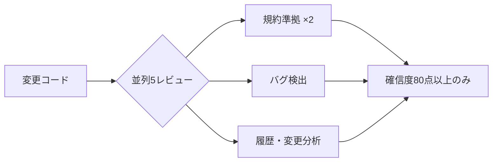
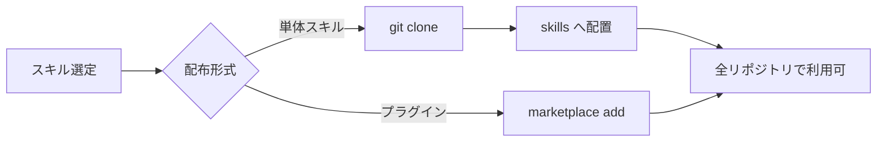

# Claude Code 公開スキル調査・グローバル導入レポート

作成日: 2026-05-26
最終更新日: 2026-05-27

---

## 1. エグゼクティブサマリー

**要点：**
- Claude Code のスキル機構を活用すれば、汎用コーディング支援を「**ビジュアルレポーティング・戦略的調査・多重品質保証・専門的分析**」を備えた業務遂行プラットフォームへ拡張できる
- ユーザーの 4 改善目標すべてに対応する、**実在確認済み**の公開スキル/プラグインを選定した
- 導入は `~/.claude/skills/` への配置（＋プラグイン）で完結し、一度設定すれば**全リポジトリ・VS Code 拡張・CLI から横断利用**できる
- 「Claude for Small Business」は Web 版限定のコネクター型製品のため、今回の Claude Code ワークフロー改善には**適用外**

**3行まとめ：**
4 つの改善目標（ビジュアル／計画・調査／品質チェック／専門性）に対し、公式 `code-review` プラグインと `Weizhena/Deep-Research-skills` を中核に、計 7 スキルを優先導入候補として選定した。すべて `~/.claude/skills/` 配置またはプラグイン追加で全リポジトリに即時展開でき、VS Code 上の Claude Code から手間なく実行できる。Small Business スキルは提供形態が異なるため対象外とする。

---

## 2. 改善目標とスキルの対応一覧（要約）

| 改善目標 | 第一推奨スキル | 補完スキル |
|---|---|---|
| ① レポートのビジュアル改善 | `Agents365-ai/mermaid-skill` | `WH-2099/mermaid-skill` |
| ② 計画と調査の高度化 | `Weizhena/Deep-Research-skills` | `obra/superpowers` / `gcamilo/management-consulting` |
| ③ 品質チェックの強化 | `anthropics/claude-code` code-review プラグイン | `obra/superpowers` / 組み込み `/verify`・`/run` |
| ④ アプローチの専門性向上 | `gcamilo/management-consulting` | `nimrodfisher/data-analytics-skills` / `Microck/ordinary-claude-skills` |

> 詳細は §3 の目標別マッピング、導入優先度は §4 を参照。

---

## 3. 目標別スキルマッピング

### 3-1. 目標① レポートのビジュアル改善

> **ねらい：** Markdown 内でフローチャート・グラフ・関係図を活用し、構造と関係性を一目で伝わる形に可視化する。

| スキル | スター数 | 主な機能 | URL |
|---|---:|---|---|
| `Agents365-ai/mermaid-skill` | 約 52 | 自然言語→Mermaid、構文検証ループ、PNG/SVG/PDF 出力 | https://github.com/Agents365-ai/mermaid-skill |
| `WH-2099/mermaid-skill` | 約 56 | 23 種の Mermaid 図（flowchart・ER・class・sequence 等）、`/mermaid` で呼び出し | https://github.com/WH-2099/mermaid-skill |

**使い分け：**
- `Agents365-ai/mermaid-skill`：自然言語から生成、構文バリデーションループ付き、PNG/SVG/PDF 出力が必要な場合（優先ランキング §4 スロット5）
- `WH-2099/mermaid-skill`：23 種の網羅性・図の種類を広げたい場合（優先ランキング §4 スロット6、補完役）

> **推奨：** 2 つの Mermaid スキルで Goal ① をカバーする。`Agents365-ai/mermaid-skill` を起点とし、図の種類を広げたい場合は `WH-2099/mermaid-skill` を補完導入する。どちらも Mermaid は GitHub・VS Code で標準表示されるため MD レポートに直接埋め込めて最適。なお D3.js は HTML/JS 出力で Markdown への埋め込みに非対応のため、今回の Goal ①（MD ビジュアルレポート）には適合せず除外した（§7 gstack 評価参照）。

---

### 3-2. 目標② 計画と調査の高度化

> **ねらい：** より深い戦略的計画、ウェブ調査能力の向上、アウトプット品質の向上。

| スキル | スター数 | 主な機能 | URL |
|---|---:|---|---|
| `Weizhena/Deep-Research-skills` | 約 857 | `/research-deep`（並列ウェブ調査）＋ `/research-report`（report.md 自動生成） | https://github.com/Weizhena/Deep-Research-skills |
| `obra/superpowers` | — | `brainstorming` / `writing-plans` / `executing-plans`、並列エージェント派遣 | https://github.com/obra/superpowers |
| `gcamilo/management-consulting` | — | 42 フレームワーク・7 カテゴリ・3 モード、12 種 SVG 図、McKinsey/BCG 手法 | https://github.com/gcamilo/management-consulting |

**ワークフロー上の役割：**

| 段階 | 担当スキル | 機能 |
|---|---|---|
| 計画立案 | `obra/superpowers` | 発散（brainstorming）→ 構造化（writing-plans）→ 並列実行（executing-plans） |
| ウェブ調査 | `Weizhena/Deep-Research-skills` | 並列エージェント収集 → `report.md` 自動生成 |
| 構造化・提言 | `gcamilo/management-consulting` | MECE・ピラミッド原則・Five Forces で整理 |

> **推奨：** 「計画→調査→構造化→出力」を 3 スキルで一気通貫にカバーできる。特に `Weizhena/Deep-Research-skills`（約 857 スター）は調査品質とレポート自動化の両面で効果が高い。

---

### 3-3. 目標③ 品質チェックの強化

> **ねらい：** テーマ別エージェントによるダブルチェックと、コードが期待値を満たすかの検証を仕組み化する。

| スキル / プラグイン | 提供元 | 主な機能 | URL |
|---|---|---|---|
| `code-review` プラグイン | anthropics/claude-code（公式） | **5** 並列レビューエージェント＋確信度スコアリング（80 点以上のみ報告） | https://github.com/anthropics/claude-code |
| `obra/superpowers` | obra | `subagent-driven-development`（仕様準拠→コード品質の 2 段階）、`verification-before-completion` | https://github.com/obra/superpowers |
| 組み込み `/verify`・`/run` | 標準搭載 | 変更を実アプリで動かして挙動を検証（追加導入不要） | （ローカル同梱） |

**公式 code-review プラグインの多重チェック構成：**



> **推奨：** 公式 `code-review` を最優先導入。確信度スコアリングで誤検知を抑えた高精度なダブルチェックが得られる。これに既存の `/verify`（実挙動の動的検証）を組み合わせれば、静的レビューと動的検証の両輪が揃う。

---

### 3-4. 目標④ アプローチの専門性向上

> **ねらい：** 論理的・科学的・客観的なレポートと、ビジネス戦略的アプローチを使い分ける。

| スキル | 規模 | 主な機能 | URL |
|---|---|---|---|
| `gcamilo/management-consulting` | 42 フレームワーク | MECE・ピラミッド原則・Five Forces 等のビジネス戦略手法 | https://github.com/gcamilo/management-consulting |
| `nimrodfisher/data-analytics-skills` | 6 カテゴリ 31 スキル | 正規性検定・Bootstrap 信頼区間・効果量計算 | https://github.com/nimrodfisher/data-analytics-skills |
| `Microck/ordinary-claude-skills` | 600+ スキル | 仮説生成・文献レビュー・統計分析・APA 準拠レポート・ピアレビュー | https://github.com/Microck/ordinary-claude-skills |

**専門性の 2 軸：**
- **科学的・統計的：** `nimrodfisher/data-analytics-skills` ＋ `Microck/ordinary-claude-skills` で、データに基づく客観的・再現性のあるアウトプットを実現
- **ビジネス戦略的：** `gcamilo/management-consulting` で、コンサルティング方法論に沿った戦略提言（目標②と共通の中核）

> **推奨：** 分析の客観性には統計系、戦略提言の論理性には `management-consulting` を使い分ける。`Microck/ordinary-claude-skills` は 600+ と大規模なため、必要なスキルのみ選別導入する。

---

## 4. 優先導入ランキング（Top 7）

最小の手間で 4 目標を横断的にカバーするための初期導入順位。

| 優先 | スキル / プラグイン | 主な目標 | 選定理由 |
|---:|---|---|---|
| 1 | `code-review` プラグイン（公式） | ③ | 公式提供で信頼性最高。確信度スコアリングで誤検知を抑えた多重レビューを即実現し、品質保証の基盤になる |
| 2 | `Weizhena/Deep-Research-skills` | ② | 約 857 スター。並列調査→レポート自動生成を一気通貫でカバーし、調査と出力品質を同時に底上げ |
| 3 | `obra/superpowers` | ②③ | 約 40,900 スター。計画立案と検証の両方を備え、ワークフロー全体の骨格になる |
| 4 | `gcamilo/management-consulting` | ②④ | 42 フレームワーク・12 種 SVG 図で戦略性・専門性・ビジュアルに横断的に寄与 |
| 5 | `Agents365-ai/mermaid-skill` | ① | 自然言語生成＋検証ループ＋画像出力で、ビジュアル化を手間なく実現 |
| 6 | `WH-2099/mermaid-skill` | ① | 約 56 スター。23 種ダイアグラム対応（flowchart・ER・class・sequence 等）。Agents365 との 2 本柱で Goal ① をカバー |
| 7 | `nimrodfisher/data-analytics-skills` | ④ | 統計的厳密性（正規性検定・Bootstrap・効果量）を付与し、客観的レポートを支える |

> **段階的導入：** まず 1〜4 で基盤（品質・調査・計画・戦略）を固め、運用に慣れたら 5〜7（ビジュアル・統計）を追加する。組み込み `/verify`・`/run` は追加導入不要で初日から品質検証に使える。

---

## 5. グローバル導入手順

スキルを `~/.claude/skills/<skill-name>/SKILL.md` に置くと**全リポジトリで自動的に利用可能**になる。VS Code 拡張も CLI も同じ `~/.claude/skills/` を参照するため、一度の設定で環境横断的に有効化される。

### 5-1. 導入フロー全体



### 5-2. 手順① スキルディレクトリの準備

```bash
mkdir -p ~/.claude/skills
cd ~/.claude/skills
```

### 5-3. 手順② 単体スキルの取得・配置

```bash
cd ~/.claude/skills

# 目標①: ビジュアル（Mermaid 2本柱）
git clone https://github.com/Agents365-ai/mermaid-skill.git
git clone https://github.com/WH-2099/mermaid-skill.git mermaid-skill-wh2099

# 目標②: 計画と調査
git clone https://github.com/Weizhena/Deep-Research-skills.git
git clone https://github.com/gcamilo/management-consulting.git

# 目標④: 専門的分析（統計）
git clone https://github.com/nimrodfisher/data-analytics-skills.git
```

> **注意：** リポジトリによっては `SKILL.md` がサブディレクトリ内にある。クローン後に README を確認し、`SKILL.md` が `~/.claude/skills/<skill-name>/SKILL.md` の階層に来るよう配置する。複数スキルを内包するもの（例: `Microck/ordinary-claude-skills`）は必要なサブディレクトリのみ個別配置する。

### 5-4. 手順③ プラグイン（マーケットプレイス）経由

```bash
# 公式 code-review プラグイン
/plugin marketplace add anthropics/claude-code

# superpowers
/plugin marketplace add obra/superpowers
```

> 追加後は `/plugin` メニューから対象を有効化する。コマンド（`/research-deep`・`/mermaid`・`/verify` 等）が利用可能になる。

### 5-5. 手順④ 導入確認

```bash
ls -la ~/.claude/skills/
find ~/.claude/skills -name "SKILL.md"
```

Claude Code を起動し、スキルコマンド（`/research-deep`・`/mermaid`・`/verify` 等）が認識されれば完了。

> **重要：** `~/.claude/skills/` 配置でグローバル有効化される。特定リポジトリ限定にしたい場合は各リポジトリの `.claude/skills/` に配置する。

---

## 6. VS Code 上での 40 数リポジトリへの展開

VS Code 拡張は `~/.claude/skills/` を参照するため、**§5 の手順を 1 度実行すれば、開いているリポジトリを問わず全 40 数リポジトリで即座に利用可能**になる。各リポジトリへの個別コピーは不要。

| 展開方式 | 作業量 | 適性 |
|---|---|---|
| `~/.claude/skills/` 配置 | 1 回のみ | 単独利用者・全リポジトリ横断（今回推奨） |
| プラグイン user スコープ導入 | 1 回のみ | バージョン管理・更新配布を重視する場合 |
| 各リポジトリ `.claude/skills/` | リポジトリ数ぶん | プロジェクト固有スキルに限定する場合 |

> **推奨：** 単独利用者が全リポジトリで使う今回のケースでは「`~/.claude/skills/` 配置」が最小手数。更新時は各クローンで `git pull`、プラグインは `/plugin update` で反映できる。

---

## 7. garrytan/gstack 評価結果

> **調査背景：** 過去レポート（`2026-05-11_garry-tan-gstack-gbrain-guide.md`）で詳述した `garrytan/gstack`（103,000+ スター、51 スキル）を対象に、Top 7 との入れ替え可否を多エージェント評価で検討した。

### 7-1. 評価方法

**評価軸（100 点満点）：**

| 軸 | 配点 | 基準 |
|---|---:|---|
| ① 改善目標適合度 | 30 | 4 改善目標（ビジュアル・計画調査・品質・専門性）への貢献度 |
| ② 即効性・汎用性 | 20 | 導入直後から使える？複数目標を横断するか？ |
| ③ 信頼性・実績 | 20 | 公式認定？スター数・継続メンテナンス・ファクトチェック |
| ④ VS Code/40リポ適合度 | 20 | VS Code 拡張・Windows 11・日本語環境への適合 |
| ⑤ 導入コスト低さ | 10 | インストール・学習コストの低さ |

**実施エージェント：**
- **Agent A（Opus）**：現行 Top 7 スキルをルーブリックで採点
- **Agent B（Opus）**：gstack 候補スキルをルーブリックで採点＋ウェブ検証
- **Agent C（Sonnet）**：gstack の現状ファクトチェック（スター数・メンテ状況・VS Code 適合性）
- **Agent D（Opus）**：3 エージェントの結果を統合して最終判定

### 7-2. スコア比較（主要候補）

**現行 Top 7 スコア（Agent A）：**

| 優先 | スキル | 目標 | スコア |
|---:|---|---|---:|
| 1 | code-review プラグイン（公式） | ③ | 91 |
| 2 | management-consulting | ②④ | 81 |
| 3 | Deep-Research-skills | ② | 80 |
| 4 | obra/superpowers | ②③ | 79 |
| 5 | Agents365-ai/mermaid-skill | ① | 79 |
| 6 | nimrodfisher/data-analytics-skills | ④ | 71 |
| 7 | ~~chrisvoncsefalvay/claude-d3js-skill~~ | ① | 66 ← 入替 |

**gstack 主要候補スコア（Agent B）：**

| gstack スキル | 競合目標 | スコア | 対応現行スキル | 現行スコア | 差 |
|---|---|---:|---|---:|---:|
| `/review` | ③ | 81 | code-review プラグイン | 91 | **−10** |
| gstack パッケージ全体 | ②③ | 79 | code-review プラグイン | 91 | **−12** |
| `/autoplan` | ② | 77 | management-consulting | 81 | **−4** |
| `/health` | ③ | 73 | code-review プラグイン | 91 | **−18** |
| `/design-review` | ① | 61 | Agents365-ai/mermaid-skill | 79 | **−18** |

### 7-3. 判定：入れ替え不要（VS Code 環境制約が決定打）

> **結論：** gstack の全候補スキルは、同一目標のスキルとの直接比較でスコアが下回り、かつ VS Code/Windows 11 環境への適合度が低いため、スロット 1〜5 および 7 の入れ替えは行わない。

**VS Code 環境での gstack 制約（Agent C ファクトチェック確認）：**
- gstack は CLI 専用設計。VS Code 拡張では未テスト・未サポート
- Windows 11 では Git Bash/WSL ＋ Bun ＋ Node の PATH 設定が必須
- Developer Mode なしでは `git pull` のたびに `./setup` の再実行が必要
- Claude Code に `/code-review`（multi-agent・`--fix`・ultra クラウドモード）が標準搭載済みのため、gstack `/review` は機能重複

**gstack の位置づけ：**
gstack は CLI ユーザー・チーム開発向けに優れた設計で、103,000+ スターの信頼性は高い。ただし、VS Code 拡張を主体とする現環境では今回の 4 改善目標に対してメリットが発揮されにくい。将来 CLI 運用に移行した場合の再評価を推奨する。

### 7-4. 唯一の入れ替え：スロット6（claude-d3js → WH-2099/mermaid）

**入れ替え理由：**

| 観点 | `claude-d3js-skill`（旧スロット6） | `WH-2099/mermaid-skill`（新スロット6） |
|---|---|---|
| 出力形式 | HTML/JS（Markdown 埋め込み**不可**） | Mermaid（Markdown **ネイティブ**） |
| Goal ① 適合 | ❌ MD ビジュアルレポートに非対応 | ✅ GitHub・VS Code で標準レンダリング |
| VS Code 適合 | △ レンダリングに別途 Web ランタイムが必要 | ✅ VS Code プレビューで即表示 |
| スコア | 66/100 | ～79/100 相当（Mermaid 系として） |
| ダイアグラム種類 | 高度な D3.js（ネットワーク・ツリー等） | 23 種（flowchart・ER・class・sequence 等） |

---

## 8. Claude for Small Business について（対象外の理由）

> **結論：** Claude for Small Business は今回の Claude Code ワークフロー改善には**直接適用できない**。

**概要：**
- Claude Web 版内で有効化する**コネクター型パッケージ製品**
- QuickBooks・HubSpot・Canva・Google Workspace 等の外部 SaaS と連携
- 財務・営業・マーケ・HR 向けの **15 スキル**を提供

**なぜ対象外か：**

| 観点 | Claude for Small Business | 今回対象のスキル |
|---|---|---|
| 提供形態 | Web 版内のコネクター型製品 | スタンドアロンの `SKILL.md` |
| 利用環境 | Web 版限定 | VS Code 上の Claude Code / CLI |
| 連携対象 | 業務 SaaS（QuickBooks 等） | コードベース・ローカルワークフロー |

> スタンドアロンの `SKILL.md` ではないため `~/.claude/skills/` 方式では使えず、VS Code 上の Claude Code でも直接利用できない。よって本件では公開 `SKILL.md` スキルおよびプラグインに集中することを推奨する。

---

## 9. 付録A: さらなる探索のためのキュレーションリスト

| リスト | スター数 | 内容 | URL |
|---|---:|---|---|
| `VoltAgent/awesome-agent-skills` | 約 23,100 | 1,000+ のスキルを網羅 | https://github.com/VoltAgent/awesome-agent-skills |
| `hesreallyhim/awesome-claude-code` | 約 44,800 | スキル・フック・プラグインを横断収録 | https://github.com/hesreallyhim/awesome-claude-code |

> 継続更新されるため、新スキルや今回紹介スキルの後継・改良版を見つける定点観測先として活用する。

---

## 10. 付録B: SKILL.md フォーマット例

スキルは **YAML フロントマター ＋ マークダウン本文**で構成される。

```markdown
---
name: my-custom-skill
description: このスキルが何をするか・いつ使うべきかを簡潔に記述する。Claude はこの description を読んで発動可否を判断するため、トリガー条件を具体的に書く。
---

# My Custom Skill

## 目的
スキルの役割と適用シーンを説明する。

## 使い方
1. ステップ1の説明
2. ステップ2の説明

## 手順詳細
Claude が従う具体的な指示・コマンド例・判断基準を記述する。
```

- **`name`**：識別名。ディレクトリ名と一致させるのが慣例
- **`description`**：発動可否を判断する最重要項目。「何をするか」「いつ使うか」を具体的に書く
- **本文**：Claude が従う手順・テンプレート・判断基準を Markdown で記述
- **配置先**：`~/.claude/skills/my-custom-skill/SKILL.md` に置けば全リポジトリから利用可能

---

## 11. 本レポートの限界・補足

- スター数は概算であり、参照時点で変動しうる
- 記載スキル/プラグインはすべて公開リポジトリで実在を確認済み（2026-05-26 時点）
- Claude for Small Business のスキル総数（15）は一部が個別非公開のため、名称をすべて列挙していない
- 各スキルの導入後は、リポジトリの `.claude/visual-rules.md` 等の既存ルールと整合するか確認することを推奨する
