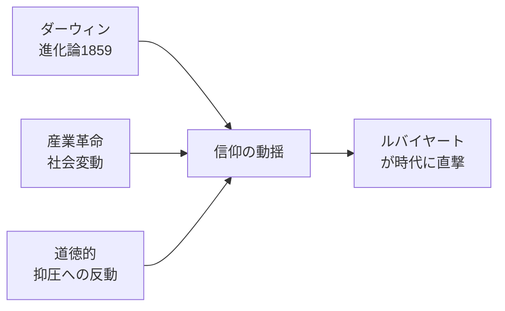

# ウマル・ハイヤーム：詩人・数学者・哲学者の全貌
### 11世紀ペルシャが生んだ「不可能な人物」

---

## エグゼクティブサマリー

ウマル・ハイヤーム（1048–1131）はセルジューク朝のペルシャで活躍した詩人・数学者・天文学者であり、3次方程式の幾何学的解法とジャラーリー暦という不朽の科学的業績を残した。同時に、神への懐疑と刹那主義を詠んだ四行詩集『ルバイヤート』は、1859年のエドワード・フィッツジェラルドによる英訳を経て西洋世界に衝撃を与え、ヴィクトリア朝の「信仰の危機」を体現する文学的象徴となった。科学と詩、信仰と懐疑という矛盾を一身に体現した人物として、約1000年後の現在も世界的な影響力を持ち続けている。

**最重要ファインディング Top 3**：
1. ジャラーリー暦の精度はグレゴリオ暦を上回る——11世紀にこれほどの天文観測精度が達成されていた
2. フィッツジェラルド訳は「翻訳」ではなく「詩的再創造」であり、ダーウィン『種の起源』と同年（1859年）出版されたことが西洋での受容に決定的な役割を果たした
3. ルバイヤートの著者性には学術的論争があり、現存する詩の多くは後世の付加の可能性がある（en.Wikipedia, Stanford Encyclopedia of Philosophy）

---

## 1. 生涯と時代背景

### 1.1 生い立ち（1048年〜）

ウマル・ハイヤーム（Ghiyāṯ ud-Dīn Abu'l-Fatḥ ʿUmar ibn Ibrāhīm Khayyām Nīshāpūrī）は**1048年5月18日**、ホラーサーン地方の**ニーシャープール**（現イラン・ラザヴィー・ホラーサーン州）に生まれた。「ハイヤーム」はアラビア語で「天幕造り」を意味し、父親の職業に由来する（出典: [Wikipedia日本語版](https://ja.wikipedia.org/wiki/%E3%82%A6%E3%83%9E%E3%83%AB%E3%83%BB%E3%83%8F%E3%82%A4%E3%83%A4%E3%83%BC%E3%83%A0) ／ 確認: 2026-05-30）。

幼少期からニーシャープールで修学し、後にイスラーム世界最高の知識人の一人とされるイマーム・ムワッファクのもとで学んだ。この師門には、のちに宰相となるニザーム・アルムルクや過激派イスラームの先駆・ハサン・サッバーフも在籍したと伝わるが、3人が「同期生」だったとする逸話の史実性には留保が必要である。

### 1.2 セルジューク朝という時代的文脈

ハイヤームが生きた11〜12世紀は、テュルク系セルジューク朝（1038–1194）がイラン・イラク・シリアを支配した黄金期にあたる。スルタン・マリク・シャーの時代（1072–1092年）には宮廷でペルシャ語が公用語として用いられ、ニザーム・アルムルク宰相のもとで学術・文化が空前の繁栄を遂げた（出典: [コトバンク「セルジューク朝」](https://kotobank.jp/word/%E3%81%9B%E3%82%8B%E3%81%98%E3%82%86%E3%83%BC%E3%81%8F%E6%9C%9D-3157284) ／ 確認: 2026-05-30）。

同時代は**神学的緊張の時代**でもあった。スンナ派正統神学が強まる中、哲学者・科学者は「異端」の嫌疑と隣り合わせで研究を続けた。ハイヤームはこの困難な知的環境で、公的には王権に仕える科学者として振る舞いながら、私的には詩の中で神への懐疑を詠い続けた。

### 1.3 宮廷科学者として（1073–1092年）

1073年、マリク・シャーの招聘を受けてイスファハーンの天文台責任者に就任。以後約18年間、暦改革と天文観測に従事し、**ジャラーリー暦**を1079年に完成させた。この時期が科学者としての絶頂期にあたる。

庇護者マリク・シャーの死（1092年）を機に宮廷での立場が変化し、その後は故郷ニーシャープールに戻って哲学・医学・詩の著作に専念したとされる。

### 1.4 晩年と死（1092–1131年）

晩年、宗教的保守派から「異端的詩句」を理由に批判を受けたとの証言がある。メッカへの巡礼を行い正統イスラームへの帰依を示したと伝えられるが、それが弾圧回避の戦略か真の信仰心によるものかは判然としない。**1131年12月4日**、ニーシャープールにて没。享年83歳。

---

## 2. 詩集ルバイヤートの世界

### 2.1 詩形と著者性

「ルバイヤート」（Rubāʿiyyāt）はアラビア語・ペルシャ語の詩形「ルバーイー」の複数形で、AABA韻律の4行詩を指す。各詩は独立した思索の断章であり、一貫したストーリーを持たない。

ハイヤームに帰属する詩の数は資料により大きく異なり、100首から数千首まで諸説ある。英語版Wikipediaおよびスタンフォード哲学百科事典は「著者性について学術的議論がある」と明記しており、後世に多数の詩が付加・誤帰属された可能性が高い（出典: [Omar Khayyam - Stanford Encyclopedia of Philosophy](https://plato.stanford.edu/entries/umar-khayyam/) ／ 確認: 2026-05-30）。

### 2.2 主要テーマ

#### ① カルペ・ディエム（今を生きよ）

> *「一壺の酒、一本のパン、詩集一冊——荒れ野の片隅に君と二人。君が傍にいれば、スルタンの王国も羨まない」*

死の不可避性を見据えたうえで、酒・恋・詩・自然という今この瞬間の喜びを最大限に味わえ、という実存的主張。エピクロスの「快楽こそ最高善」に通ずる思想として西洋研究者から再評価されている（出典: [Epicurean Friends](https://www.epicureanfriends.com/thread/459-the-dark-epicureanism-in-the-rubaiyat-of-omar-khayyam/) ／ 確認: 2026-05-30）。

#### ② 神への懐疑と宿命論

> *「世界の謎を解こうとした者は多い。だが帰ってきた者はいない」*

> *「陶工が粘土を好きに形作るように、神は我々を形作った——にもかかわらず来世の報いを語る」*

神の存在そのものを否定するのではなく、宗教的報償・懲罰の体系、神の「正義」に対する懐疑を表明する。スタンフォード哲学百科事典は彼を**「東洋のヴォルテール」**と評している。

#### ③ 虚無と無常

> *「王も乞食も、どちらも同じ土に帰る」*

権力・富・名声の虚しさを繰り返し詠み、死という平等を描く。

### 2.3 酒の解釈論争

ルバイヤートに頻出する「酒（wine）」の意味については大きく2説に分かれる：

| 解釈 | 主張 | 支持者 |
|---|---|---|
| **字義通り（享楽主義）** | 酒・快楽・今を享受することの肯定 | フィッツジェラルド、西洋文学研究者 |
| **スーフィー的象徴** | 酒＝神秘的恍惚、酒場＝霊的集会、恋人＝神 | イスラム神秘主義研究者 |

フィッツジェラルド自身は「酒をスーフィー的に解釈すべきではない」と明言した。現代の学術的合意は「両義的読みが可能」というものが多い（出典: [Medium - East Berry](https://medium.com/the-east-berry/the-timeless-classic-of-omar-khayyams-rubaiyat-on-an-everlasting-relationship-between-wine-and-god-ce25243fc833) ／ 確認: 2026-05-30）。

---

## 3. 数学・天文学の業績

### 3.1 三次方程式の体系的解法

ハイヤームは著書『代数学問題の解法研究』において、**三次方程式を体系的に研究した最初の数学者**として数学史に記録されている。当時、代数的（数式による）解法は存在しなかったため、**円錐曲線（放物線と円）の交点**を求めることで幾何学的に解を得る方法を開発した。

スタンフォード哲学百科事典によれば、三次方程式を**14種類**に分類し各タイプの解法を示したとされる（出典: [Stanford Encyclopedia of Philosophy](https://plato.stanford.edu/entries/umar-khayyam/) ／ 確認: 2026-05-30）。

**歴史的意義**: 代数的解法（カルダーノの公式）が発見されるのは約500年後（1545年）。ハイヤームは「代数的には解けない」と自ら限界を明記しており、その誠実さも後世から高く評価されている。

### 3.2 ユークリッド幾何学への批判と非ユークリッド幾何学の萌芽

平行線公準（第5公準）の証明を試みた際に導入した「ハイヤーム＝サッケーリ四辺形」は、18世紀のジロラモ・サッケーリによる非ユークリッド幾何学研究の先駆となった（出典: [Wikipedia - Omar Khayyam](https://en.wikipedia.org/wiki/Omar_Khayyam) ／ 確認: 2026-05-30）。

### 3.3 ジャラーリー暦（1079年）

| 項目 | 数値・内容 |
|---|---|
| 制定年 | 1079年（マリク・シャー期） |
| 計算された太陽年の長さ | 365.24219858156日 |
| 閏年規則 | 33年に8回 |
| 推定誤差 | 約5,000年に1日 |
| グレゴリオ暦の推定誤差 | 約3,300年に1日 |
| 現代への影響 | イラン現行公式暦（イラン太陽暦）の基礎 |

ジャラーリー暦はグレゴリオ暦を上回る精度を持つとされているが、「5,000年に1日」という数値はソースにより若干の差異があり、現代天文学の定義に依拠した厳密な比較が必要であることに留意が必要である（出典: [数学めも - ウマル・ハイヤーム](https://mathsuke.jp/omar-khayyam/) ／ 確認: 2026-05-30）。

### 3.4 その他の業績

- **二項展開**: パスカルの三角形に相当する計算手法を先取り
- **比率論**: ユークリッドの比率定義を拡張し、有理数・無理数を統一的に扱う枠組みを提示
- **医学・哲学**: 複数の論文を執筆し、当時の博学者（ポリマス）の典型を体現

---

## 4. フィッツジェラルド英訳と西洋への衝撃

### 4.1 翻訳の誕生（1859年）

エドワード・フィッツジェラルド（1809–1883）はペルシャ語を独学で習得し、長年かけてルバイヤートの英訳を完成させた。1859年に匿名で75首の英訳詩を出版。**初版は商業的に失敗**しほとんど売れなかったが、1861年に詩人ホイットリー・ストークスとラファエル前派のダンテ・ゲイブリエル・ロセッティが再発見し絶賛して広めた（出典: [Wikipedia - Rubaiyat of Omar Khayyam](https://en.wikipedia.org/wiki/Rubaiyat_of_Omar_Khayyam) ／ 確認: 2026-05-30）。

**翻訳の特徴**: フィッツジェラルドはペルシャ語原文への忠実な翻訳よりも「自由な詩的再創造」を選択した。散在する独立した四行詩を「夜明けから月の入りまで」という劇的弧線に再配置し、英語圏の読者が没入できる統一的な詩世界を構築した。

### 4.2 ヴィクトリア朝での爆発的流行

1880年代までに、ルバイヤートは英語圏で最も知られた詩集の一つとなった。その背景：

「オマル・ハイヤーム・クラブ」が英国（1892年設立）・米国など各地に設立された。スウィンバーン、ラスキン、テニスン、バートランド・ラッセルらが愛読者として知られる（出典: [Oxford University Press](https://global.oup.com/academic/product/rubiyt-of-omar-khayym-9780199580507) ／ 確認: 2026-05-30）。

### 4.3 フィッツジェラルドの4版と翻訳観

フィッツジェラルドは生涯に4版（1859・1868・1872・1879年）を出版し、版を重ねるごとに首数・訳文を改変し続けた。彼自身は「ハイヤームはシェイクスピアや欽定訳聖書を読んでいるようだ」とも評されるほど英語詩として昇華させた。今日広く読まれるのは主に第1版または死後刊の第5版である。

---

## 5. 現代における評価と遺産

### 5.1 文学的影響

- **詩人への影響**: A.E.ハウスマン、トマス・ハーディ、アーノルド・ベネットらが直接の影響を受けた
- **推理小説**: アガサ・クリスティがルバイヤートから複数の作品タイトルを採用
- **歴史的演説**: マーティン・ルーサー・キング・ジュニアが「The Moving Finger writes」の詩句を引用
- **現代の読者**: 死と喪失を前にした人間の探求という普遍的テーマが、21世紀にも共鳴し続けている

（出典: [World History Encyclopedia](https://www.worldhistory.org/Omar_Khayyam/) ／ 確認: 2026-05-30）

### 5.2 科学的遺産

- イランの現行暦（イラン太陽暦）はジャラーリー暦を直接継承
- 小惑星「**3095 Omarkhyyam**」に名を冠す
- 月面クレーター「**Omar Khayyam**」として命名
- ニーシャープールの墓廟は現在もイランの重要な文化遺産・観光地

（出典: [SurfIran - Omar Khayyam Legacy](https://surfiran.com/mag/omar-khayyam/) ／ 確認: 2026-05-30）

### 5.3 現在も続く論争点

| 論点 | 内容 | 確実性 |
|---|---|---|
| **著者性問題** | 流通する詩の多くは後世付加の可能性あり | 低（研究継続中） |
| **哲学的立場** | 享楽主義 vs スーフィー神秘主義 vs 懐疑論 | 低（両義的） |
| **フィッツジェラルド訳の評価** | 優れた詩的再創造 vs オリエンタリズムによる歪曲 | 中（視点による） |
| **宗教的帰依の真偽** | 晩年の巡礼は信仰か弾圧回避か | 判定不能 |

---

## 結論：矛盾を生きた知性

ウマル・ハイヤームは、**科学的厳密さと詩的奔放さ、信仰と懐疑、王権への服従と精神的自由**という相矛盾する要素を一人で体現した。

- 昼は精密な天文観測と幾何学で宇宙の秩序を測定し、
- 夜は「その秩序を作った神を疑え」と詠んだ。

約1000年前の11世紀にこれほどの科学的精度と哲学的大胆さを持ち合わせた人物が存在したという事実そのものが、人類の知性史における最大の驚きの一つである。スタンフォード哲学百科事典が「東洋のヴォルテール」と呼ぶゆえんがここにある。

> *「永遠の眠りは長い——だから今この杯を干せ」*

---

## 参考文献・ソース一覧（確認済み）

| # | タイトル | URL | 確認日 |
|---|---|---|---|
| 1 | ウマル・ハイヤーム - Wikipedia（日本語） | [リンク](https://ja.wikipedia.org/wiki/%E3%82%A6%E3%83%9E%E3%83%AB%E3%83%BB%E3%83%8F%E3%82%A4%E3%83%A4%E3%83%BC%E3%83%A0) | 2026-05-30 |
| 2 | Omar Khayyam - Stanford Encyclopedia of Philosophy | [リンク](https://plato.stanford.edu/entries/umar-khayyam/) | 2026-05-30 |
| 3 | ウマル・ハイヤーム数学業績 - 数学めも | [リンク](https://mathsuke.jp/omar-khayyam/) | 2026-05-30 |
| 4 | Omar Khayyam - Wikipedia（英語） | [リンク](https://en.wikipedia.org/wiki/Omar_Khayyam) | 2026-05-30 |
| 5 | Rubaiyat of Omar Khayyam - Wikipedia | [リンク](https://en.wikipedia.org/wiki/Rubaiyat_of_Omar_Khayyam) | 2026-05-30 |
| 6 | Epicureanism in the Rubaiyat - Epicurean Friends | [リンク](https://www.epicureanfriends.com/thread/459-the-dark-epicureanism-in-the-rubaiyat-of-omar-khayyam/) | 2026-05-30 |
| 7 | Omar Khayyam - World History Encyclopedia | [リンク](https://www.worldhistory.org/Omar_Khayyam/) | 2026-05-30 |
| 8 | Omar Khayyam Legacy - SurfIran | [リンク](https://surfiran.com/mag/omar-khayyam/) | 2026-05-30 |
| 9 | Rubaiyat - Oxford University Press | [リンク](https://global.oup.com/academic/product/rubiyt-of-omar-khayym-9780199580507) | 2026-05-30 |
