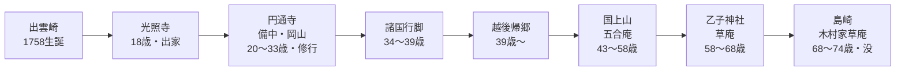

# 良寛：清貧・無欲・遊心で生きた禅僧の全貌
### 「何も持たない」ことで「すべてを持っていた」人

---

## エグゼクティブサマリー

良寛（1758–1831）は越後・出雲崎（現・新潟県）に生まれ、74年の生涯を通じて寺を持たず、弟子も持たず、財産も持たず、それでいて「最も日本人らしい日本人」と評される圧倒的な存在感を放った曹洞宗の禅僧・詩人・書家である。子供たちと手まりをつき、泥棒には布団を与え、藩主の招聘を歌で断った——その言動はすべて「無欲・無我・あるがまま」という一本の軸で貫かれていた。本レポートでは、生涯・哲学・日常・逸話・晩年を多角的に整理し、後半に良寛の生き方を現代に応用するための具体的な実践を提示する。

**最重要ファインディング Top 3**：
1. ⚠️ 良寛は「正直すぎて名主になれなかった」——清廉さとは社会適応の失敗から始まった
2. ⚠️ 生前はほぼ無名。貞心尼が死後に歌集をまとめなければ、現代に名は残っていなかった
3. ⚠️ 「災難は災難のままに受け入れよ」という言葉は、東日本大震災後に改めて注目を集めた

---

## 1. 生涯と行動範囲

### 1.1 出身地と家柄

| 項目 | 内容 |
|---|---|
| 生年 | 宝暦8年（1758年）10月2日 |
| 没年 | 天保2年（1831年）1月6日 ／ 享年74歳 |
| 出身地 | 越後国出雲崎（現・新潟県三島郡出雲崎町） |
| 家柄 | 名主・橘屋（山本家）の長男 |
| 俗名 | 山本栄蔵（のち文孝） |
| 号 | 大愚（たいぐ） |

良寛の生家は代々続く名主であり、父・以南は名主を務めながら俳人でもあった。才気と文学的素養に満ちた家庭環境が、幼少期の良寛の感受性を育てた。

### 1.2 出家の経緯——「正直すぎた」名主見習い

18歳で家督を継ぎ名主見習いになるが、**わずか1ヶ月で職を辞した**。理由は「調停役として嘘や二枚舌を使えなかった」から。純粋すぎる正直さが、世俗の社会と衝突した最初の出来事である（出典: [和樂web](https://intojapanwaraku.com/jpart/1870/) ／ 確認: 2026-06-04）。

その後、隣町の禅寺「光照寺」に出家。さらに20歳で国仙和尚に弟子入りし、岡山県倉敷市の曹洞宗・円通寺へと赴いた。

### 1.3 行動範囲と主な居住地

| 時期 | 場所 | 年齢 |
|---|---|---|
| 修行期 | 備中・円通寺（岡山県倉敷市） | 20〜33歳 |
| 遊行期 | 諸国行脚（四国・中国・九州ほか） | 34〜39歳 |
| 定住期① | 国上山・五合庵（新潟県燕市） | 43〜58歳 |
| 定住期② | 乙子神社草庵（新潟県長岡市付近） | 58〜68歳 |
| 晩年 | 島崎・木村家草庵（新潟県長岡市） | 68〜74歳 |

33歳で師・国仙から「印可（いんか）」——禅修行の証明——を受けた後も、良寛は住職の地位を求めず、諸国をさまよう遊行僧として生き続けた。越後へ戻った後も「寺」を持つことなく、生涯を草庵の中で過ごした（出典: [良寛記念館](http://www.ryokan-kinenkan.jp/study/) ／ 確認: 2026-06-04）。

---

## 2. 哲学・思想の世界

### 2.1 思想の三本柱

良寛の思想は大きく三つの源流を持つ。

| 源流 | 内容 |
|---|---|
| **曹洞禅** | 「ただ坐る（只管打坐）」——特定の目的なく坐禅を行う。自然体こそが仏の姿 |
| **老子・荘子（道家）** | 無為自然・柔弱謙下。水のように形を変え、争わず流れる生き方 |
| **万葉集・古今集** | 日本語の詩的伝統への傾倒。漢詩よりも和歌に「肉声」を込めた |

晩年には、阿弥陀如来の本願に帰依する浄土思想（南無阿弥陀仏）へ傾いたとも伝えられる——禅と浄土という一見対立する思想を、良寛は「どちらも本当のことを指している」と統合的に受け止めた（出典: [true-buddhism.com](https://true-buddhism.com/history/ryokan/) ／ 確認: 2026-06-04）。

### 2.2 「大愚」という号に込められた哲学

良寛は自らを「大愚（たいぐ）」——大いなる愚か者——と名乗った。これは逆説的な自己表現である。

> **「大賢は愚なるに似たり」**（老子）

世間的な「賢さ」（打算・名誉・権力）を手放した者が、真の知恵に近づく——という逆転の論理。良寛は「愚か者」を演じることで、真に自由な存在であろうとした。

### 2.3 核心的な言葉

> **「災難に逢ふ時節には災難に逢ふがよく候。死ぬ時節には死ぬがよく候。是はこれ災難をのがるる妙法にて候」**

地震の被害を受けた友人へ宛てた手紙の一節。「逃げるのではなく、その事態の中に完全に入れ」という禅的受容の思想。東日本大震災後、この言葉は改めて注目を集めた（出典: [長岡ナビ](https://nagaoka-navi.or.jp/feature/ryoukann/top) ／ 確認: 2026-06-04）。

> **「散る桜　残る桜も　散る桜」**（辞世の句）

死を嘆かず、残る命もやがて散る——生と死を同列に置いた透明な無常観。

> **「うらを見せ　おもてを見せて　散る紅葉」**

貞心尼に伝えたとされる最後の言葉。表裏なく、ありのままを見せながら散っていく——究極の誠実さ。

### 2.4 良寛の宗教観——「説教しない」禅僧

良寛は一切の説法・布教をしなかった。弟子も持たなかった（晩年の貞心尼を除く）。代わりに彼が選んだのは「共にいること」「共に遊ぶこと」「詩を詠むこと」だった。

> *「良寛の法話を聞いた者はいないが、良寛に感化された者は無数にいる」*

これは逆説的な伝道——言葉で教えるのではなく、**存在そのもの**が教えとなる生き方である。

---

## 3. 日常生活のカテゴリー別分析

### 3.1【遊び】子供との交流——無邪気さを生涯貫く

良寛は子どもたちと同じ目線で遊ぶことを、修行と同等に重視した。

**常に懐に手まりを携帯**していたことが複数の文献に記録されている。子供が見えると草庵を出て、日が暮れるまで遊び続けた。

**有名な逸話「かくれんぼ」**：
鬼役の子どもが帰った後も、良寛は翌朝まで同じ姿勢で隠れ続けた。見つけた農家の人が「ここに鬼（良寛）がいるよ」と言うと、良寛は「シーッ、まだゲームの途中だ」と答えたとも伝わる。

良寛にとって遊びは「子どもの純真な心こそが仏の心」という確信から来ていた。遊びが修行であり、修行が遊びだった（出典: [honcierge.jp](https://honcierge.jp/articles/shelf_story/4158) ／ 確認: 2026-06-04）。

### 3.2【生活】托鉢と清貧——「五合庵」の暮らし

五合庵は、五合（約900ml）の米しか入らない小さな庵。名前そのものが良寛の質素さを示している。

| 生活要素 | 内容 |
|---|---|
| 食事 | 托鉢で得た米・野菜のみ。戴けなければ飢える |
| 住まい | 雨漏りのする小さな草庵。冬は極寒の越後 |
| 衣服 | 一枚の衣を何年も着続けた |
| 財産 | ほぼゼロ。泥棒が入っても盗めるものがなかった |
| 健康 | 野宿同然の生活で多病。しかし74歳まで生存 |

良寛は「欲しいものが何もない」のではなく、「欲しいという心が薄い」人間だった。これは抑制ではなく、天性の質素さだったと伝えられている。

### 3.3【芸術】詩・書・和歌——三芸の巨人

良寛は**漢詩・和歌・書**の三芸において、江戸時代後期を代表する水準に達していた。

| 分野 | 特徴 |
|---|---|
| **漢詩** | 700首以上を残す。哲学的内容が多く、自然・孤独・無常を詠む |
| **和歌** | 万葉集に傾倒。素朴で飾り気のない言葉で感情を表現 |
| **書** | 独自の「良寛体」と呼ばれるスタイル。柔らかく、力みのない線 |

しかし良寛は「上手い字を書こう」とは一切思わなかったと言われる。**書を求める者には喜んで書き、報酬を求めなかった**。名声を目的としない芸術——これが「良寛体」の本質である。

### 3.4【社会との関わり】権力への距離感

良寛は社会の周縁に自らを置き続けた。

**長岡藩主からの招聘を断る**際、良寛は招待状の余白に次の歌を書いて返した：

> *「たきぎこり　菜をつみ水を　汲みながら　おのが活計（たつき）は　おのがなりけり」*

（薪を拾い、菜を摘み、水を汲みながら生きる——それが私の生き方です）

地位・権力・名誉を求めない姿勢を、説教でも拒絶でもなく、**詩で柔らかく返した**。これが良寛の「社会との距離感」の典型だった。

また、**酒も好んだ**。戒律に反するが、良寛は「戒律よりも、酒を通じて人と交わることのほうが大切だ」と考えた。村人と盃を交わし、笑い、歌う——それが良寛の「布教」だった。

### 3.5【感情】怒らない・説教しない・恨まない

良寛が「怒った」という記録は皆無に近い。叱責・説教もしない。代わりに次のような対応が記録されている。

- 泥棒が来ても「取られたもの」より「残った月」に目を向けた
- 子どもが悪さをしても叱らず、一緒に笑った
- 嫌なことがあっても詩に変えて消化した

これは感情の抑圧ではなく、**怒りが生まれる前に「あるがまま」を受け入れる**構造になっていたと思われる。

---

## 4. 有名な逸話・エピソード集

### 4.1 泥棒と月

ある夜、乙子神社の草庵に泥棒が入った。草庵には盗むものが何もなく、泥棒は寝ている良寛の布団を剥がして去った。良寛は剥がしやすいよう寝返りを打って協力したとも伝わる。翌朝、良寛が詠んだ句：

> **「盗人に　とり残されし　窓の月」**

泥棒はすべて持っていったが、あの月だけは取り忘れた——という余裕と美意識。この話は「怒らない良寛」の象徴として語り継がれている（出典: [honcierge.jp](https://honcierge.jp/articles/shelf_story/4158) ／ 確認: 2026-06-04）。

### 4.2 かくれんぼ・翌朝まで

子供たちとかくれんぼをして、良寛が田んぼの中に隠れた。鬼役の子が見つけられず帰ってしまったが、良寛は翌朝まで同じ場所に隠れ続けた。翌朝、農夫が「良寛さん、こんなところに何してるんですか？」と声をかけると——

> **「シーッ、まだ誰も来ていないんだよ」**

遊びに完全に入り込む純粋さ。これは演技ではなく、子どもと同じ次元で「いま・ここ」に生きていた良寛の本質を示す（出典: [true-buddhism.com](https://true-buddhism.com/history/ryokan/) ／ 確認: 2026-06-04）。

### 4.3 甥への手紙——「説教しない」愛

放蕩を続ける甥・由之を心配した人々が良寛に「注意してほしい」と頼んだ。良寛は訪ねて行き、一泊した後、何も言わずに帰ろうとした。見送りに出た甥の手を握って、良寛はただ涙を流した。甥は「あの涙には勝てなかった」と言い、後に改心したと伝わる。

言葉よりも深い言葉——これが良寛の人間関係の核心だった。

### 4.4 ヒラメになるのを待つ（幼少期の純粋さ）

幼い頃、父から「ヒラメは海岸の砂の中にいる」と聞いた良寛は、砂浜に横たわりヒラメが自分のところへ来るのをじっと待ち続けた。大人たちが笑っても、良寛は大真面目だった。この「文字通りに信じる」純朴さは生涯変わらなかった。

### 4.5 長岡地震への手紙（1828年）

良寛70歳の時、越後で大地震が起きた。友人・山田杜皐への手紙でこう書いた：

> **「災難に逢ふ時節には災難に逢ふがよく候。死ぬ時節には死ぬがよく候。是はこれ災難をのがるる妙法にて候」**

これは諦めではない。「その状況の中に完全にいよ」という覚悟の言葉である。

---

## 5. 貞心尼との晩年——70歳の出会い

良寛が70歳の時、貞心尼（当時30歳）が訪ねてきた。彼女は良寛の名声を聞き、仏法の教えを乞いに来た。以来、二人は互いに和歌を交わす深い関係となった。

良寛の歌：
> **「君にかく　あいみることの　うれしさも　まださめやらぬ　夢かとぞ思ふ」**

貞心尼の歌：
> **「これからも　常陸の海の　みちのくに　あなたと共に　ありたいものを」**

40歳の年の差を超えた師弟愛・友愛——恋愛に近いという見方もあるが、いずれにせよ良寛が晩年に経験した唯一の深い人間的絆だった。

良寛の死後、貞心尼は歌集『蓮の露』をまとめ、良寛の詩や逸話を後世に伝えた。**今日の良寛像は、貞心尼なくして存在しなかった**（出典: [honcierge.jp](https://honcierge.jp/articles/shelf_story/4158) ／ 確認: 2026-06-04）。

良寛が最後に貞心尼へ伝えた言葉（辞世）：

> **「うらを見せ　おもてを見せて　散る紅葉」**

---

## 6. 現代に良寛の良さを取り入れる——実践ガイド

良寛の生き方から抽出できる現代的実践を7つのカテゴリーで整理する。

### 6.1【ミニマリズム実践】「五合庵」の思想

**考え方**: 良寛は「所有が不安を生む」ことを生涯で体現した。物を持てば、失う恐れが生まれる。持たなければ、失うものがない。

**行動実践**:
- 「一物一用」ルール——同じ機能を持つものは1つだけ持つ
- 「月に一回、使っていないものを1つ手放す」習慣
- 金銭以外の豊かさ（関係・体験・時間）をカレンダーに意識的に記録する

### 6.2【感情調整】怒りを詩に変える

**考え方**: 良寛は怒りを直接表現しなかった。代わりに「盗人に取り残されし窓の月」のように、不快な出来事を**別の美しいものへの気づき**に転換した。

**行動実践（認知的再フレーミング）**:
1. 嫌なことが起きたら、3分間そのまま受け止める（反応しない）
2. 「その出来事の中に、まだ残っているもの（良いもの）は何か？」を書き出す
3. 週に一度、その週の「取り残された月」（嫌なことの中にあった美しいもの）を記録する

### 6.3【人間関係】「説教しない」コミュニケーション

**考え方**: 良寛は甥を涙で変えた。言葉より先に「共にいること」「感情を見せること」が人を動かす場合がある。

**行動実践**:
- アドバイスを言う前に「あなたのことが心配だ」という感情を先に伝える
- 「正しいことを言う」より「共にいる」を優先する時間を意識的に作る
- 批判的なメッセージを送る前に「これを言わなかったら、何が起きるか？」を考える30秒ルール

### 6.4【遊び・没入】「かくれんぼの朝まで」精神

**考え方**: 良寛は遊びと修行を区別しなかった。今この瞬間に完全に入ること——それ自体が禅の実践だった。

**行動実践（フロー状態の意図的な設計）**:
- 仕事・趣味・遊びの中で「時間を忘れる活動」を週に1回意識的に設定する
- その時間はスマートフォンを別室に置く（「通知」は良寛の時代に存在しなかった）
- 子どもと一緒に遊ぶ時間を作り、「大人の目線」を意識的に手放す

### 6.5【受容】「災難に逢ふがよく候」実践

**考え方**: 良寛の言葉は、仏教・ストア哲学・ACT（アクセプタンス＆コミットメント・セラピー）と共鳴する。「コントロールできないことを受け入れる」ことで、コントロールできることにエネルギーを集中できる。

**行動実践（ACT的アプローチ）**:
- 困難な状況に直面したら「これは私がコントロールできることか？」と問う
- コントロールできないと判断したら「そういう時節がきた」と声に出す
- 次に「その中で、私が選択できることは何か？」を1つだけ決める

### 6.6【アイデンティティ】「大愚」を名乗る自由

**考え方**: 良寛は「大いなる愚か者」を自称することで、社会的評価への依存から自由になった。「賢く見られたい」という欲求は、人を不自由にする最大の鎖の一つである。

**行動実践**:
- 「完璧に見せようとしている場面」を1週間記録してみる
- 失敗・弱点を1つ、信頼できる人に正直に話す（良寛の「うらを見せ」）
- SNSで「不完全な自分」を意図的に1回見せる（成功だけを発信しない）

### 6.7【孤独との付き合い方】「ひとり」を恐れない

**考え方**: 良寛は長期間、山の草庵で一人で過ごした。しかしそれは孤立ではなく「ひとりでいる充実した時間」だった。自然・詩・書がその孤独を豊かにした。

**行動実践（ソリチュード実践）**:
- 週に1時間「何も予定のない一人の時間」を意図的に設ける
- その時間にスマートフォン・テレビを切り、散歩・読書・書き物など静かな活動をする
- 「何もしないことへの不安」を観察し、その不安が薄れる瞬間を記録する

---

## 7. 良寛の魅力——なぜ200年後も愛されるのか

| 魅力の要素 | 内容 |
|---|---|
| **反権力の清潔さ** | 名誉・地位・財産をすべて断り、その選択を誰も責められない生き方をした |
| **矛盾の共存** | 禅僧でありながら酒を飲む。修行者でありながら子供と遊ぶ。理屈ではなく生き方で矛盾を超えた |
| **無名からの偉大さ** | 生前ほぼ無名。一冊の本も出版しなかった。それでも人々の記憶に残り続けた |
| **「説教しない」教え** | 言葉で教えなかった分、存在が語った。現代の情報過多時代に刺さる逆説 |
| **死の美しさ** | 「散る桜も散る桜」「うらを見せ」——死の直前まで詩人だった |

---

## 8. 結論：良寛が現代人に問うもの

良寛の生涯は問い続ける——「あなたは何のために持っているのか？」「あなたは何のために正しくあろうとしているのか？」「あなたは何のために急いでいるのか？」

答えは出さない。ただ、手まりを懐に入れて、子供を見つけると草庵から飛び出していった。

> **「形見とて　何残すらむ　春は花　夏ほとゝぎす　秋はもみぢ葉」**

何も残さない。それが最大の遺産だった——という逆説の中に、良寛の生き方の核心がある。

---

## 参考文献・ソース一覧（確認済み）

| # | タイトル | URL | 確認日 |
|---|---|---|---|
| 1 | 良寛とは何をした人 - true-buddhism.com | [リンク](https://true-buddhism.com/history/ryokan/) | 2026-06-04 |
| 2 | 良寛の生い立ち - 和樂web | [リンク](https://intojapanwaraku.com/jpart/1870/) | 2026-06-04 |
| 3 | 良寛の逸話6選 - honcierge.jp | [リンク](https://honcierge.jp/articles/shelf_story/4158) | 2026-06-04 |
| 4 | 人々に慕われた良寛 - 長岡ナビ | [リンク](https://nagaoka-navi.or.jp/feature/ryoukann/top) | 2026-06-04 |
| 5 | 良寛 - Wikipedia | [リンク](https://ja.wikipedia.org/wiki/%E8%89%AF%E5%AF%9B) | 2026-06-04 |
| 6 | 良寛略年譜 - 燕市 | [リンク](https://www.city.tsubame.niigata.jp/soshiki/kyoiku/3/12/10278/2755.html) | 2026-06-04 |
| 7 | 良寛の人生観 - 田中会計 | [リンク](http://www.tanakakaikei.com/syotyou1912.htm) | 2026-06-04 |
| 8 | 良寛のこころ - 新潟県友会 | [リンク](https://ni-kenyuukai.jp/ryoukan_no_kokoro.html) | 2026-06-04 |
