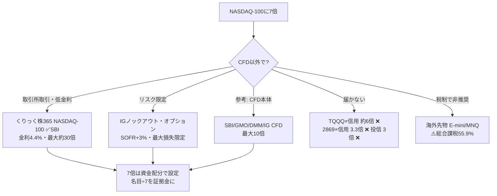

# CFDの代替：NASDAQ-100にレバレッジ7倍をかけられる日本で買える商品とコスト

作成日: 2026-06-10
最終更新日: 2026-06-10

著者: 男座員也（Kazuya Oza）
基準金利: **SOFR 3.63%**（2026年6月上旬）／くりっく株365 金利相当額 **約4.4%**（2026年5〜6月適用・毎週見直し）
対象: 日本の個人投資家が利用でき、NASDAQ-100に**実効レバレッジ7倍**を構築できる商品（CFD以外を中心に）

> **本レポートの位置づけ**
> 既存レポート『[NASDAQ-100で4倍以上レバレッジを実現する全商品比較](https://github.com/KazuyaMurayama/deep-research/blob/main/outputs/2026-05-15_nasdaq-4x-leverage-products.md)』『[SBI CFDでNASDAQ 8〜9倍レバレッジ運用ガイド](https://github.com/KazuyaMurayama/deep-research/blob/main/outputs/2026-05-20_sbi-cfd-nasdaq-8x-9x-leverage-guide.md)』の続編。追加リクエスト「**CFDの代替になる、NASDAQで7倍まで可能な商品**」に応え、CFD以外の手段で7倍を実現できる商品を横断調査し、コストを同形式で分解した。

---

## ■ 結論（先に全体像）

### 結論①：7倍運用時のコスト一覧表（年率・SOFR 3.63%前提・元本100万円）

> 「実質年率コスト（元本比）」は**7倍で1年保有**した場合の概算（配当相当額の受取を控除）。CFD（比較基準）も併記。ボラドラッグは日次リバランス型のみ発生し別途表記。

| 商品 | 種別 | 7倍可否（最大倍率） | 金利/ロールコスト（エクスポージャー比） | 手数料・スプレッド | **実質年率コスト/元本比【7倍時・推定】** | ボラドラッグ | 税制 | SBI |
|---|---|---|---|---|---|---|---|---|
| **── 本命：CFD代替 ──** | | | | | | | | |
| **くりっく株365 NASDAQ-100リセット付証拠金取引** | 取引所証拠金取引（TFX上場） | ✅（理論最大 約30倍） | 金利相当額 **約4.4%** − 配当 約0.6% ＝ **net 約3.8%** | 30円/枚（SBI・片道）＋スプレッド1〜2pt | **≈ 26〜27%** | **なし** | 申告分離 20.315%・損失3年繰越 | ✅ |
| **IG証券 ノックアウト・オプション（米国テック株100）** | 店頭オプション | ✅（実効 数十倍まで可） | **SOFR＋3.0% ≈ 6.6%** − 配当 約0.5% | スプレッド＋KOプレミアム（ノックアウト時のみ） | **≈ 43%** | **なし**（最大損失＝購入額に限定） | 申告分離 20.315%・損失3年繰越 | ─（IG口座） |
| **── 比較基準：CFD ──** | | | | | | | | |
| GMOクリック／DMM CFD（7倍設定） | 店頭CFD（先物参照型） | ✅（最大10倍） | ロールコスト 推定4〜5%（日次金利なし） | スプレッド1.8〜2.0pt | **≈ 28〜35%** | なし | 申告分離 20.315% | ─ |
| SBI CFD（7倍設定） | 店頭CFD | ✅（最大10倍） | 日次ON金利 ≈SOFR＋約3% ＝ 約6.6% − 配当 | スプレッド約1.58pt | **≈ 42〜43%** | なし | 申告分離 20.315% | ✅ |
| IG証券CFD（7倍設定） | 店頭CFD | ✅（最大10倍） | SOFR＋3.0% ＝ **6.63%**（明示） − 配当 | スプレッド2.0pt | **≈ 43%** | なし | 申告分離 20.315% | ─ |
| **── 7倍未達／非推奨 ──** | | | | | | | | |
| TQQQ × 米国株信用買い | 米国ETF×信用 | ⚠️ **約6倍が上限**（保証金率≈50%） | 経費率0.86%＋TRS≈SOFR×2＋信用金利2.8% | 買付0円（キャッシュバック） | ≈ 17%（元本比）＋**ドラッグ≈73%**（6倍・σ22%） | **大** | 株式等 20.315%（株と通算可） | ✅ |
| E-mini NASDAQ-100先物（楽天・海外先物） | 海外先物（CME） | ✅（証拠金次第） | ロール ≈4.2〜4.5%（価格内包） | $4.95/枚 | ≈ 30% だが**⚠️ 総合課税（最大55.9%）** | なし | **⚠️ 雑所得・総合課税／繰越不可** | ─ |
| MNQ（マイクロNQ先物・サクソ/IBKR） | 海外先物（CME） | ✅ | ロール ≈4.2〜4.5% | 約$0.8〜1.5/枚 | ≈ 30% だが**⚠️ 総合課税** | なし | **⚠️ 雑所得・総合課税／繰越不可** | ─ |
| 2869 × 国内信用買い | 国内ETF×信用 | ❌ 約3.3倍まで | 信託報酬0.825%＋ヘッジコスト＋信用金利2.8% | 売買手数料 | ≈ 6.5〜7.5% | あり | 株式等 20.315% | ✅ |
| 国内投信（NASDAQ100 3倍ブル等） | 投信 | ❌ 3倍まで | SOFR×2内包＋ヘッジ≈3% | 0円 | ≈ 12%（3倍） | あり | 株式等 20.315% | ✅ |
| 大阪取引所（OSE）のNASDAQ先物 | ─ | ❌ **上場なし**（日経225系のみ） | ─ | ─ | ─ | ─ | ─ | ─ |

### 結論②：4行サマリー

1. **CFD代替の本命は「くりっく株365 NASDAQ-100リセット付証拠金取引」**。取引所（TFX）上場で透明性が高く、金利相当額**約4.4%**はCFD各社（SOFR+3%≈6.6%）より約2%安い。証拠金基準額は**9,010円/枚**（2026/6/15週）で理論最大約30倍——**資金量の調整だけで7倍を自由に設定可能**。SBI証券で取引でき、税制もCFDと同じ申告分離20.315%・損失3年繰越。
2. **リスク限定型の代替なら「IG証券 ノックアウト・オプション」**。実効レバレッジは数十倍まで可能で7倍は余裕。コストはCFDと同水準（SOFR+3.0%）だが、**最大損失が購入額に限定**され追証がない（CFDの強制ロスカット・ギャップリスクを構造的に回避）。
3. **TQQQ×信用は約6倍止まりで7倍に届かず**、かつ6倍時のボラドラッグが年率≈73%（σ22%）と壊滅的。**海外先物（E-mini/MNQ）は金利コスト最安級だが総合課税（最大55.945%）で論外**。OSEにNASDAQ先物は上場していない。
4. **7倍・1年保有の元本比コストは約26〜43%**。どの商品でも横ばい相場では元本の1/4以上が溶ける水準であり、**7倍は数日〜数週間の短期方向性トレード専用**と割り切ること（指数が▲14.3%動くと元本消失）。

---

## ■ 1. 「7倍」を実現できる商品の探し方

7倍は「商品固有の倍率」ではなく、**証拠金取引で資金量を調整して作る倍率**。日本で買える商品のうち、倍率を7倍に設定できるのは①くりっく株365、②店頭CFD、③ノックアウト・オプション、④海外先物の4系統のみ。レバレッジETF・投信・信用の組み合わせは最大でも6倍（TQQQ×信用）で届かない。



---

## ■ 2. 本命：くりっく株365 NASDAQ-100リセット付証拠金取引

東京金融取引所（TFX）上場の株価指数証拠金取引。機能はCFDと同等（差金決済・配当相当額受取・金利相当額支払）だが、**取引所取引のため価格・金利の透明性が高い**のが最大の違い。

| 項目 | 内容 |
|---|---|
| 取引単位 | NASDAQ-100 × 10円（1枚 ≈ 名目数十万円） |
| 証拠金基準額 | **9,010円/枚**（2026年6月15日週・毎週見直し） |
| 理論最大レバレッジ | 約30倍前後（名目÷証拠金） |
| **7倍での運用法** | **1枚あたり「名目価値÷7」の資金を口座に置く**（例：名目29万円なら約4.2万円） |
| 金利相当額（買い・支払） | **年 約4.4%**（2026年5月適用・FF金利/SOFR連動で毎週改定。2025年8月時点は4.92%→低下傾向） |
| 配当相当額（買い・受取） | NASDAQ-100配当 ≈ 年0.5〜0.6% |
| 取引手数料 | SBI証券 30円/枚（片道）。最安はひまわり証券15円 |
| スプレッド | マーケットメイク方式・推定1〜2pt |
| リセット | 年1回のリセット日に強制決済・新銘柄へ乗換（2026年リセット銘柄は2025年9月取引開始） |
| 税制 | **先物取引に係る雑所得等（申告分離20.315%）**・損失3年繰越・CFD/FXと損益通算可 |
| ボラドラッグ | **なし**（日次リバランスしない） |
| SBI取扱 | **✅ あり** |

**7倍・元本100万円・1年保有のコスト試算：**

```
エクスポージャー = 700万円
金利相当額（支払） = 700万円 × 4.4%  = 308,000円
配当相当額（受取） = 700万円 × 0.6%  = ▲42,000円
手数料（往復・数枚） ≈ 数百円
─────────────────────────────
純コスト ≈ 266,000円（元本比 ≈ 26.6%/年）
```

→ **CFD（SOFR+3%方式）で7倍を組むより年率約16〜17万円（元本比16%pt）安い**。ロールコスト方式のGMO/DMM CFD（28〜35%）と比べても最安。

---

## ■ 3. リスク限定型の代替：IG証券 ノックアウト・オプション（米国テック株100）

CFDと同じ値動きをするが「ノックアウト価格」をあらかじめ設定するオプション型商品。**最大損失＝購入金額（＋KOプレミアム）に限定**され、追証・ギャップ拡大損失が構造的に発生しない。

| 項目 | 内容 |
|---|---|
| 対象 | 米国テック株100（＝NASDAQ-100） |
| 実効レバレッジ | KO価格の距離で決まる。**7倍＝現値から約14%下にKO設定**。数十倍まで可 |
| ファンディングコスト（買い） | **総取引金額 ×（基準金利＋3.0%）÷360** ＝ SOFR 3.63%＋3.0% ≈ **年6.6%**（CFDと同水準） |
| KOプレミアム | ノックアウトが実際に発動した時のみ支払（保証料的な少額） |
| スプレッド | CFDと同等（NASDAQ 2.0pt前後） |
| 税制 | **申告分離20.315%**（先物取引に係る雑所得等）・損失3年繰越 |
| ボラドラッグ | なし |
| 7倍時の年率コスト | ≈（6.6% − 0.5%）× 7 ≈ **43%（元本比）** |

**評価**：コストはCFD本体と同じで安くはないが、「**急落時でも損失が購入額で止まる**」のはCFD・くりっく株365にない特長。7倍のような高レバレッジ運用では、コスト差を払ってでもテールリスクを切る価値がある局面（FOMC・決算跨ぎ等）で有効。

---

## ■ 4. 7倍に届かない／推奨しない手段

### 4-1. TQQQ × 米国株信用買い（最大約6倍・7倍未達）
- SBI/楽天の米国株信用は保証金率≈50% → TQQQ（3倍）×2倍 ＝ **約6倍が上限**。
- コスト：経費率0.86%＋TRS内包コスト（SOFR×2≈7.3%）×2倍＋信用金利2.8% ≈ **元本比17%/年**。
- 致命的なのは**ボラドラッグ**：実効6倍・σ22%で `0.5×6×5×0.22² ≈ 72.6%/年`。横ばい相場で元本が急速に溶ける。**7倍狙いの代替としては不適**。

### 4-2. 海外先物（E-mini NQ／MNQ）——金利は安いが税制で論外
- 楽天証券の海外先物は**E-mini NASDAQ-100のみ取扱（マイクロMNQは取扱なし）**。手数料$4.95/枚。E-miniは1枚の名目が大きく（$20×指数 ≈ 数千万円規模）、7倍運用には元本1,000万円級が必要。
- MNQはサクソバンク・IBKR等で取引可能だが、**海外先物は雑所得・総合課税（最大実効55.945%）・損失繰越不可**。国内業者経由でも外国市場デリバティブは申告分離の対象外（楽天証券公式も「総合課税」と明記）。
- ロールコスト≈4.2〜4.5%と金利面では最安級だが、**税引後では申告分離20.315%のくりっく株365に勝てない**。

### 4-3. その他（確認済み・不可）
- **大阪取引所（OSE）**：NASDAQ-100先物は**上場していない**（株価指数先物は日経225系・TOPIX系のみ）。
- **国内投信**：最大3倍（NASDAQ100 3倍ブル・大和AM）。**国内ETF×信用**：2869×信用で約3.3倍。いずれも7倍に遠く及ばない。

---

## ■ 5. 7倍運用の実務とリスク

| 項目 | 内容 |
|---|---|
| 元本消失ライン | 指数が**▲14.3%**で元本ゼロ（7倍）。NASDAQ-100は2022年に年間▲33%、単日▲5%超も複数回 |
| 推奨保有期間 | **数日〜数週間**の方向性トレードのみ。1年保有はコスト26〜43%で非現実的 |
| 証拠金管理 | くりっく株365は強制ロスカットなし（追証方式）→ 維持率300%以上を確保。急落時の追加入金余力を必ず残す |
| 金利変動 | くりっく株365の金利相当額は毎週改定（FF金利連動）。利下げ局面ではコスト低下（2025/8: 4.92% → 2026/5: 約4.4%） |
| テールヘッジ | イベント跨ぎはIGノックアウト・オプションでリスク限定する選択肢 |

### 使い分け早見

| ニーズ | 推奨 |
|---|---|
| **SBI口座内で7倍・コスト最安** | **くりっく株365 NASDAQ-100（資金配分で7倍に設定）** |
| 急落リスクを限定して7倍 | IG証券 ノックアウト・オプション |
| 超短期（日跨ぎなし） | SBI CFD（スプレッド1.58pt・金利不発生） |
| 中期ロール許容・口座追加可 | GMO/DMM CFD（ロールコスト方式 4〜5%） |
| 7倍に拘らず管理を簡単に | TQQQ単体3倍（ドラッグ・SOFR×2内包は許容） |

---

## 付録：出典

- [くりっく株365 公式（NASDAQ-100 売り金利受取 約4.4〜4.5%）](https://www.clickkabu365.jp/sp/contents16.html)
- [くりっく株365 証拠金基準額（NASDAQ-100：9,010円/枚・2026/6/15週）](https://www.clickkabu365.jp/service/service01.html)
- [くりっく株365 NASDAQ-100リセット付証拠金取引の上場について（TFX）](https://www.tfx.co.jp/newsfile/article/20211203-01)
- [SBI証券 取引所CFD（くりっく株365）2026年リセット銘柄](https://www.sbisec.co.jp/ETGate/?OutSide=on&getFlg=on&_ControlID=WPLETmgR001Control&_PageID=WPLETmgR001Mdtl30&_ActionID=DefaultAID&_DataStoreID=DSWPLETmgR001Control&burl=search_cfd&cat1=cfd&cat2=none&dir=info&file=cfd_info250904_start_trading.html)
- [IG証券 ノックアウト・オプション 取引ルール（株価指数：基準金利±3.0%）](https://www.ig.com/jp/help-and-support/cfds/fees-and-charges/what-are-igs-knock-outs-cfd-product-details)
- [IG証券 ノックアウト・オプションとは](https://www.ig.com/jp/knock-outs)
- [楽天証券 海外先物 取引ルール（E-mini NQ取扱・雑所得総合課税）](https://www.rakuten-sec.co.jp/web/foreign_futures/rule/)
- [楽天証券 海外先物 手数料／証拠金（株価指数 $4.95/枚）](https://www.rakuten-sec.co.jp/web/foreign_futures/commission/)
- [JPX 大阪取引所（上場デリバティブ一覧にNASDAQ-100なし）](https://www.jpx.co.jp/)
- 既存レポート: [NASDAQ-100 4倍以上レバレッジ全商品比較（2026-05-15）](https://github.com/KazuyaMurayama/deep-research/blob/main/outputs/2026-05-15_nasdaq-4x-leverage-products.md)／[SBI CFD 8〜9倍ガイド（2026-05-20）](https://github.com/KazuyaMurayama/deep-research/blob/main/outputs/2026-05-20_sbi-cfd-nasdaq-8x-9x-leverage-guide.md)

> 注: 金利相当額・ロールコスト・スプレッドは2026年6月上旬時点の公表値・推定値。くりっく株365の金利相当額と証拠金基準額は毎週改定されるため、発注前にTFX公式で最新値を確認のこと。本レポートは情報提供目的であり投資勧誘ではない。

*作成: 男座員也（Kazuya Oza） / 2026-06-10*
