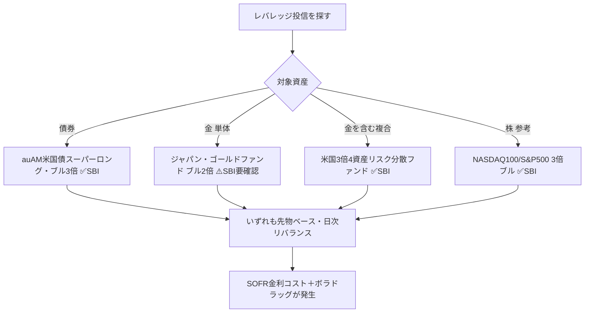
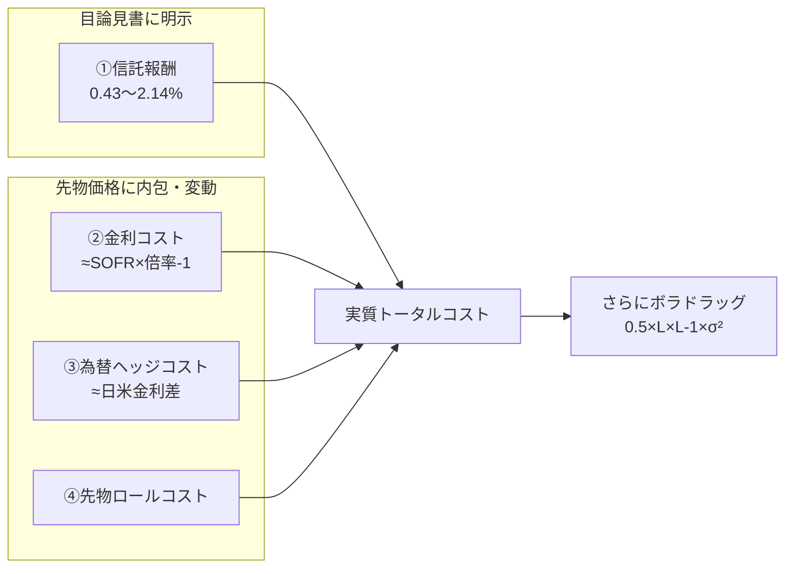

# SBI証券で買えるゴールド／債券「レバレッジ投資信託」コスト徹底比較

作成日: 2026-06-10
最終更新日: 2026-06-10

著者: 男座員也（Kazuya Oza）
基準金利: **SOFR 3.63%**（2026年6月上旬時点）／対象: SBI証券で購入可能な**投資信託（ブル・レバレッジ型）**

> **本レポートの位置づけ**
> 既存レポート『[SBIゴールド・債券 2x/3x ブル統合ガイド](https://github.com/KazuyaMurayama/deep-research/blob/main/outputs/2026-06-10_sbi-gold-bond-2x3x-bull-guide.md)』が **米国ETF・国内ETF×信用・CFD** を対象にしていたのに対し、本レポートは追加リクエストに応じて **「投資信託（ファンド）」** に絞って横断調査したもの。NASDAQ100 3倍ブルのような“ブル型レバレッジ投信”の、ゴールド版・債券版を探し、コストを分解する。

---

## ■ 結論（先に全体像）

### 結論①：コスト一覧表（年率・SOFR 3.63%前提）

> 倍率欄の「3x債券」=純資産の約3倍の米国超長期国債先物を保有、等の意味。コストは**4種類**に分解（①信託報酬＝明示／②SOFR等の金利コスト＝先物価格に内包・**目論見書の信託報酬には含まれない**／③トレード（先物ロール）コスト＝内包・変動／④購入時手数料）。

| 投資信託 | 対象 | レバレッジ | ①信託報酬/年(税込) | ②金利(SOFR)コスト/年【内包・推定】 | ③為替ヘッジコスト/年【推定】 | ④トレード/ロール【内包・変動】 | 購入時手数料(SBI) | **概算トータルコスト/年【推定】** | SBI取扱 |
|---|---|---|---|---|---|---|---|---|---|
| **auAM米国債スーパーロング・ブル3倍（円コース）** | 米国超長期国債 | **3倍** | 0.4334% | ≈ SOFR×2 ≈ **7.3%** | ≈ 日米金利差 **約3%**（円ヘッジ） | ~0.2% | **0円** | **≈ 10〜11%** | ✅ |
| **auAM米国債スーパーロング・ブル3倍（米ドルプラスコース）** | 米国超長期国債 | **3倍** | 0.4334% | ≈ SOFR×2 ≈ **7.3%** | **0%**（ヘッジ無＝為替変動を負う） | ~0.2% | **0円** | **≈ 7.5〜8%** ＋為替変動 | ✅ |
| **米国3倍4資産リスク分散ファンド**（株・債券・REIT・**金**） | 米国4資産（金含む） | **3倍** | 0.4675% | ≈ SOFR×2 ≈ **7.3%** | 一部ヘッジ（変動） | ~0.2% | **0円** | **≈ 8〜9%** | ✅ |
| **ジャパン・ゴールドファンド（ブル2倍型）** | 金（円建・国内金先物） | **2倍** | **2.14%** | ≈ 円短期金利×1 ≈ **0.5%** | （円建のため小） | ~0.3% | （取扱要確認） | **≈ 3.0%**（信託報酬が突出） | ⚠️ 要確認（主に大和） |
| 〔参考〕NASDAQ100 3倍ブル | 米国株 | 3倍 | 〜0.99%（上限1.98%） | ≈ 7.3% | ≈ 約3%（円ヘッジ） | ~0.3% | **0円** | **≈ 11%** | ✅ |
| 〔参考〕SBI日本株4.3ブル | 日本株 | 4.3倍 | 〜0.968% | ≈ 円金利×3.3 ≈ 1.7% | （円建） | ~0.3% | **0円** | **≈ 3%** | ✅ |

> ⚠️ ②③は**信託報酬には含まれない“隠れコスト”**で、相場・金利・ロール環境により変動する推定値。特に②（先物に内包される金利コスト）が、レバレッジ投信の実質コストの大半を占める。

### 結論②：3行サマリー

1. **債券3倍ブルの投信は“本命”が存在する** → **auAM米国債スーパーロング・ブル3倍**（2025年1月設定、SBI取扱✅、信託報酬わずか0.43%）。米国上場ETFの**TMF（経費率0.95%）より信託報酬が低く**、SBIなら買付手数料0円・為替手数料0円で買える。
2. **ゴールドの“レバレッジ投信”はSBIでは実質手薄** → 純金の通常型投信（SBI・iシェアーズ・ゴールド等）は豊富だが、**2倍・3倍ブルの金投信はSBIラインナップに見当たらない**（唯一級の「ジャパン・ゴールドファンド ブル2倍」は信託報酬2.14%と高コストかつSBI取扱が要確認）。→ 金のレバレッジは**ETF（UGL）・1540×信用・CFD**が依然有力（別レポート参照）。
3. **どの投信も“先物ベース＝日次リバランス”** なので、**ボラティリティ・ドラッグ（≈0.5×L×(L−1)×σ²）と金利（SOFR）コストはETFと同様に発生**する。「信託報酬が安い＝総コストが安い」ではない点に注意。

---

## ■ 1. 探し方：日本の「ブル型レバレッジ投信」とは

日本の投資信託で「2倍・3倍ブル」を名乗る商品は、ほぼ全て **株価指数先物・債券先物・商品先物を“純資産の数倍”買い建てる**「ブル・ベア型（特殊型）」ファンド。代表が **NASDAQ100 3倍ブル／S&P500 3倍ブル（大和）** や **SBI日本株4.3ブル**。
同じ仕組みで、**債券（米国超長期国債）** と **金（コモディティ）** を対象にしたものを探した結果が以下。

---

## ■ 2. 債券レバレッジ投信【本命】

### 2-1. auAM米国債スーパーロング・ブル3倍（円コース／米ドルプラスコース）

| 項目 | 内容 |
|---|---|
| 運用会社 | auアセットマネジメント（KDDIグループ） |
| 設定日 | **2025年1月31日** |
| 対象 | 米国超長期国債先物（≈20〜30年）を**純資産の約3倍**買い建て |
| レバレッジ | **3倍ブル** |
| 信託報酬 | **年0.4334%（税込）**／税抜0.394% |
| 購入時手数料 | 上限2.2%だが **SBIは0円**（後述） |
| 信託財産留保額 | なし |
| 為替 | **円コース**＝為替ヘッジあり／**米ドルプラスコース**＝ヘッジ無し（USD金利収入を取りに行く設計） |
| SBI取扱 | **✅ あり**（SBI特集ページ・クレカ積立対象） |
| 証券コード | 円コース AY313251／米ドルプラス AY312251 |

**コスト構造の読み解き：**
- **①信託報酬 0.43%** は、米国上場の**TMF（Direxion 20年超米国債3倍、経費率0.95%）より大幅に低い**。これが投信の最大の利点。
- **②金利（SOFR）コスト**：3倍を作るために純資産の**2倍を借りている**のと等価。先物価格に**短期金利（米ドル＝ほぼSOFR）が内包**され、運用会社の説明どおり「投資収益＝3倍ポートフォリオのリターン − 短期金利」。概算 **SOFR3.63% × 2 ≈ 7.3%/年**。
- **③為替ヘッジコスト**：**円コース**は円ヘッジのため**日米金利差（≈3%/年）が追加コスト**になる。**米ドルプラスコース**はヘッジしないのでこのコストは発生せず、その代わり**ドル円の為替変動をまるごと負う**（円安ならプラス・円高ならマイナス）。
- **④ロールコスト**：四半期ごとの先物乗り換え（ロール）費用。変動・小（数十bp程度）。

> **要点**：円ヘッジで「為替リスクを消す」と②に加えて③が乗り、合計**約10〜11%/年**の逆風。長期保有では金利が下がって債券価格が上がらない限り厳しい。**短期の金利低下（債券高）局面を取りに行く商品**。

### 2-2. （重要・再掲）野村ブルベア 米国国債4倍ブル9 は償還済み
- 旧・最高倍率だった4倍債券投信は **2026年1月16日に償還**され、現在は購入不可。後継的ポジションが上記 auAM 3倍。

---

## ■ 3. 金（ゴールド）レバレッジ投信【SBIでは手薄】

### 3-1. ジャパン・ゴールドファンド（ブル2倍型）
| 項目 | 内容 |
|---|---|
| 運用会社 | アストマックス投信投資顧問 |
| 対象 | 金先物（円建）／**2倍ブル** |
| 信託報酬 | **年2.14164%（税込）** ← 非常に高い |
| 純資産 | 約2.6億円（小規模） |
| SBI取扱 | **⚠️ 要確認**（販売は主に大和証券系。SBIの金投信ラインナップは“通常型”が中心で、本ファンドは確認できず） |

**評価**：金2倍の投信は理屈上存在するが、**信託報酬2.14%が重く**、純資産も小さい。**SBIでの取扱が確認できない**ため、金のレバレッジは投信より下記の方が有利。

### 3-2. SBIにある金投信は「レバレッジ無し（1倍）」
- **SBI・iシェアーズ・ゴールドファンド（為替ヘッジあり/なし）**、**サクっと純金** などはいずれも**1倍（現物連動）**。レバレッジ目的には使えない。

### 3-3. 金のレバレッジは投信より「ETF／信用／CFD」が有力（別レポート要約）
| 手段 | 倍率 | 実質コスト/年 | SBI |
|---|---|---|---|
| **1540（純金ETF）× 信用買い** | ≈2倍 | **≈3.24%**（最安） | ✅ |
| **UGL（ProShares Ultra Gold 2x ETF）** | 2倍 | ≈7.2% | ✅ |
| **SBIゴールドCFD（倍率設定で3倍運用）** | 最大20倍 | ≈14%【推定】 | ✅ |

→ **金で2倍を狙うなら、投信より「1540×信用」または「UGL」**。詳細は[統合ガイド](https://github.com/KazuyaMurayama/deep-research/blob/main/outputs/2026-06-10_sbi-gold-bond-2x3x-bull-guide.md)参照。

---

## ■ 4. 金を“含む”複合レバレッジ投信

### 米国3倍4資産リスク分散ファンド（愛称：アメリカまるごとレバレッジ）
| 項目 | 内容 |
|---|---|
| 運用会社 | 大和アセットマネジメント |
| 対象 | 米国の**株式・債券・REIT・金（ゴールド）**に分散し、全体で**3倍** |
| 配分 | 各資産の**リスク量が均等**になるよう月次リバランス（固定比率でない） |
| 信託報酬 | **年0.4675%（税込）** |
| 信託財産留保額 | なし／購入時手数料 上限3.3%だが **SBIは0円** |
| 金利コスト | 「先物価格の短期金利部分＝借入金利」と運用会社が明記。**3倍ポートフォリオのリターン − 短期金利（≈SOFR×2）** |
| 決算型 | 毎月／隔月／年2回 の各型あり |
| SBI取扱 | **✅ あり**（SBI特集ページあり） |

→ **「金単体3倍」ではない**が、ポートフォリオの一部として金にレバレッジを掛けたい場合の選択肢。1本で米国株・債券・REIT・金に3倍分散。

---

## ■ 5. コストの仕組み：なぜ「信託報酬」だけ見てはいけないか

### 5-1. レバレッジ投信のコスト4層構造

### 5-2. 「SOFRコストが出るもの／出ないもの」の区別（ユーザー指摘の論点）

| コスト種別 | 発生する商品 | 理由 |
|---|---|---|
| **②米ドルSOFR金利コスト** | **米ドル資産の先物**を使う投信（auAM米国債3倍／米国3倍4資産／NASDAQ100 3倍ブル） | 先物価格にUSD短期金利（≈SOFR）が内包。レバレッジ＝借入なので**借入分にSOFRが乗る** |
| ②が**ほぼ出ない/円金利のみ** | **円建資産の先物**を使う投信（ジャパン・ゴールド2倍／SBI日本株4.3ブル） | 借入金利が**日本円の短期金利（≈0.5%）** で、SOFRは無関係 |
| **③為替ヘッジコスト** | **円ヘッジ型**（auAM円コース／NASDAQ100 3倍ブル） | ヘッジ＝日米金利差（≈3%）を毎年支払う |
| ③が**出ない** | **ヘッジ無し型**（auAM米ドルプラスコース） | 為替変動をそのまま負う代わりにヘッジコスト0 |
| **トレード（売買委託）コスト** | **全レバレッジ投信** | 日次リバランス＋先物ロールで売買が発生（変動・内包） |
| **購入時手数料** | 投信全般で設定があるが… | **SBIは投信買付手数料を全ファンド無料化済み → 実質0円** |
| **信託報酬（年間）** | 全商品 | 唯一“明示”されるコスト。ただし総コストの一部にすぎない |

### 5-3. ボラティリティ・ドラッグ（全レバレッジ投信に共通）
- **日次リバランス型**は、横ばい・乱高下相場で元本が削られる。`D ≈ 0.5 × L × (L−1) × σ²`。
  - 3倍・年率ボラ20%なら **≈ 0.5×3×2×0.04 = 12%/年** の理論ドラッグ。
  - **CFD・先物の自前ポジション（毎日リバランスしない）には出ない**が、**これらの投信には出る**（ETFと同じ）。
- → **レバレッジ投信は“長期保有に不向き・短期の方向性を取る商品”**。目論見書も明記。

---

## ■ 6. 投信ルート vs ETFルート（同じ3倍債券で比較）

| 観点 | **auAM米国債3倍（投信）** | **TMF（米国上場ETF）** |
|---|---|---|
| 信託報酬/経費率 | **0.43%** ✅ | 0.95% |
| SBI購入時手数料 | **0円** ✅ | 為替スプレッド＋取引手数料が発生 |
| 為替手数料 | 円コースは不要 / ドルコースも投信内で処理 | ドル転が必要（為替コスト） |
| SOFR金利コスト | 約7.3%（内包） | 約7.3%（スワップ内包） |
| ボラドラッグ | あり | あり |
| 円ヘッジ選択 | **コースで選べる** ✅ | 自分でヘッジ手段が必要 |
| 課税 | 申告分離（投信） | 申告分離（外国株式） |

→ **同じ「米国債3倍」なら、信託報酬・手数料・利便性で投信（auAM）が優位**。金利コストとボラドラッグは構造上どちらも同じ。

---

## ■ 7. 結論と推奨

| ニーズ | 推奨（投信ルート） | 代替（別レポートのETF/CFD） |
|---|---|---|
| **米国債3倍ブル** | **auAM米国債スーパーロング・ブル3倍**（為替を消すなら円コース／円安も取りたいなら米ドルプラス） | TMF（コスト面で投信が優位） |
| **金2倍** | （投信は高コスト・SBI要確認）**非推奨** | **1540×信用（≈3.24%）** or UGL |
| **金を含む3倍分散** | **米国3倍4資産リスク分散ファンド** | — |
| **超短期で方向を取る** | いずれも可（ただしボラドラッグ前提） | CFD（ボラドラッグ無し） |

> **最重要メッセージ**：これらは全て**先物・日次リバランス型**であり、**SOFR金利コスト（米ドル資産は年7%超）とボラティリティ・ドラッグ**が信託報酬とは別に効く。**「信託報酬0.43%だから安い」ではなく、実質コストは年7〜11%規模**。**長期保有ではなく、金利・相場の方向性を短中期で取りに行く用途**に限定するのが定石。

---

## 付録：出典

- [auAM米国債スーパーロング・ブル3倍｜SBI証券特集](https://go.sbisec.co.jp/prd/fund/au_am/usbond_superlong.html)
- [auAM米国債スーパーロング・ブル3倍 設定のお知らせ｜auアセットマネジメント](https://www.kddi-am.com/news/n20250108/)
- [アメリカまるごとレバレッジ（米国3倍4資産リスク分散ファンド）｜大和AM](https://www.daiwa-am.co.jp/special/marugotoleverage/)
- [米国3倍4資産リスク分散ファンド｜SBI証券特集](https://go.sbisec.co.jp/prd/fund/daiwa_am/marugotoleverage.html)
- [NASDAQ100 3倍ブル｜大和AM](https://www.daiwa-am.co.jp/funds/detail/3432/detail_top.html)
- [ジャパン･ゴールドファンド(ブル2倍型)｜Yahoo!ファイナンス](https://finance.yahoo.co.jp/quote/97311102)
- [NEXT NOTES 金先物 ダブル・ブル ETN（2036）](https://nextnotes.com/lineup/detail/2036_goldbull.html)
- [SBI日本株4.3ブル｜SBI証券コラム](https://www.sbisec.co.jp/ETGate/WPLETmgR001Control?OutSide=on&getFlg=on&burl=search_fund&cat1=fund&cat2=none&dir=info&file=comment%2Ffund_comment_151106.html)
- [レバレッジ投信の仕組みと注意点｜松井証券コラム](https://www.matsui.co.jp/fund/column/bull-bear/)

> 注: ②金利コスト・③為替ヘッジコスト・④ロールコストは目論見書で個別開示されず、SOFR3.63%・日米金利差・先物カーブから試算した**推定値**。実際のコストは運用報告書の「1万口当たりの費用明細」と基準価額の対指数乖離で事後検証が必要。
