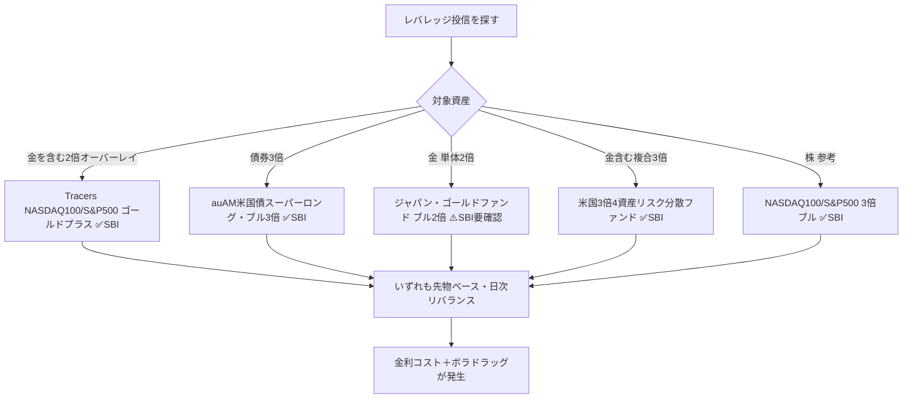
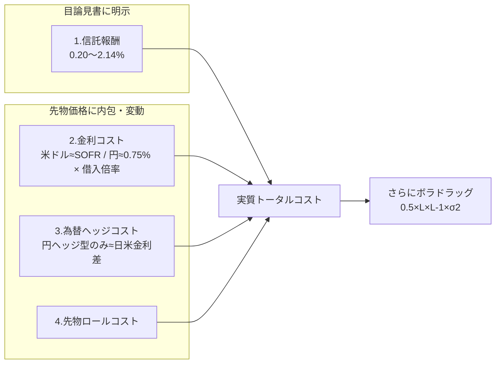

# SBI証券で買えるゴールド／債券「レバレッジ投資信託」コスト徹底比較

作成日: 2026-06-10
最終更新日: 2026-06-10

著者: 男座員也（Kazuya Oza）
基準金利: **SOFR 3.63%**／**日本円 政策金利 0.75%**（いずれも2026年6月上旬時点）
対象: SBI証券で購入可能な**投資信託（ブル・レバレッジ型）**

> **本レポートの位置づけ**
> 既存レポート『[SBIゴールド・債券 2x/3x ブル統合ガイド](https://github.com/KazuyaMurayama/deep-research/blob/main/outputs/2026-06-10_sbi-gold-bond-2x3x-bull-guide.md)』が **米国ETF・国内ETF×信用・CFD** を対象にしていたのに対し、本レポートは追加リクエストに応じて **「投資信託（ファンド）」** に絞って横断調査したもの。NASDAQ100 3倍ブルのような“ブル型レバレッジ投信”の、ゴールド版・債券版を探し、コストを分解する。
> **改訂メモ（同日改訂）**: 初版レビューにより (1) **Tracersゴールドプラス系2本を追加**、(2) TMF経費率0.95→**0.90%**・NASDAQ100 3倍ブル信託報酬を**1.524%**に修正、(3) 円短期金利0.5→**0.75%**（日銀2025年12月利上げ反映）、(4) 米ドルプラスコースの仕組みを正確化。

---

## ■ 結論（先に全体像）

### 結論①：コスト一覧表（年率・SOFR 3.63%／円金利 0.75%前提）

> コストは**4種類**に分解（①信託報酬＝明示／②金利コスト＝先物価格に内包・**目論見書の信託報酬には含まれない**・米ドル資産は≈SOFR／③為替ヘッジコスト＝円ヘッジ型のみ・日米金利差／④トレード（先物ロール）コスト＝内包・変動）。「レバレッジ」欄は **総エクスポージャー** を示す。

| 投資信託 | 対象 | レバレッジ（総倍率／内訳） | ①信託報酬/年(税込) | ②金利コスト/年【内包・推定】 | ③為替ヘッジコスト/年【推定】 | ④トレード/ロール | 購入時(SBI) | **概算トータル/年【推定】** | SBI |
|---|---|---|---|---|---|---|---|---|---|
| **Tracers NASDAQ100ゴールドプラス** | NASDAQ100＋**金** | 2倍（株1x＋**金1x**） | **0.2189%** | ≈SOFR×1 ＝ **3.6%**＋金リース | 無（為替変動を負う） | ~0.2% | **0円** | **≈ 4.3%** | ✅ |
| **Tracers S&P500ゴールドプラス** | S&P500＋**金** | 2倍（株1x＋**金1x**） | **0.1991%** | ≈SOFR×1 ＝ **3.6%**＋金リース | 無（為替変動を負う） | ~0.2% | **0円** | **≈ 4.3%** | ✅ |
| **auAM米国債スーパーロング・ブル3倍（円コース）** | 米国超長期国債 | **3倍** | 0.4334% | ≈SOFR×2 ＝ **7.3%** | ≈日米金利差 **約3%** | ~0.2% | **0円** | **≈ 10〜11%** | ✅ |
| **auAM米国債スーパーロング・ブル3倍（米ドルプラスコース）** | 米国超長期国債＋ドル | **3倍** | 0.4334% | ≈SOFR×2 ＝ **7.3%** | 0%（ドル保有戦略・為替変動を負う） | ~0.2% | **0円** | **≈ 7.5〜8%** ＋為替 | ✅ |
| **米国3倍4資産リスク分散ファンド**（株・債券・REIT・**金**） | 米国4資産（金含む） | **3倍** | 0.4675% | ≈SOFR×2 ＝ **7.3%** | 一部ヘッジ（変動） | ~0.2% | **0円** | **≈ 8〜9%** | ✅ |
| **ジャパン・ゴールドファンド（ブル2倍型）** | 金（円建・国内金先物） | **2倍（金2x）** | **2.14%** | ≈円金利×1 ＝ **0.75%** | （円建のため小） | ~0.3% | （取扱要確認） | **≈ 3.2%**（信託報酬が突出） | ⚠️ 要確認 |
| 〔参考〕NASDAQ100 3倍ブル | 米国株 | 3倍 | **1.524%** | ≈SOFR×2 ＝ 7.3% | ≈約3%（円ヘッジ） | ~0.3% | **0円** | **≈ 12%** | ✅ |
| 〔参考〕SBI日本株4.3ブル | 日本株 | 4.3倍 | 〜0.968% | ≈円金利×3.3 ＝ 2.5% | （円建） | ~0.3% | **0円** | **≈ 3.8%** | ✅ |

> ⚠️ ②③④は**信託報酬には含まれない“隠れコスト”**で、相場・金利・ロール環境により変動する推定値。**米ドル資産の先物**は②に**SOFR**が、**円建資産の先物**は②に**日本円金利（0.75%）**が内包される。

### 結論②：4行サマリー

1. **「ゴールドにレバレッジ」の最有力は Tracers ゴールドプラス系** → **NASDAQ100ゴールドプラス（信託報酬0.2189%）／S&P500ゴールドプラス（0.1991%）**。1万円で「株1万円＋**金1万円**」の200%エクスポージャーを持てる“オーバーレイ型”。信託報酬は投信最安水準で、**金を1倍ぶん“ほぼ金利コストだけ”で上乗せ**できる。ただし**金は1倍**で、純粋な「金2倍・3倍ブル」ではない点に注意。
2. **純粋な「金2倍・3倍ブル投信」はSBIでは依然手薄** → 金単体2倍の「ジャパン・ゴールドファンド ブル2倍」は信託報酬2.14%と高コストかつSBI取扱が要確認。純粋に金へ2x/3xなら**ETF（UGL）・1540×信用・CFD**が有利（別レポート参照）。
3. **債券3倍ブルの本命は auAM米国債スーパーロング・ブル3倍** → SBI取扱✅、信託報酬0.43%。米国上場ETFの**TMF（経費率0.90%）より信託報酬が低く**、SBIなら買付・為替手数料0円。
4. **どの投信も“先物ベース＝日次リバランス”** → **ボラティリティ・ドラッグと金利（SOFR/円金利）コストはETFと同様に発生**。「信託報酬が安い＝総コストが安い」ではない。

---

## ■ 1. 探し方：日本の「ブル型レバレッジ投信」とは

日本の投資信託でレバレッジを掛ける商品は、ほぼ全て **株価指数先物・債券先物・商品先物を“純資産の数倍”買い建てる**「ブル・ベア型／レバレッジ型（特殊型）」ファンド。本レポートでは対象資産が **債券・金（および金を含む複合）** のものを抽出した。

---

## ■ 2. 金にレバレッジ【最有力＝Tracersゴールドプラス系】

### 2-1. Tracers NASDAQ100ゴールドプラス／S&P500ゴールドプラス（AMOVA）

| 項目 | NASDAQ100ゴールドプラス | S&P500ゴールドプラス |
|---|---|---|
| 証券コード | 02311251 | 02315228 |
| 構成 | NASDAQ100 **100%** ＋ 金 **100%** | S&P500 **100%** ＋ 金 **100%** |
| 総エクスポージャー | **純資産の200%**（株1x＋金1x） | **純資産の200%**（株1x＋金1x） |
| 信託報酬 | **年0.2189%（税込）** | **年0.1991%（税込）** |
| 購入時手数料 | **SBI 0円** | **SBI 0円** |
| SBI取扱 | **✅ あり**（SBI個別ページ確認） | **✅ あり**（要最終確認） |
| 為替ヘッジ | なし（為替変動を負う） | なし（為替変動を負う） |

**仕組みとコストの読み解き：**
- **「プラス」＝オーバーレイ構造**：1万円の資金で、株を1万円ぶん買いつつ、**先物を使って金も1万円ぶん**保有。自己資金100%に対し**100%を借りて**金（または株）を上乗せする発想。
- **②金利コスト**：借入は純資産の**1倍ぶん**なので ≈ **SOFR×1 ＝ 3.6%/年**。加えて金先物には**金リース／保管コスト**が薄く内包（数十bp）。**3倍ブル（借入2倍）より金利負担は約半分**。
- **①信託報酬0.2%**は投信のレバレッジ商品として破格。**金を1倍ぶん、実質“金利コストだけ”で持てる**のが本商品の妙味。
- **注意**：得られる金エクスポージャーは**1倍**。「金を2倍・3倍に増幅したい」というニーズには応えない（あくまで株に金を上乗せする分散・ヘッジ目的）。
- **ボラドラッグ**：2倍型なので3倍型より小さい（`0.5×2×1×σ²＝σ²`）。株と金は相関が低く合成ボラが下がりやすいぶん、ドラッグも相対的に軽い。

---

## ■ 3. 債券レバレッジ投信【本命】

### 3-1. auAM米国債スーパーロング・ブル3倍（円コース／米ドルプラスコース）

| 項目 | 内容 |
|---|---|
| 運用会社 | auアセットマネジメント（KDDIグループ） |
| 設定日 | **2025年1月31日** |
| 対象 | 米国超長期国債先物（≈20〜30年）を**純資産の約3倍**買い建て |
| レバレッジ | **3倍ブル** |
| 信託報酬 | **年0.4334%（税込）**／税抜0.394% |
| 購入時手数料 | 上限2.2%だが **SBIは0円** |
| 信託財産留保額 | なし |
| 証券コード | 円コース AY313251／米ドルプラス AY312251 |
| SBI取扱 | **✅ あり**（SBI特集ページ・クレカ積立対象） |

**コスト構造の読み解き：**
- **①信託報酬 0.43%** は、米国上場の**TMF（Direxion 20年超米国債3倍、経費率0.90%）より大幅に低い**。これが投信の最大の利点。
- **②金利（SOFR）コスト**：3倍を作るために純資産の**2倍を借りている**のと等価。先物価格に**短期金利（米ドル＝ほぼSOFR）が内包**され、運用会社の説明どおり「投資収益＝3倍ポートフォリオのリターン − 短期金利」。概算 **SOFR3.63% × 2 ≈ 7.3%/年**。
- **③為替の扱い（2コースの本質的な違い）**：
  - **円コース**＝為替予約で円ヘッジ。**日米金利差（≈3%/年）が追加コスト**。為替変動の影響を消す。
  - **米ドルプラスコース**＝ヘッジしないどころか、**為替予約で純資産相当の米ドル“ロング”を別途構築**。「国債3倍リターン＋ドル円リターン」の**二重取り戦略**。ヘッジコストは0だが、**円高になればドルロング分が損失**になる（為替変動をフルに負う）。
- **④ロールコスト**：四半期ごとの先物乗り換え費用。変動・小。

> **要点**：円ヘッジ（円コース）で為替を消すと②＋③で合計**約10〜11%/年**の逆風。**短期の金利低下（債券高）局面を取りに行く商品**。

### 3-2.（重要・再掲）野村ブルベア 米国国債4倍ブル9 は償還済み
- 旧・最高倍率だった4倍債券投信は **2026年1月16日に償還**。後継的ポジションが上記 auAM 3倍。

---

## ■ 4. 純粋な金（ゴールド）2倍投信【SBIでは手薄】

### 4-1. ジャパン・ゴールドファンド（ブル2倍型）
| 項目 | 内容 |
|---|---|
| 運用会社 | アストマックス投信投資顧問 |
| 対象 | 金先物（円建）／**2倍ブル（金そのものを2倍）** |
| 信託報酬 | **年2.14164%（税込）** ← 非常に高い |
| 純資産 | 約2.6億円（小規模） |
| SBI取扱 | **⚠️ 要確認**（販売は主に大和証券系。SBIの金投信ラインナップは“通常型1倍”が中心で本ファンドは確認できず） |

**評価**：金「そのもの」を2倍にする数少ない投信だが、**信託報酬2.14%が重く**純資産も小さい。SBI取扱も確認できないため、**純粋な金2x/3xなら投信より下記が有利**。

### 4-2. 純粋な金レバレッジは「ETF／信用／CFD」が有力（別レポート要約）
| 手段 | 倍率 | 実質コスト/年 | SBI |
|---|---|---|---|
| **1540（純金ETF）× 信用買い** | ≈2倍 | **≈3.24%**（最安） | ✅ |
| **UGL（ProShares Ultra Gold 2x ETF）** | 2倍 | ≈7.2% | ✅ |
| **SBIゴールドCFD（倍率設定で3倍運用）** | 最大20倍 | ≈14%【推定】 | ✅ |

→ 純粋に**金を2倍**なら「1540×信用」または「UGL」。詳細は[統合ガイド](https://github.com/KazuyaMurayama/deep-research/blob/main/outputs/2026-06-10_sbi-gold-bond-2x3x-bull-guide.md)参照。

---

## ■ 5. 金を“含む”複合レバレッジ投信

### 米国3倍4資産リスク分散ファンド（愛称：アメリカまるごとレバレッジ）
| 項目 | 内容 |
|---|---|
| 運用会社 | 大和アセットマネジメント |
| 対象 | 米国の**株式・債券・REIT・金（ゴールド）**に分散し、全体で**3倍** |
| 配分 | 各資産の**リスク量が均等**になるよう**月次リバランス**（固定比率でない） |
| 信託報酬 | **年0.4675%（税込）** |
| 信託財産留保額 | なし／購入時手数料 上限3.3%だが **SBIは0円** |
| 金利コスト | 「先物価格の短期金利部分＝借入金利」と運用会社が明記。**3倍ポートフォリオのリターン − 短期金利（≈SOFR×2）** |
| リバランス頻度 | **月次**（日次型のレバレッジ投信よりボラドラッグはやや穏やか） |
| SBI取扱 | **✅ あり**（SBI特集ページあり） |

→ **「金単体3倍」ではない**が、1本で米国株・債券・REIT・金に3倍分散したい場合の選択肢。

---

## ■ 6. コストの仕組み：なぜ「信託報酬」だけ見てはいけないか

### 6-1. レバレッジ投信のコスト4層構造

### 6-2. 「金利コストが出るもの／出ないもの」の区別（ユーザー指摘の論点）

| コスト種別 | 発生する商品 | 理由・概算 |
|---|---|---|
| **米ドルSOFR金利コスト** | **米ドル資産の先物**を使う投信（auAM米国債3倍／米国3倍4資産／Tracersゴールドプラス／NASDAQ100 3倍ブル） | 先物価格にUSD短期金利（≈SOFR3.63%）が内包。**借入倍率ぶん**乗る（3倍＝×2、200%型＝×1） |
| **金先物の内包金利** | 金先物を使う投信（Tracersゴールドプラス／ジャパン・ゴールド／米国3倍4資産の金部分） | 金先物価格 ≈ 現物＋（短期金利＋保管/リースコスト）。米ドル金先物なら**SOFRベース**、円建金先物なら**円金利ベース** |
| **円金利コストのみ** | **円建資産の先物**（ジャパン・ゴールド2倍／SBI日本株4.3ブル） | 借入金利が**日本円短期金利（≈0.75%）**。SOFRは無関係 |
| **為替ヘッジコスト** | **円ヘッジ型**（auAM円コース／NASDAQ100 3倍ブル） | ヘッジ＝日米金利差（≈3%）を毎年支払う |
| ヘッジコストが**出ない** | **ヘッジ無し型**（auAM米ドルプラス／Tracersゴールドプラス） | 為替変動をそのまま負う代わりにヘッジコスト0 |
| **トレード（売買委託）コスト** | **全レバレッジ投信** | 日次リバランス＋先物ロールで売買が発生（変動・内包） |
| **購入時手数料** | — | **SBIは投信買付手数料を全ファンド無料化済み → 実質0円** |
| **信託報酬（年間）** | 全商品 | 唯一“明示”されるコスト。ただし総コストの一部にすぎない |

### 6-3. ボラティリティ・ドラッグ（全レバレッジ投信に共通）
- **日次リバランス型**は、横ばい・乱高下相場で元本が削られる。`D ≈ 0.5 × L × (L−1) × σ²`。
  - 3倍・年率ボラ20%なら **≈ 0.5×3×2×0.04 = 12%/年** の理論ドラッグ。
  - 2倍なら **≈ 0.5×2×1×0.04 = 4%/年**。
  - **米国3倍4資産は月次リバランス**のため日次型より緩和される。
  - **CFD・先物の自前ポジション（毎日リバランスしない）には出ない**が、**これらの投信には出る**（ETFと同じ）。
- → **レバレッジ投信は“長期保有に不向き・短期の方向性を取る商品”**。目論見書も明記。

---

## ■ 7. 投信ルート vs ETFルート（同じ3倍債券で比較）

| 観点 | **auAM米国債3倍（投信）** | **TMF（米国上場ETF）** |
|---|---|---|
| 信託報酬/経費率 | **0.43%** ✅ | 0.90% |
| SBI購入時手数料 | **0円** ✅ | 取引手数料＋為替スプレッドが発生 |
| 為替手数料 | 投信内で処理（円で完結） | ドル転が必要 |
| SOFR金利コスト | 約7.3%（内包） | 約7.3%（スワップ内包） |
| ボラドラッグ | あり | あり |
| 円ヘッジ選択 | **コースで選べる** ✅ | 自分でヘッジ手段が必要 |
| 課税 | 申告分離（投信） | 申告分離（外国株式） |

→ **同じ「米国債3倍」なら、信託報酬・手数料・利便性で投信（auAM）が優位**。金利コストとボラドラッグは構造上どちらも同じ。

---

## ■ 8. 結論と推奨

| ニーズ | 推奨（投信ルート） | 代替（別レポートのETF/CFD） |
|---|---|---|
| **株に“金”を上乗せ（2倍・分散）** | **Tracers NASDAQ100/S&P500ゴールドプラス**（信託報酬0.2%、金1倍を低コストで） | — |
| **米国債3倍ブル** | **auAM米国債スーパーロング・ブル3倍**（為替を消すなら円コース／円安も取るなら米ドルプラス） | TMF（コスト面で投信が優位） |
| **純粋な金2倍・3倍** | 投信は高コスト・SBI要確認＝**非推奨** | **1540×信用（≈3.24%）** or UGL / CFD |
| **金を含む3倍分散** | **米国3倍4資産リスク分散ファンド** | — |
| **超短期で方向を取る** | いずれも可（ボラドラッグ前提） | CFD（ボラドラッグ無し） |

> **最重要メッセージ**：これらは全て**先物・日次リバランス型**であり、**金利コスト（米ドル資産は借入倍率×SOFR）とボラティリティ・ドラッグ**が信託報酬とは別に効く。**「信託報酬0.2〜0.43%だから安い」ではなく、実質コストは年4〜12%規模**。**長期保有ではなく、金利・相場の方向性を短中期で取りに行く用途**に限定するのが定石。

---

## 付録：出典

- [Tracers S&P500ゴールドプラス｜AMOVA公式](https://www.amova-am.com/sp/tracers/sp500gold)
- [Tracers NASDAQ100ゴールドプラス｜SBI証券（基準価額）](https://site0.sbisec.co.jp/marble/fund/history/standardprice.do?fund_sec_code=02311251)
- [auAM米国債スーパーロング・ブル3倍｜SBI証券特集](https://go.sbisec.co.jp/prd/fund/au_am/usbond_superlong.html)
- [auAM米国債スーパーロング・ブル3倍（米ドルプラスコース）｜auアセットマネジメント](https://www.kddi-am.com/funds/4006/)
- [auAM米国債スーパーロング・ブル3倍 設定のお知らせ｜auアセットマネジメント](https://www.kddi-am.com/news/n20250108/)
- [アメリカまるごとレバレッジ（米国3倍4資産リスク分散ファンド）｜大和AM](https://www.daiwa-am.co.jp/special/marugotoleverage/)
- [米国3倍4資産リスク分散ファンド｜SBI証券特集](https://go.sbisec.co.jp/prd/fund/daiwa_am/marugotoleverage.html)
- [NASDAQ100 3倍ブル｜大和AM](https://www.daiwa-am.co.jp/funds/detail/3432/detail_top.html)
- [TMF, TMV: 20+ Year Treasury Bull/Bear 3X ETFs｜Direxion](https://www.direxion.com/product/daily-20-year-treasury-bull-bear-3x-etfs)
- [ジャパン･ゴールドファンド(ブル2倍型)｜Yahoo!ファイナンス](https://finance.yahoo.co.jp/quote/97311102)
- [レバレッジ投信の仕組みと注意点｜松井証券コラム](https://www.matsui.co.jp/fund/column/bull-bear/)
- [日銀の利上げ見通し（政策金利0.75%）｜日本経済新聞](https://www.nikkei.com/article/DGXZQOUB023HG0S6A600C2000000/)

> 注: ②金利コスト・③為替ヘッジコスト・④ロールコストは目論見書で個別開示されず、SOFR3.63%・円金利0.75%・日米金利差・先物カーブから試算した**推定値**。実際のコストは運用報告書の「1万口当たりの費用明細」と基準価額の対指数乖離で事後検証が必要。Tracersゴールドプラス系の信託報酬は0.20%前後だが、運用報告ベースの**実質コスト**は売買・ロール費用を含め約1%前後に達した実績がある点に留意。
