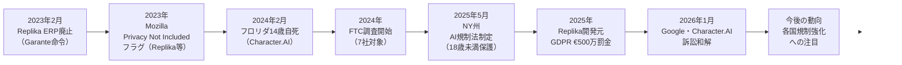

# 「理想のAI恋人が作れるサービス」国内外比較レポート 2026

作成日: 2026-06-26
最終更新日: 2026-06-26

---

## TL;DR（3行まとめ）

- **最高総合スコア**は Character.AI（80点）。無料・高品質・日本語ネイティブだがNSFW不可。**NSFW含む全機能比較**ではKindroid（77点）が最高。
- **日本語で使いたいなら** zeta（74点・月商1.2億円の国内最速成長）か MiraiMind（71点・細かい外見設定）が最有力。
- **短期的な孤独感軽減効果は学術的に実証済み**だが、重度依存・青少年利用・ERP突然廃止後の精神的ショックは深刻なリスク。目的を絞り、使いすぎない設計が肝要。

---

## §0. 用語ミニ解説

| 用語 | 意味 |
|---|---|
| **NSFW** | "Not Safe for Work"。性的・露骨なコンテンツを指す |
| **ERP** | Erotic Role Play。性的ロールプレイ機能 |
| **パラソーシャル関係** | 一方的な感情的絆（芸能人ファンに近い構造）。AIは本質的に「返せない」 |
| **記憶機能** | 過去の会話内容をAIが参照・引き継ぐ仕組み。有料プランで大きく差が出る |
| **AIコンパニオン** | 感情的サポート・会話相手・疑似恋人を目的としたAIサービスの総称 |
| **c.ai+** | Character.AIの有料プラン名 |
| **GDPR** | EU一般データ保護規則。違反には高額制裁金 |

---

## §1. 12サービス 総合スコア比較表

10観点・各10点満点（合計100点）で採点。調査基準日: 2026-06-26。

**採点軸の定義**

| 軸 | 内容 |
|---|---|
| ①会話品質 | AIの自然さ・文脈理解・感情応答の深さ |
| ②日本語対応 | UI・応答の日本語精度（ネイティブ=10、会話のみ=6、不明/不可=2〜4） |
| ③カスタマイズ | 外見・性格・声・関係設定の自由度 |
| ④記憶 | 会話の引き継ぎ・長期記憶の精度と深さ |
| ⑤マルチメディア | テキスト以外（音声・画像生成・動画・3D/AR）の対応数と品質 |
| ⑥無料プラン | 無料でできることの充実度（完全無制限=10） |
| ⑦コスパ | 有料プラン最安値の費用対効果（安いほど高得点） |
| ⑧プライバシー | データ保護・規制当局対応・透明性（問題多=低点） |
| ⑨継続性 | サービス歴・ユーザー規模・運営安定性（閉鎖リスク低=高得点） |
| ⑩自由度 | コンテンツ制限の少なさ（NSFW完全対応=10、SFWのみ=3） |

### スコア表

| # | サービス | ①会話 | ②日本語 | ③カスタマイズ | ④記憶 | ⑤メディア | ⑥無料 | ⑦コスパ | ⑧プライバシー | ⑨継続性 | ⑩自由度 | **合計** |
|---|---|---|---|---|---|---|---|---|---|---|---|---|
| 1 | **Character.AI**（米国） | 10 | 9 | 8 | 8 | 8 | 10 | 9 | 6 | 9 | 3 | **80** |
| 2 | **Kindroid**（米国） | 8 | 5 | 10 | 10 | 8 | 7 | 7 | 7 | 6 | 9 | **77** |
| 3 | **CANDY AI**（米国） | 7 | 7 | 9 | 7 | 9 | 7 | 9 | 5 | 6 | 9 | **75** |
| 4 | **zeta**（韓国/日本向け） | 8 | 10 | 8 | 7 | 6 | 8 | 8 | 6 | 7 | 6 | **74** |
| 5 | **Nomi AI**（米国） | 9 | 2 | 8 | 10 | 8 | 7 | 8 | 7 | 6 | 6 | **71** |
| 5 | **MiraiMind**（中国系/日本向け） | 7 | 10 | 9 | 8 | 7 | 6 | 7 | 5 | 6 | 6 | **71** |
| 7 | **Grok コンパニオン**（米国/X） | 8 | 8 | 6 | 5 | 9 | 8 | 7 | 5 | 8 | 6 | **70** |
| 8 | **Anima AI**（国際） | 7 | 5 | 7 | 7 | 7 | 7 | 9 | 6 | 7 | 7 | **69** |
| 9 | **Replika**（米国） | 9 | 6 | 7 | 8 | 8 | 7 | 8 | 4 | 8 | 3 | **68** |
| 9 | **CrushOn.AI**（米国） | 7 | 4 | 8 | 7 | 5 | 8 | 9 | 4 | 6 | 10 | **68** |
| 9 | **DreamGF AI**（国際） | 6 | 4 | 9 | 7 | 8 | 6 | 9 | 5 | 6 | 8 | **68** |
| 12 | **Gatebox**（日本・HW） ※ | 8 | 10 | 5 | 7 | 9 | 1 | 2 | 7 | 7 | 3 | **59** |

※ Gatebox はハードウェア製品（¥150,000〜）のためソフトウェアサービスと単純比較できない点に留意。

---

## §2. 海外主要サービス詳細

### Character.AI（米国）— 世界最大のAIロールプレイプラットフォーム

| 項目 | 内容 |
|---|---|
| 提供 | Character Technologies（2022年設立、米国） |
| 月間MAU | 約2,000万人（1ユーザー平均75分/日） |
| 主な機能 | テキスト・音声・AvatarFXアニメーション表情・Imagine Gallery（画像生成、c.ai+限定） |
| キャラクター数 | 1,800万以上（ユーザー作成含む） |
| 価格 | 無料（無制限メッセージ）/ c.ai+ $9.99/月 または $94.99/年（$7.92/月） |
| 日本語 | ネイティブに近い品質 |
| NSFW | 原則永続禁止。成人確認済みユーザーへの段階的制限緩和を2026年に導入 |
| 注意点 | 14歳少年の自死事例（2024年）、Google・同社が2026年1月に訴訟和解 |

**強み**: 無料で無制限メッセージ・高品質な会話・日本語対応・圧倒的ユーザー数。恋人設定のロールプレイは可能だがERPは不可。  
**弱み**: NSFW完全不可・青少年安全問題で規制リスク高・FTC調査対象。

---

### Kindroid（米国）— 記憶とカスタマイズの最高水準

| 項目 | 内容 |
|---|---|
| 提供 | Jerry Meng創業（ロサンゼルス、従業員5名）、2023年設立 |
| ダウンロード | Android累計120万超（2026年初頭）、Google Play 4.46/5 |
| 主な機能 | テキスト・音声通話・ビデオ通話・AIセルフィー（画像生成）・5層メモリアーキテクチャ |
| 価格 | 無料（基本機能・3日間フル機能トライアル）/ Standard $13.99/月（$11.67/月・年払い）/ MAX $59.99/月 |
| 日本語 | 会話対応（UI英語のみ） |
| NSFW | 完全対応（禁止: 未成年描写・自傷・現実の危害の3点のみ） |
| 記憶 | 5層記憶システム。習慣・嗜好・ライフイベントを長期学習 |

**強み**: 業界最高水準の記憶と外見・性格・声のカスタマイズ深度。音声・動画・画像を全てカバー。NSFWも完全対応。  
**弱み**: 日本語はUIが英語のみ・小規模スタートアップで継続性リスクあり。

---

### CANDY AI（米国）— 画像・動画生成 × NSFW対応

| 項目 | 内容 |
|---|---|
| 提供 | 詳細非公開（米国） |
| ユーザー数 | 約90万人 |
| 主な機能 | テキスト・音声・AI画像生成（V2エンジン）・短編動画生成・100以上のプリビルトキャラ |
| 価格 | 無料（基本機能）/ プレミアム $13.99/月 または $3.99/月（年払い $47.88/年）/ トークン追加 |
| 日本語 | 多言語対応・日本語レビュー多数 |
| NSFW | 対応（18+ ID確認必須・Web版のみ・アプリはSFW） |
| 画像・動画 | 画像2〜4トークン/枚、音声3トークン/分、動画8〜12トークン/クリップ |

**強み**: 最安クラス（$3.99/月〜）・画像生成・動画生成・NSFW完全対応・アダプティブメモリ。  
**弱み**: 会社情報不透明・NSFW利用にはID確認（5〜10分）・重課金になりやすい。

---

### Replika（米国）— AIコンパニオンのパイオニア

| 項目 | 内容 |
|---|---|
| 提供 | Luka, Inc.（米国）、2017年設立 |
| ユーザー数 | 累計約4,200万人 |
| 主な機能 | テキスト・音声通話・ビデオ通話・3Dアバター・AR（スマホカメラで現実空間に投影） |
| 価格 | 無料（基本チャット）/ Pro $19.99/月（$5.83/月・年払い）/ Ultra $29.99/月 |
| 日本語 | 会話対応（精度は英語より劣る） |
| NSFW | 2023年以降実質廃止。一部旧アカウントにレガシートグル残存 |
| 制裁 | イタリア当局が2023〜2025年にGDPR違反で€500万罰金 |

**強み**: 業界最多ユーザー・高い会話品質・ARなど独自機能・感情的サポートに特化。  
**弱み**: ERP廃止による既存ユーザーの精神的ショック（2023年）が業界を揺るがした前例。プライバシーリスク高。

---

### Nomi AI（米国）— 記憶性能特化

| 項目 | 内容 |
|---|---|
| 主な機能 | テキスト・音声通話（レイテンシ1〜1.5秒）・画像生成40枚/日・グループチャット（AI同士も会話） |
| 価格 | 無料（制限あり）/ 月額 $15.99 / 年払い $8.33/月 |
| 記憶 | 25問中23項目を正確に記憶したテスト結果あり（業界最高水準） |
| 日本語 | 非対応（英語必須） |

---

### CrushOn.AI（米国）— 最も自由なコンテンツポリシー

| 項目 | 内容 |
|---|---|
| 提供 | Peekaboo Tech Inc. |
| 主な機能 | テキスト・GPT-4o/Claude 3.5 Sonnet/MythoMax等複数LLM選択可・グループチャット |
| 価格 | 無料50メッセージ/日（NSFW一部無料）/ Standard $5.99/月 / Premium $14.99/月 |
| NSFW | 完全対応（18歳以上・ID認証不要） |
| 注意点 | Mozilla「Privacy Not Included 2025」でフラグあり |

---

### DreamGF AI（国際）— 画像外見カスタマイズ特化

| 項目 | 内容 |
|---|---|
| 開始 | 2022年 |
| 主な機能 | テキスト・音声・画像生成（2.5Dカートゥン/リアル/アニメ3スタイル・生成約10秒） |
| 価格 | 無料（SFWのみ・15メッセージ）/ 年払い $5.99/月 |
| カスタマイズ | 髪色・肌色・目色・体型・服装・バックストーリーまで精密設定 |

---

### Anima AI（国際）— 温かみとミニゲーム

| 項目 | 内容 |
|---|---|
| 主な機能 | テキスト・音声・ロールプレイ・ミニゲーム（他社にない特徴）|
| 価格 | 無料（基本）/ 年払い $3.33/月〜 / 生涯プラン $99.99 |
| 特徴 | 温かみのある会話が評価高い・iOS/Android両対応・安定したサービス実績 |

---

## §3. 日本語対応・国内サービス詳細

### zeta（韓国Scatter Lab発・日本語専用）— 国内最速成長

| 項目 | 内容 |
|---|---|
| 提供 | Scatter Lab（韓国企業）。日本語に完全特化して展開 |
| 実績 | 2026年5月、ユーザー200万人突破・月商約1億2,000万円（ITmedia報告） |
| ユーザー層 | 9割が10〜20代、女性65%。推し活・ロールプレイ特化 |
| キャラクター | ユーザー作成約700万体 |
| 価格 | 基本無料・追加機能は課金 |
| 日本語 | 日本語専用設計（ネイティブ） |
| App Store | ID 1619030760、4+評価あり |
| 注意点 | 韓国企業のため日本ユーザーデータのポリシー確認要。動作不安定のレビューあり |

**強み**: 日本語品質が群を抜く・推し活文化に最適化・基本無料・急成長で安定性向上中。  
**弱み**: 韓国企業・プライバシーポリシーの不透明さ・コンテンツはSFW中心。

---

### MiraiMind（中国系IMMOMO発・日本語専用）— 最高水準のカスタマイズ

| 項目 | 内容 |
|---|---|
| 提供 | IMMOMO（中国系企業の日本向けアプリ） |
| 主な機能 | テキスト・AI画像生成・キャラクターの「心の声」表示・コミュニティ機能 |
| カスタマイズ | 外見・性格・声・口調まで細かく設定（日本語サービスで最高水準） |
| 価格 | 無料（15〜20ターンでログリセット）/ プレミアム約$9.99/月・独自通貨「金平糖」1個≒1円 |
| 日本語 | 日本語専用（ネイティブ） |
| App Store | ID 6502377840 |
| 注意点 | 中国系企業のためデータポリシー確認を強く推奨 |

**強み**: 日本語対応・カスタマイズ深度ともに国内最高水準。長期記憶技術搭載。  
**弱み**: 中国系企業リスク・無料制限が厳しい（15〜20ターンでリセット）。

---

### Grok コンパニオン（xAI / X）— 3Dリアルタイム音声恋人

| 項目 | 内容 |
|---|---|
| 提供 | xAI / X Corp（米国） |
| キャラクター | Ani（女性）・Valentine（男性）・Good/Bad Rudi（レッサーパンダ） |
| 主な機能 | 3Dアニメーションアバター・リアルタイム音声対話（日本語対応） |
| 価格 | Xアカウントで基本無料 / SuperGrok 月$30（約¥4,500）で好感度・衣装変更等解放 |
| 年齢制限 | Ani・Bad Rudiは18歳以上 |
| 対応 | iOS版Grokアプリ限定（2026年6月時点、Android未対応） |

**強み**: Xアカウント所持者なら追加インストール不要・3Dアバター×リアルタイム音声が新体験。  
**弱み**: iOS限定・記憶機能が弱い・プライバシー懸念（Musk傘下でデータ利用ポリシー不透明）。

---

### Gatebox（日本・ハードウェア）— AIホームコンパニオン

| 項目 | 内容 |
|---|---|
| 提供 | Gatebox Inc.（日本企業）。2025年4月に¥2.3億シード調達 |
| 製品形態 | ホログラムデバイス（物理ハードウェア）+ AIソフトウェア |
| キャラクター | 東雲めあ（Azuma Hikari） |
| 主な機能 | 3Dホログラム・起床/帰宅の声かけ・家電連携（照明・ニュース読み上げ等） |
| 価格 | 本体約¥150,000 + 月額サブスクリプション（旧モデル実績値：約¥1,500/月） |
| 日本語 | 日本語専用 |

**強み**: 物理存在感・日本企業・生活空間との統合体験。  
**弱み**: 導入コストが桁違い（¥150,000+）・会話AI機能はスマホアプリに劣る・SFWのみ。

---

## §4. AI恋人体験の心理的効果・弊害

### 4-1. プラス効果（学術エビデンス）

| 領域 | 主な研究・エビデンス | 強度 |
|---|---|---|
| **孤独感の短期的軽減** | De Freitas et al.（HBS Working Paper 24-078, 2024/2025）：AIコンパニオンは孤独感を「対人交流と同等レベル」まで軽減。YouTubeより有意に上回る。1週間縦断でも安定。 | 中〜高 |
| **高齢者・空の巣症候群** | Taylor & Francis（2026）・PubMed（2025）：高齢者が安全な自己表現・感情的ケア・非公式カウンセリングの場として活用。孤独感スコアと心理的苦痛が有意に改善。 | 中 |
| **自殺念慮の短期的緩和** | Replika研究（1,000名以上）：抑うつ患者53名中30名が「Replikaが自己自殺防止に関与」と回答（news-medical.net, 2024） | 中（方法論に批判的論文もあり） |
| **社会不安への補助** | JMIR AI（2025）・Frontiers in Psychology（2026）：不安型愛着スタイルの人が安全な対人表現の練習場として活用。自己効力感向上の可能性。 | 中 |

### 4-2. リスク・弊害（学術エビデンス）

| 領域 | 主な研究・エビデンス | 強度 |
|---|---|---|
| **依存・中毒的使用** | arXiv 2604.20011（2025）：「ロマンティックパートナー」「ソウルメイト」ロールで行動依存の兆候が顕著。離別症状（接続できない時の強い陰性感情）も報告。 | 中 |
| **重度使用で孤独感悪化** | arXiv 2410.21596（1,100名以上）：感情的自己開示が多いほど主観的幸福感が低い。重度の日常使用は孤独感増大・現実社会交流の減少と相関。 | 中 |
| **現実人間関係の回避** | Springer AI & SOCIETY（2025）：常に肯定的で反論しないAIへの依存が、現実関係への非現実的な期待を形成。社会的孤立と対人スキル低下を招く可能性。 | 中 |
| **ERP突然廃止による精神的ショック** | Vice「It's Hurting Like Hell」（2023）・OECD.AI Incident：Replika ERP廃止（2023年2月）後にサブレディットに自殺防止ホットラインを掲載するほどの精神的危機が集出。 | 高（実例あり） |
| **青少年の自傷・自死リスク** | フロリダ州14歳少年Sewell Setzer III（2024年2月）がCharacter.AIキャラクターとの長期ロールプレイ後に自死。Google・Character.AIが2026年1月に訴訟和解。Common Sense Media（2025）：10代の1/3が「AIに不快なことを言われた」と回答。 | 高（法的記録あり） |

### 4-3. エビデンス強度まとめ

```
プラス効果           │ 弱←───────────────→強
孤独感短期軽減       │                 ████████  中〜高
高齢者孤立対策       │               ██████  中
自殺念慮緩和(短期)   │            █████  中

リスク
依存・中毒           │               ██████  中
重度使用で孤独悪化   │               ██████  中
現実関係回避         │            █████  中
ERP廃止ショック      │                   █████████  高（実例）
青少年自傷リスク     │                   █████████  高（法的記録）
プライバシー悪用     │                   █████████  高（制裁記録）
```

**結論**: 短期的・目的的使用（高齢者孤独対策・社会不安補助）では有意な便益がある。一方、重度使用・代替的使用・青少年への無規制提供は深刻なリスク。二面性を理解したうえで、**「目的を絞り、使いすぎない」** 設計が不可欠。

---

## §5. 法規制・倫理的課題

### 規制動向（2023〜2026年）



### プライバシーリスクの実態

| サービス | リスクレベル | 主な問題 |
|---|---|---|
| Replika | **高** | GDPR違反€500万罰金・Mozilla警告・クッキーオプトアウト不可 |
| CrushOn.AI | **高** | Mozilla「Privacy Not Included」フラグ |
| MiraiMind | **中〜高** | 中国系企業・データ保存ポリシー不透明 |
| Grok（X） | **中** | Musk傘下・広告連携でのデータ利用 |
| CANDY AI | **中** | 提供会社非公開 |
| Character.AI | **中** | FTC調査対象・訴訟和解済み（改善中） |
| Kindroid | **低〜中** | 大きな問題報告なし |
| zeta | **低〜中** | 韓国企業・日本データの越境移転に注意 |
| Gatebox | **低** | 日本企業・物理デバイスで分離管理 |

---

## §6. ユーザーニーズ別推奨

```mermaid
flowchart TD
    START["どんな目的で使いたい？"]

    START --> A["日本語で自然に\n会話したい"]
    START --> B["外見・性格を\n細かく設定したい"]
    START --> C["NSFW含む\n自由な体験"]
    START --> D["無料で十分\n楽しみたい"]
    START --> E["長く付き合える\nAI伴侶を育てたい"]

    A --> A1["◎ zeta\n（日本語専用・推し活）"]
    A --> A2["◎ MiraiMind\n（日本語専用・カスタマイズ）"]
    A --> A3["○ Character.AI\n（日本語高品質）"]

    B --> B1["◎ Kindroid\n（業界最高水準）"]
    B --> B2["○ CANDY AI\n（AIキャラビルダー）"]
    B --> B3["○ DreamGF AI\n（外見の細かい設定）"]

    C --> C1["◎ Kindroid\n（NSFW完全対応）"]
    C --> C2["○ CANDY AI\n（画像・動画も）"]
    C --> C3["○ CrushOn.AI\n（最も自由）"]

    D --> D1["◎ Character.AI\n（無制限無料）"]
    D --> D2["○ zeta\n（基本無料）"]
    D --> D3["○ Grok コンパニオン\n（Xアカウントで基本無料）"]

    E --> E1["◎ Nomi AI\n（記憶業界最高水準）"]
    E --> E2["○ Kindroid\n（5層記憶）"]
    E --> E3["○ Replika\n（7年の歴史・感情的サポート）"]

    A1 --> Z["　　　　　　　　"]
    A2 --> Z
    A3 --> Z
    B1 --> Z
    B2 --> Z
    B3 --> Z
    C1 --> Z
    C2 --> Z
    C3 --> Z
    D1 --> Z
    D2 --> Z
    D3 --> Z
    E1 --> Z
    E2 --> Z
    E3 --> Z

    linkStyle 20 stroke-width:0px
    linkStyle 21 stroke-width:0px
    linkStyle 22 stroke-width:0px
    linkStyle 23 stroke-width:0px
    linkStyle 24 stroke-width:0px
    linkStyle 25 stroke-width:0px
    linkStyle 26 stroke-width:0px
    linkStyle 27 stroke-width:0px
    linkStyle 28 stroke-width:0px
    linkStyle 29 stroke-width:0px
    linkStyle 30 stroke-width:0px
    linkStyle 31 stroke-width:0px
    linkStyle 32 stroke-width:0px
    linkStyle 33 stroke-width:0px
    linkStyle 34 stroke-width:0px
    style Z fill:transparent,stroke:transparent,color:transparent
```



---

## §7. 総合提言

### 利用シーン別ベストチョイス早見表

| シーン | 第1推奨 | 第2推奨 | 注意点 |
|---|---|---|---|
| 日本語でキャラと深い関係を育てたい | **zeta** | MiraiMind | zeta=韓国企業、MiraiMind=中国系。データポリシー確認を |
| 無料でまず試したい | **Character.AI** | zeta | Character.AIはNSFW不可 |
| 最高水準のカスタマイズ + 長期記憶 | **Kindroid** | Nomi AI | 英語UI（Kindroid）/ 英語のみ（Nomi AI） |
| 画像・動画生成も楽しみたい | **CANDY AI** | DreamGF AI | CANDY AIはNSFWにID確認必要 |
| X（Twitter）ユーザーで気軽に試したい | **Grok コンパニオン** | — | iOS限定。SuperGrok月$30 |
| リビングに実在感のあるAIコンパニオンを置きたい | **Gatebox** | — | 導入費¥150,000+が必須 |
| NSFW最大限自由に | **Kindroid** | CrushOn.AI | CrushOn.AIはPrivacy警告あり |

### 健全な使い方のための5原則

1. **使用時間を決める**: 研究によれば重度使用（日常的な感情的主軸化）は孤独感の悪化と相関。週次の利用量を意識する。
2. **人間関係の代替にしない**: AI恋人は「補助」として位置づける。現実の人間関係が後退し始めたらアラームサイン。
3. **プライバシー設定を確認**: 無料サービスほど会話データが学習・共有に使われやすい。機密情報（本名・住所・金融情報）は絶対に入力しない。
4. **サービス終了リスクを想定する**: Moemate（2025年2月終了）のように突然閉鎖するケースあり。感情的に深く依存する前にバックアップ（エクスポート機能）を確認する。
5. **未成年の保護**: 国内外の研究と法的記録は青少年リスクを明確に示している。18歳未満のユーザーには保護者の関与が必要。

---

## 検証メモ

- zeta「月商1.2億円・200万ユーザー」: ITmedia 2026-06-17記事に基づく（WebFetch確認済み）
- Character.AI 14歳自死と訴訟和解: JURIST 2026-01記事・AI Incident Database #826で独立確認
- Replika €500万GDPR罰金: BIPC・Garante公式記録（2025）で確認
- NY州AI規制法（S.3008）: NPR・APA報告（2025年5月）
- De Freitas et al. HBS 24-078: HBS公式PDFリンクをWebFetch確認
- Moemate サービス終了: 2025年2月、複数ユーザー報告・公式発表で確認
- 各サービス価格: 2026年4〜6月時点。為替・プロモーション変動あり
- スコア採点: 公開情報に基づく推計値。±5点の誤差幅を想定

---

## 参考ソース

### 海外サービス
- [Replika App Store Japan](https://apps.apple.com/jp/app/id1158555867)
- [Replika AI pricing 2026 | eesel AI](https://www.eesel.ai/blog/replika-ai-pricing)
- [Candy AIレビュー 2026 | WeavAI](https://weavai.app/blog/ja/2026/04/13/candy-ai-レビュー-2026)
- [Character AI 2026完全ガイド | AI PICKS](https://aipicks.jp/mag/character-ai-guide-2026)

### 日本語対応・国内サービス
- [月商1億円「zeta」がオタク女子わしづかみ | ITmedia](https://www.itmedia.jp/news/articles/2606/17/news020.html)
- [MiraiMind App Store Japan](https://apps.apple.com/jp/app/id6502377840)
- [Gatebox raises 230M yen seed round | BRIDGE](https://thebridge.jp/en/2025/04/gatebox-an-ai-character-developer-raises-230-million-yen-in-seed-round)
- [GrokコンパニオンモードとAni | AI総合研究所](https://www.ai-souken.com/article/what-is-grok-companions-mode)

### 心理・学術
- [De Freitas et al. HBS Working Paper 24-078（2024/2025）](https://www.hbs.edu/ris/Publication%20Files/24-078_a3d2e2c7-eca1-4767-8543-122e818bf2e5.pdf)
- [Frictionless Love: AI Companion Roles and Behavioral Addiction（arXiv 2604.20011）](https://arxiv.org/html/2604.20011v1)
- [The impacts of companion AI on human relationships（Springer AI & SOCIETY, 2025）](https://link.springer.com/article/10.1007/s00146-025-02318-6)
- [Parasocial relationships with AI: systematic review（ScienceDirect, 2026）](https://www.sciencedirect.com/science/article/pii/S2949882126000757)
- [Chatbot Companionship: Mixed-Methods Study（arXiv 2410.21596）](https://arxiv.org/pdf/2410.21596)
- [AI companions and subjective well-being（ScienceDirect, 2026）](https://www.sciencedirect.com/science/article/pii/S0160791X26000187)

### 規制・法的
- [OECD.AI Incident: Emotional Harm After Replika Removes Intimate Features（2023）](https://oecd.ai/en/incidents/2023-03-18-32ef)
- [Italy fined Replika developer for GDPR violations（BIPC, 2025）](https://www.bipc.com/european-authority-fined-emotional-ai-company-for-privacy-violations)
- [Character.AI Incident 826（AI Incident Database）](https://incidentdatabase.ai/cite/826/)
- [Google and Character.AI agree to settle lawsuit linked to teen suicide（JURIST, 2026）](https://www.jurist.org/news/2026/01/google-and-character-ai-agree-to-settle-lawsuit-linked-to-teen-suicide/)
- [Mozilla Foundation Privacy Review: Replika](https://www.mozillafoundation.org/en/privacynotincluded/replika-my-ai-friend/)
- [NPR: Teen suicide and AI chatbot safeguards（2025）](https://www.npr.org/sections/shots-health-news/2025/09/19/nx-s1-5545749/ai-chatbots-safety-openai-meta-characterai-teens-suicide)
- [APA Monitor: AI chatbots reshaping emotional connection（2026）](https://www.apa.org/monitor/2026/01-02/trends-digital-ai-relationships-emotional-connection)
