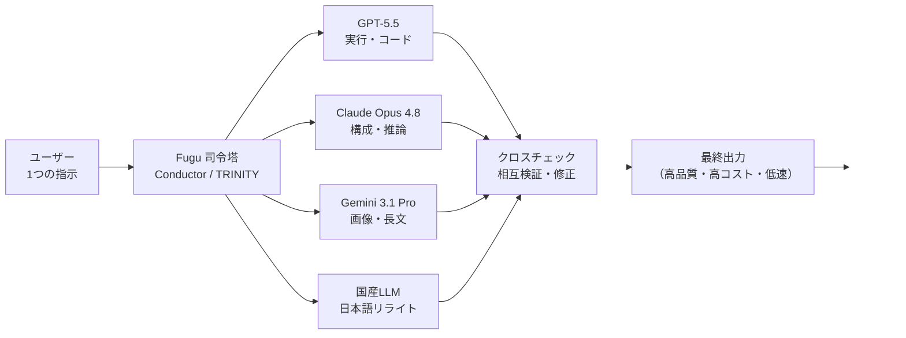

# Sakana Fugu vs VS Code Claude Code（Fable）— 性能・コスト徹底比較レポート

作成日: 2026-06-26
最終更新日: 2026-06-26

> **目的**: 日本発の AI オーケストレーションサービス『Sakana Fugu（サカナ フグ）』を調査し、「**Fable 並みの問題解決能力**」を出すための初期コスト／ランニングコストを明らかにする。すでに **Claude Max プラン（$100/月）** を契約している前提で、追加でいくら発生するのかを検証する。
>
> **結論先出し（TL;DR）**
> 1. **Fable 5 は 2026-06-12 から米国輸出規制で全世界停止中**。よって「VS Code で今すぐ Fable を使う」こと自体が現時点では不可能。停止中の事実上の最高性能は **Opus 4.8**。
> 2. Sakana Fugu Ultra は**ベンチマーク上は多項目で Fable に肉薄〜凌駕**するが、**実開発のバグ修正は Fable が圧勝**、かつ**コストが従量課金で暴走**（実機検証で4時間≒4万円／処理待ち最大34分）。
> 3. **Max $100/月にすでに加入済み**なら、**Fable 並みを狙う最安・最確実な追加コストは「ほぼ 0 円」（Opus 4.8 を Max 枠内で使う）**。Fugu でそれを代替しようとすると**月数万〜十数万円規模の従量課金**が新たに乗る。
> 4. 総合スコア（12観点・100点満点換算）: **VS Code + Claude Code（Fable/Opus 4.8）＝ 87.1 点** ＞ **Sakana Fugu Ultra 最大稼働 ＝ 72.6 点**。Fugu が勝つのは**日本語品質・データ主権**の2点に集中する。

---

## 0. 用語ミニ解説（先に押さえる5語）

| 用語 | 平たく言うと |
|---|---|
| **AIオーケストレーション** | 複数のAI（GPT・Claude・Gemini等）を1つの司令塔が自動で使い分け・分業させる仕組み。Fugu の本体機能。 |
| **ルーター / ルーティング** | 「この仕事はClaude、この計算はGPT」と振り分ける交通整理。Fugu の "Conductor / TRINITY" がこれを担う。 |
| **クロスチェック（相互検証）** | 複数AIの答えを突き合わせて誤りを直してから返す検品工程。Fugu が時間とトークンを大量に食う主因。 |
| **従量課金（Pay-as-you-go）** | 使ったトークン量だけ後払い。Fugu は複数AI同時稼働で消費が跳ね上がる。 |
| **Usage-based Fallback** | サブスク枠を使い切ったら自動で従量課金に切り替わる機能。**オフにしないと青天井**。 |

---

## 1. Sakana Fugu とは何か

**Sakana AI**（東京都港区麻布台ヒルズ・David Ha ら設立）が **2026-06-22 に正式リリース**した AI オーケストレーションサービス。コンセプトは **"One Model to Command Them All"**（1つのモデルで全モデルを統率する）。

### 仕組み（KEITO 氏検証動画＋公式情報の統合）

ユーザーが**1つの OpenAI 互換 API** にプロンプトを投げると、裏側で **GPT・Claude・Gemini** という世界三大 LLM ＋ **Sakana AI 独自の国産 LLM** が同時起動。Fugu がその場で役割分担を決める（例：Claude が構成、Codex がコード実行、Gemini が画像認識）。各 AI の回答を Fugu が**クロスチェックして誤りを修正**してから最終出力を返すため、品質が上がる代わりに**時間とコストを大量消費**する。

### 技術基盤（ICLR 2026 の2論文）

| 手法 | 概要 |
|---|---|
| **TRINITY** | 約0.6Bの軽量コーディネーター。CMA-ES（進化戦略）で最適化。各ワーカーに Thinker / Worker / Verifier を動的割当。 |
| **Conductor** | 約7B。強化学習（GRPO）で訓練。自然言語ベースの協調戦略を自律発見し、最大5ステップのパイプラインを構成。 |

### ポジショニング

2026-06-12 発動の**米国の対日 AI 輸出規制**（Anthropic の Fable 5・Mythos が米国外で利用不可に）を受けて、「**規制に依存しないフロンティア級性能**」として、X で2000万インプレッションの注目を集めた。

---

## 2. ベンチマーク：Fugu Ultra は Fable に肉薄、ただし実開発は Fable 圧勝

下表はすべて**ベンダー（Sakana AI / Anthropic）自社発表値**。第三者の独立再現は 2026-06-26 時点で未確認。

| ベンチマーク | Fugu Ultra | Claude Fable 5 | 判定 |
|---|---|---|---|
| LiveCodeBench v6（コードを書く力） | **93.2** | 89.8 | Fugu 勝利 |
| GPQA-Diamond（理系推論） | **95.5%** | 94.3%（最良比較） | Fugu 僅差勝利 |
| 図・グラフ読解推論 | Fugu 僅差勝利 | — | Fugu 僅差勝利 |
| Terminal Bench 2.1（端末操作） | **82.1%** | 78.2%（最良比較） | Fugu 勝利 |
| **SWE-Bench Pro（実ソフト開発・バグ修正）** | 73.7% | **80.3%** | **Fable 圧勝** |

> **KEITO 氏の実機所感**: ベンチでは Fugu が多項目で勝つが、「**泥臭いバグの発見と修正**」では、最初からデバッグ特化で調整された **Claude Fable が他を寄せ付けない**。ゲーム制作・トレンドゲームのクローンでは Fugu が「**後ろ向きにしか進まないクソゲー**」を量産した。一方、タスクが明確でシンプルな実用 Web アプリ（お小遣い帳印刷アプリ）は一発で完璧に完成。

**含意**: 「Fable 並みの問題解決能力」をユーザーが**実際のソフトウェア開発・バグ修正**で求めるなら、ベンチの数字に反して **Fable（停止中なら Opus 4.8）優位**。Fugu の真価は別の場所（後述の日本語）にある。

---

## 3. 【最重要】Fable 5 は現在停止中という前提崩壊

ユーザーの要件は「VS Code で Fable を使う場合と比べ…」だが、**その Fable が今は使えない**。

| 項目 | 内容 |
|---|---|
| 停止指令受領 | 2026-06-12 17:21 ET |
| 停止理由 | Fable 5 のジェイルブレイク手法発見に伴うサイバーセキュリティ輸出規制懸念 |
| 対象 | 全ユーザー（国籍・Anthropic従業員問わず全世界） |
| Anthropic の立場 | 停止に**反対**。「既知の軽微な脆弱性でリコール理由にならない」と声明 |
| 復旧見通し | 「できる限り早急に」のみ。**具体日程未定**（2026-06-26 時点で停止継続） |
| 影響を受けないモデル | **Opus 4.8 / Sonnet 4.6 / Haiku 4.5 は通常利用可** |

出典: [Anthropic公式声明](https://www.anthropic.com/news/fable-mythos-access) / [Fortune報道](https://fortune.com/2026/06/13/anthropic-disables-fable-mythos-export-controls-national-security-threat/) / [復旧チェッカー isfable5back.com](https://isfable5back.com/)

> **したがって本レポートでは「Fable」を 2 通りで扱う**:
> - **A-1**: Fable 5 が**復旧した場合**の理想ケース
> - **A-2**: 復旧までの**現実的代替＝ Opus 4.8**（VS Code Claude Code の現行最高性能）

---

## 4. ユーザー要件への直接回答

### 要件1(a)：VS Code の Claude Code 拡張機能で Fable 並みが実現できるか？

| 状況 | 回答 |
|---|---|
| **Fable 5 復旧後** | **YES**。`anthropic.claude-code` 拡張（200万DL超）で `/model fable` を選べば、VS Code 上でネイティブに Fable 5 を駆動できる。インラインdiff・@メンション・MCP・サブエージェント等のエージェント機能をフル装備。 |
| **現在（停止中）** | **Fable そのものは不可**。ただし **Opus 4.8（`/model opus`）が事実上の最高性能**として即利用可能。SWE-Bench Pro 69.2% と、実開発では Fugu Ultra（73.7%）に肉薄しつつ、**応答速度・コスト効率・IDE統合で圧倒**。 |

### 要件1(b)：拡張機能で不可でも、AIエージェント機能とともに Fable 並みを出せるか？

**出せる。むしろこれが現実解。** Claude Code は単なるモデル呼び出しではなく、**Skills / Subagents / Hooks / MCP / 自動コンテキスト圧縮**を備えた成熟したエージェント基盤。Fable 5 停止中でも、**Opus 4.8 ＋ サブエージェント並列**という構成（本レポート自体がその方式で作成）で、Fable 級の複雑タスク遂行能力を**追加コストほぼ 0 円**で実現できる。

Sakana Fugu は「Fable 並み」の**別ルート**として成立するが、後述の通り**コストと速度のペナルティが極めて大きい**。

---

## 5. 【本題】コスト試算 — Max $100/月にいくら上乗せされるか

前提：ユーザーは **Claude Max 5x（$100/月）に加入済み**。これは Claude Code を**追加費用なし**で含む（VS Code 拡張のインストールも無料）。

### 選択肢A：VS Code + Claude Code（Fable / Opus 4.8）

| 費目 | 金額 | 備考 |
|---|---|---|
| 初期コスト | **0 円** | 拡張機能無料・既存 Max に含まれる |
| ランニング（停止中＝Opus 4.8） | **+0 円** | Max 枠内。`ANTHROPIC_API_KEY` を設定しなければ従量課金は一切発生しない |
| ランニング（Fable 5 復旧後） | **+0 円〜（条件付き）** | 復旧後は Usage Credits 方式（$10/$50 per MTok）に移行見込み。ただし Max 枠内消費で収まる範囲なら追加 0 円。重い使い方をした分のみ従量加算 |

> **結論A**: **すでに Max $100/月なら、Fable 並みを狙う追加コストは実質 0 円**（停止中は Opus 4.8、復旧後も枠内なら 0 円）。

### 選択肢B：Sakana Fugu Ultra を最大限エージェント的に使う

Fugu の料金は OpenAI 互換 API。「最高精度＝Fugu Ultra」「最もエージェント的＝複数エージェント同時稼働＋従量課金」を選ぶと、**Max とは別建ての新規費用**が発生する。

**サブスク追加（Fugu 側）**

| プラン | 月額 | 位置づけ |
|---|---|---|
| Standard | $20 | 軽い日常利用 |
| Pro | $100 | 定期的コーディング |
| Max | $200 | ヘビーユーザー |

**従量課金（Fugu Ultra 単価）**

| 区分 | 入力 | 出力 | キャッシュ入力 |
|---|---|---|---|
| 標準（〜272K） | $5 / MTok | $30 / MTok | $0.5 / MTok |
| 大コンテキスト（272K超） | $10 / MTok | $45 / MTok | $1.0 / MTok |

> **複数エージェント同時稼働時は「関与する最上位モデルの単価ベースで全トークンが計算される」**ため、消費が跳ね上がる（KEITO 氏検証）。

**KEITO 氏の実機コスト実測（最も生々しい現実）**

| 実測項目 | 数値 |
|---|---|
| $20プランで資料1作成（修正2回） | 5時間枠の **45%** を瞬時に消費 |
| 高負荷タスク並行・約4時間（実質2日） | 従量課金だけで **251ドル（約4万円）** が溶解 |
| サブスク等込みの総消費 | **約8万円** |
| 1プロンプトの最大処理待ち | **34分** |

> **結論B**: **Max $100/月（Claude側）はそのまま残しつつ、Fugu 側に新たに月 $20〜200 のサブスク＋従量課金が乗る**。KEITO 氏のような重い使い方では**従量だけで月数万〜十数万円規模**に達しうる。「Fable 並み」を Fugu で代替する初期/ランニングコストは、**選択肢Aの「ほぼ0円」と比べ桁違いに高い**。

### コスト早見（Max $100/月 加入済みからの**追加**支出）

| 用途 | 選択肢A（Claude Code）| 選択肢B（Sakana Fugu Ultra）|
|---|---|---|
| 初期コスト | **0 円** | プラン加入 $20〜200/月 or カード登録 |
| 軽い利用/月 | 0 円（枠内） | $20プランでも枠を即消費しがち |
| 重い利用/月（KEITO級） | 0〜数千円（Fable復旧後の超過分のみ） | **従量で数万〜十数万円** |
| コストの予測可能性 | 高（定額＋明示警告） | **低（ルーティング不透明・青天井リスク）** |

---

## 6. 【中核】100点満点スコア比較表（12観点）

- **A**：VS Code + Claude Code 拡張機能で **Fable 5（復旧時）／Opus 4.8（現状）** を使う、最もエージェント的な構成
- **B**：**Sakana Fugu Ultra**（最高精度）を**従量課金で複数エージェント同時稼働**させる、最もエージェント的な構成

| # | 観点 | A: VS Code + Claude Code | B: Sakana Fugu Ultra | 寸評 |
|---|---|---:|---:|---|
| 1 | 実ソフト開発・バグ修正力 | **96** | 78 | SWE-Bench Pro と実機検証の両方で Fable/Claude が優位 |
| 2 | コーディングベンチ総合 | 92 | 85 | LCV/Terminal は Fugu 勝ち、SWE-Bench Pro は Fable 勝ち |
| 3 | 日本語品質 | 80 | **97** | Fugu 最大の武器。「Claude が比にならないほど上手い」(KEITO) |
| 4 | AIエージェント機能（自律性・ツール連携） | **93** | 88 | Claude Code は Skills/Subagent/MCP/Hooks が成熟 |
| 5 | 応答速度・レイテンシ | **88** | 45 | Fugu は1プロンプト最大34分。クロスチェックの代償 |
| 6 | コスト効率・透明性 | **82** | 38 | Fugu は4時間4万円・ルーティング不透明・青天井リスク |
| 7 | IDE統合（VS Code） | **95** | 70 | Claude Code はネイティブ拡張。Fugu は API/Codex経由 |
| 8 | ワークフロー・スキル活用 | **94** | 65 | Claude のエコシステムが圧倒的に成熟 |
| 9 | コンテキスト管理 | **88** | 75 | 自動圧縮 vs 272K（超過で課金倍） |
| 10 | データ主権・オプトアウト | 85 | **90** | Fugu は1クリックopt-out・国産で安心。Claude も ZDR 可 |
| 11 | 安定性・規制リスク | 60 | **80** | **Fable は輸出規制で停止中＝最大の弱点**。Fugu は規制非依存が売り |
| 12 | エコシステム・学習リソース | **92** | 60 | Claude は情報膨大、Fugu は新興で情報少 |
| | **合計（/1200）** | **1045** | **871** | |
| | **100点換算（平均）** | **87.1** | **72.6** | |

### スコアの読み解き

- **A が勝つ領域**: 実開発力・エージェント成熟度・IDE統合・速度・**コスト効率**・学習リソース。「**コードを書いて直す仕事**」と「**財布の安全**」では Claude Code が明確に上。
- **B が勝つ領域**: **日本語品質**・**データ主権**・**規制耐性**の3点に集中。「**手直し不要の美しい日本語ビジネス文書**」を量産する用途では Fugu が圧倒的。
- **意外な逆転**: 観点11（規制リスク）だけは **A が60点と低い**。Fable 5 が停止中である事実が、本来の王者の足を引っ張っている。

---

## 7. 総合提言

### ユーザーの状況（Max $100/月 加入済み）への最適解

1. **「Fable 並みの問題解決能力」をコーディング/開発で求めるなら → 選択肢A、追加コスト 0 円が最善。**
   - 停止中は **`/model opus`（Opus 4.8）** を使う。Fable 5 復旧後は `/model fable` に戻すだけ。
   - Claude Code の **サブエージェント並列＋Skills** で、単一モデル以上の問題解決力を引き出せる。

2. **Sakana Fugu に課金する価値があるのは「日本語の品格が売上に直結する業務」に限る。**
   - 社外メール・ビジネス資料・ブログ・LP コピーなど。**開発のメイン軸にするのはコスト・速度面で非推奨**（KEITO 総評「Fable 並みにトークンをゴリゴリ使って待たされる Codex」）。
   - 導入するなら **Usage-based Fallback を必ずオフ**、**Fugu Custom Model Pool で上位モデルを絞る**ことが財布防衛の必須テク。

3. **コスト対効果の現実**: Max $100/月で Fable 級の開発力が「追加 0 円」で得られる以上、**同じ目的のために Fugu へ月数万円を新たに払う合理性は薄い**。Fugu は「**日本語特化のサブ武器**」として、用途を絞って併用するのが賢い。

### 一言サマリ

> **「Fable 並みの開発力」は、すでに払っている Max $100/月の中に Opus 4.8 として眠っている。Sakana Fugu は財布を溶かす日本語名人——開発の主役ではなく、文章の仕上げ職人として呼べ。**

---

## 検証メモ

- ベンチマーク数値は **Sakana AI / Anthropic のベンダー発表値**であり、第三者独立再現は 2026-06-26 時点で未確認。
- 実機コスト・体感は **KEITO 氏（KEITO【AI&WEB ch】）の検証動画**（2026-06、8万円課金・4時間検証）に基づく一次的実機証言。商用ベンチではない点に留意。
- Fable 5 の停止・復旧状況は流動的。最新は [isfable5back.com](https://isfable5back.com/) と [Anthropic公式](https://www.anthropic.com/news/fable-mythos-access) で要確認。
- スコアは本レポートの評価枠組み（12観点・各100点）による相対評価であり、用途により重み付けは変わる。

---

## 参考ソース

**Sakana Fugu（公式・一次）**
- [Sakana Fugu 公式ページ](https://sakana.ai/fugu/)
- [Sakana Fugu リリースブログ "One Model to Command Them All"](https://sakana.ai/fugu-release/)
- [Sakana Fugu Technical Report（arxiv 2606.21228v1）](https://arxiv.org/html/2606.21228v1)
- [console.sakana.ai/pricing（料金）](https://console.sakana.ai/pricing)

**Sakana Fugu（実機検証・報道）**
- KEITO【AI&WEB ch】「Claude Fable級！？国産AI『Sakana Fugu』を解説【8万円分課金して徹底検証】」[YouTube](http://www.youtube.com/watch?v=zlU74QG2ASE)
- [VentureBeat: How Sakana trained a 7B model to orchestrate GPT, Claude and Gemini](https://venturebeat.com/orchestration/how-sakana-trained-a-7b-model-to-orchestrate-gpt-5-claude-sonnet-4-and-gemini-2-5-pro)
- [The Decoder: Sakana AI's Fugu orchestrates multiple LLMs](https://the-decoder.com/sakana-ais-fugu-orchestrates-multiple-llms-to-match-anthropics-fable-and-mythos-benchmarks/)
- [DataCamp: Sakana Fugu Features, Benchmarks, and How It Works](https://www.datacamp.com/blog/sakana-fugu)
- [gihyo.jp: Sakana AI、Sakana Fugu の正式提供開始](https://gihyo.jp/article/2026/06/sakana-fugu)

**Claude Fable / Claude Code / 料金（一次）**
- [Anthropic公式: Fable 5・Mythos アクセス停止声明](https://www.anthropic.com/news/fable-mythos-access)
- [Claude 公式料金ページ](https://claude.com/pricing)
- [Claude Code VS Code ドキュメント](https://code.claude.com/docs/en/vs-code)
- [Claude Code モデル設定ドキュメント](https://code.claude.com/docs/en/model-config)
- [Max プランとは（サポート）](https://support.claude.com/en/articles/11049741-what-is-the-max-plan)
- [Fable 5 復旧状況チェッカー](https://isfable5back.com/)
- [Vellum.ai: Fable 5 ベンチマーク詳細](https://www.vellum.ai/blog/claude-fable-5-and-mythos-5-benchmarks-explained)
