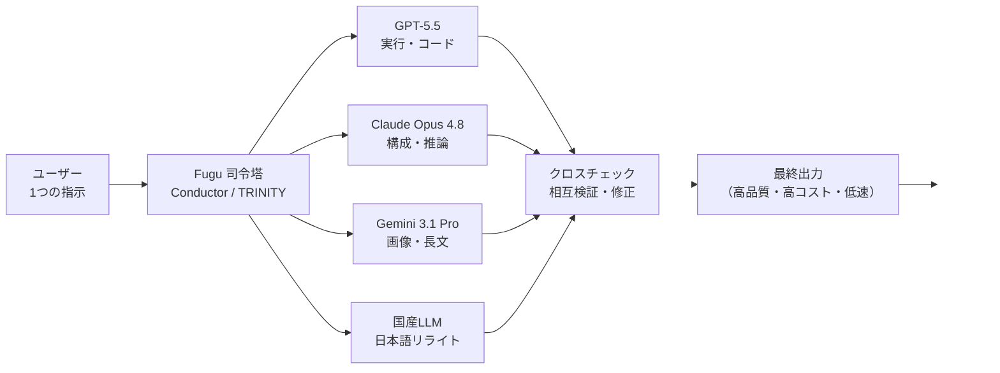

# Sakana Fugu vs VS Code Claude Code（Fable）— 性能・コスト徹底比較レポート

作成日: 2026-06-26
最終更新日: 2026-06-26

> **目的**: 日本発の AI オーケストレーションサービス『Sakana Fugu（サカナ フグ）』を調査し、「**Fable 並みの問題解決能力**」を出すための初期コスト／ランニングコストを明らかにする。すでに **Claude Max プラン（$100/月）** を契約している前提で、追加でいくら発生するのかを検証する。
>
> **⚠️ 結論先出し（TL;DR）**
> 1. **Fable 5 は 2026-06-12 から米国輸出規制で全世界停止中**（復旧日程未定）。「VS Code で今すぐ Fable を使う」こと自体が現時点では不可能。停止中の事実上の最高性能は **Opus 4.8**。
> 2. Sakana Fugu Ultra はベンチマーク上で多くの項目に勝るが、**実際のソフトウェア開発・バグ修正は Fable が優位**。かつ**コストが従量課金で暴走**（実機検証で4時間≒4万円／処理待ち最大34分）。
> 3. **Max $100/月にすでに加入済み**なら、**Fable 並みを狙う追加コストは「ほぼ 0 円」（Opus 4.8 を Max 枠内で使う）**。Fugu でそれを代替しようとすると**月数万〜十数万円規模の従量課金**が新たに乗る。
> 4. 総合スコア（12観点）: **VS Code + Claude Code ＝ 復旧後 87.1 点 / 現状(Opus 4.8) 79.3 点** ＞ **Sakana Fugu Ultra ＝ 72.6 点**。Fugu が勝つのは**日本語品質・データ主権・規制耐性**の3点のみ。
> 5. **⚠️ コスト罠**: 環境変数 `ANTHROPIC_API_KEY` が設定済みの場合、Max プランの枠を飛び越えて直接 API 課金が発生する（実被害 $152〜$1,800+ の事例あり）。

---

## 0. 用語ミニ解説（先に押さえる7語）

| 用語 | 平たく言うと |
|---|---|
| **AIオーケストレーション** | 複数のAI（GPT・Claude・Gemini等）を1つの司令塔が自動で使い分け・分業させる仕組み。Fugu の本体機能。 |
| **ルーター / ルーティング** | 「この仕事はClaude、この計算はGPT」と振り分ける交通整理。Fugu の "Conductor / TRINITY" がこれを担う。 |
| **クロスチェック（相互検証）** | 複数AIの答えを突き合わせて誤りを直してから返す検品工程。Fugu が時間とトークンを大量に食う主因。 |
| **従量課金（Pay-as-you-go）** | 使ったトークン量だけ後払い。Fugu は複数AI同時稼働で消費が跳ね上がる。 |
| **Usage-based Fallback** | サブスク枠を使い切ったら自動で従量課金に切り替わる機能。**オフにしないと青天井**。 |
| **TRINITY / Conductor** | Fugu 内部の2種類のコーディネーター役 AI。TRINITY（0.6B・軽量・高速）と Conductor（7B・高精度）が用途に応じて使い分けられる。 |
| **SWE-Bench Pro** | 「実際のソフトウェア開発における自動バグ修正・コード修正力」を測る業界標準ベンチマーク。数値が高いほど現場での開発タスクに強い。 |

---

## 1. Sakana Fugu とは何か

**Sakana AI**（東京都港区麻布台ヒルズ・David Ha ら設立）が **2026-06-22 に正式リリース**した AI オーケストレーションサービス。コンセプトは **"One Model to Command Them All"**（1つのモデルで全モデルを統率する）。

### 仕組み（KEITO 氏検証動画＋公式情報の統合）

ユーザーが**1つの OpenAI 互換 API** にプロンプトを投げると、裏側で **GPT・Claude・Gemini** という世界三大 LLM ＋ **Sakana AI 独自の国産 LLM** が動的に呼び出される。Fugu がその場でタスクに応じた役割分担を決める（例：Claude が構成、Codex がコード実行、Gemini が画像認識）。各 AI の回答を Fugu が**クロスチェックして誤りを修正**してから最終出力を返すため、品質が上がる代わりに**時間とコストを大量消費**する。



### 技術基盤（ICLR 2026 の2論文）

| 手法 | 規模 | 概要 |
|---|---|---|
| **TRINITY** | 約0.6B（軽量） | 進化的最適化アルゴリズムで訓練。各ワーカーに Thinker（思考役）/ Worker（実行役）/ Verifier（検証役）を動的割当。高速処理向き。 |
| **Conductor** | 約7B（高精度） | 強化学習で訓練。自然言語ベースの協調戦略を自律発見し、最大5ステップのマルチエージェントパイプラインを構成。複雑タスク向き。 |

### ポジショニング・背景

2026-06-12 発動の**米国の対日 AI 輸出規制**（Anthropic の Fable 5・Mythos が米国外で利用不可に）を受けて、「**規制に依存しないフロンティア級性能**」として X で2000万インプレッションの注目を集めた。

---

## 2. ベンチマーク比較

> ⚠️ **注意**: 下記の Fable 5 との比較は将来の参照用。**Fable 5 は現在停止中**（→ §3 で詳細）。現時点での Fable 代替は **Opus 4.8**。

すべて**ベンダー自社発表値**（独立第三者再現は 2026-06-26 時点で未実施）。**⚠️ 重要な制約: Sakana AI の公式技術論文は Fable 5・Mythos を「非公開APIのため比較対象外」として除外している。Fugu と Fable の直接比較は Sakana 側では行われていない。**

| ベンチマーク | 測定内容 | Fugu Ultra | Claude Fable 5 | 最良の公開比較対象 | 判定 |
|---|---|---|---|---|---|
| LiveCodeBench v6 | コードを書く・読む総合力 | **92.0**（Sakana公式論文値） | 89.8（※1） | Claude Opus 4.8: 84.4 | Fugu 優位（Fable比較は間接値） |
| GPQA-Diamond | 難関理系推論（博士級） | **95.5%** | ―（Sakana論文に未掲載） | **Gemini 3.1: 94.3%** | Fugu 優位（公開モデル中） |
| CharXiv Reasoning（図表読解） | マルチモーダル推論 | **86.6** | ―（Sakana論文に未掲載） | Claude Opus 4.8: 84.2 | Fugu 優位（Fable比較は不可能） |
| Terminal Bench 2.1 | 端末操作・システム制御 | **82.1%** | ―（Sakana論文に未掲載） | 78.2%（最良比較） | Fugu 優位（公開モデル中） |
| **SWE-Bench Pro** | **実ソフト開発・バグ修正** | 73.7%（自社申告） | **80.3%**（自社申告） | — | **Fable 優位**（※2） |

※1 Fable 5 の LiveCodeBench 89.8 は複数の第三者サイトが Anthropic 公式発表由来として報告。Anthropic 公式ページは画像形式のため直接確認困難。  
※2 SWE-Bench Pro の評価条件が異なる（Sakana 独自ハーネス vs Anthropic 独自スキャフォールド）ため、中立条件での差は未確認。数値上は Fable が 6.6pt 上回る。

> **KEITO 氏の実機所感**: ベンチ数値では Fugu が多くの公開モデルを上回るが、「**泥臭いバグの発見と修正**」では Claude Fable が他を寄せ付けない。ゲーム制作では Fugu が「**後ろ向きにしか進まないクソゲー**」を量産。一方、タスクが明確なシンプルな Web アプリ（お小遣い帳印刷アプリ）は一発で完璧に完成。

**含意**: 「Fable 並みの問題解決能力」を**実際のソフトウェア開発・バグ修正**で求めるなら、**SWE-Bench Pro と実機検証の両方で Fable（停止中なら Opus 4.8）が優位**。Fugu が勝るのはコーディング**ベンチ**と日本語品質（後述）の2方向。

---

## 3. 【最重要】Fable 5 は現在停止中

ユーザーの要件は「VS Code で Fable を使う場合と比べ…」だが、**その Fable が今は使えない**。

| 項目 | 内容 |
|---|---|
| 停止指令受領 | 2026-06-12 17:21 ET |
| 停止理由 | Fable 5 のジェイルブレイク手法発見に伴うサイバーセキュリティ輸出規制懸念 |
| 対象 | 全ユーザー（国籍・Anthropic従業員問わず全世界） |
| Anthropic の立場 | 停止に**反対**。「既知の軽微な脆弱性でリコール理由にならない」と声明 |
| 復旧見通し | 「できる限り早急に」のみ。**具体日程未定**（2026-06-26 時点で停止継続） |
| 影響を受けないモデル | **Opus 4.8 / Sonnet 4.6 / Haiku 4.5 は通常利用可** |

出典: [Anthropic公式声明](https://www.anthropic.com/news/fable-mythos-access) / [Fortune報道](https://fortune.com/2026/06/13/anthropic-disables-fable-mythos-export-controls-national-security-threat/) / [復旧チェッカー isfable5back.com](https://isfable5back.com/)

> **本レポートの扱い方:**
> - **A-1（理想）**: Fable 5 が**復旧した場合**のスコア・コスト
> - **A-2（現実）**: 復旧まで使える **Opus 4.8**（VS Code Claude Code 現行最高性能）

---

## 4. ユーザー要件への直接回答

### 要件1(a)：VS Code の Claude Code 拡張機能で Fable 並みが実現できるか？

| 状況 | 回答 |
|---|---|
| **Fable 5 復旧後** | **YES**。`anthropic.claude-code` 拡張（200万DL超）で `/model fable` または `/model claude-fable-5` を選べば、VS Code 上でネイティブに Fable 5 を駆動できる。インラインdiff・@メンション・MCP・サブエージェント等のエージェント機能をフル装備。Claude Code v2.1.170 以降が必要。 |
| **現在（停止中）** | **Fable そのものは不可**。ただし **Opus 4.8（`/model opus`）が事実上の最高性能**として即利用可能。SWE-Bench Pro 69.2% と、実開発では Fugu Ultra（73.7%）に肉薄しつつ、**応答速度・コスト効率・IDE統合で圧倒**。 |

### 要件1(b)：拡張機能で不可でも、AIエージェント機能とともに Fable 並みを出せるか？

**出せる。むしろこれが現実解。**

#### Claude Code（エージェント基盤として）

Claude Code は単なるモデル呼び出しではなく、**Skills / Subagents / Hooks / MCP / 自動コンテキスト圧縮**を備えた成熟したエージェント基盤。Fable 5 停止中でも、**Opus 4.8 ＋ サブエージェント並列**という構成（本レポート自体がその方式で作成）で、Fable 級の複雑タスク遂行能力を**追加コストほぼ 0 円**で実現できる。

#### Codex + Sakana Fugu（組み合わせ構成）

ユーザーが言及した「**Codex のような AI エージェント機能**」と Sakana Fugu を組み合わせる構成も**技術的には可能**。

| 統合方法 | 手順 |
|---|---|
| **OpenAI Codex に Fugu を統合** | Codex のエンドポイントを `console.sakana.ai` に向け、モデルを `fugu-ultra-20260615` に変更するだけ（OpenAI 互換 API のため1行変更） |
| **VS Code 汎用拡張（Continue.dev 等）経由** | OpenAI 互換クライアントのエンドポイントを差し替えて Fugu を呼び出す |

ただし **Sakana Fugu 専用の VS Code 拡張機能は現時点では存在しない**。また、Codex + Fugu Ultra の組み合わせは**最もコストが高い構成**であり、KEITO 氏が体験した「4時間4万円・34分待ち」の状況に陥りやすい。

> **推奨**: 「Codex のような AI エージェント機能」を求める場合、**Claude Code（Opus 4.8）の方が VS Code 統合・コスト・安定性のすべてで優位**。Codex は OpenAI 側のエコシステムのため、Claude Max プランとの親和性は低い。

---

## 5. 【本題】コスト試算 — Max $100/月にいくら上乗せされるか

前提：ユーザーは **Claude Max 5x（$100/月）に加入済み**。これは Claude Code を**追加費用なし**で含む（VS Code 拡張のインストールも無料）。

### ⚠️ 最重要の落とし穴：`ANTHROPIC_API_KEY` 問題

> **Max プランを使っているにもかかわらず、環境変数 `ANTHROPIC_API_KEY` がシェルプロファイル（`.bashrc`/`.zshrc`等）に設定されている場合、Claude Code は Max プランの枠を飛び越えて API キーへの直接課金に切り替わる。**

実際の被害事例:
- サブエージェントの子プロセスが `ANTHROPIC_API_KEY` を拾い → **$152 の予期しない請求**（GitHub Issue #39903）
- `claude -p` の誤使用により → **2日間で $1,800+** の API 課金（GitHub Issue #37686）

**確認・対策（まず実行すること）：**
```bash
# API キーが設定されているか確認
echo $ANTHROPIC_API_KEY

# 設定されていた場合 → .bashrc/.zshrc から該当行を削除またはコメントアウト
# export ANTHROPIC_API_KEY="..." → # export ANTHROPIC_API_KEY="..."（削除）
```

Max プランの OAuth ログインのみで使う場合、追加課金は発生しない（使用量上限に達した場合はリクエスト停止、自動課金はされない）。

---

### 選択肢A：VS Code + Claude Code（Fable / Opus 4.8）

| 費目 | 金額 | 備考 |
|---|---|---|
| 初期コスト | **0 円** | 拡張機能無料・既存 Max に含まれる |
| ランニング（停止中＝Opus 4.8） | **+0 円** | Max 枠内。`ANTHROPIC_API_KEY` 未設定なら従量課金は発生しない（上記確認を実施のこと） |
| ランニング（Fable 5 復旧後） | **+0 円〜（条件付き）** | 復旧後は Usage Credits 方式（$10/$50 per MTok）に移行見込み。Max 枠内消費で収まる範囲なら追加 0 円 |

> **結論A**: **すでに Max $100/月なら、`ANTHROPIC_API_KEY` を設定しない前提で追加コストは実質 0 円**。

---

### 選択肢B：Sakana Fugu Ultra を最大限エージェント的に使う

**初期コスト（Fugu アカウント開設）**

| ステップ | 内容 | コスト |
|---|---|---|
| アカウント作成 | Google アカウントまたはメールで登録可（招待制は終了・一般公開済み） | 無料 |
| カード登録 | API キー取得・有料プラン利用に必須 | 無料（登録自体は無料） |
| キャンペーン（確認済み） | **2026年7月31日までの登録で翌月無料**（2ヶ月間） | ±0（期間限定） |
| ※無料枠上限・トライアル期間の詳細 | **公開情報では未確認**（要 console.sakana.ai で直接確認） | — |

**ランニングコスト（サブスク）**

| プラン | 月額 | 位置づけ |
|---|---|---|
| Standard | $20 | 軽い日常利用 |
| Pro | $100 | 定期的コーディング（Claude Max と同額） |
| Max | $200 | ヘビーユーザー |

**従量課金（Fugu Ultra 単価）**

| 区分 | 入力 | 出力 | キャッシュ入力 |
|---|---|---|---|
| 標準（〜272K） | $5 / MTok | $30 / MTok | $0.5 / MTok |
| 大コンテキスト（272K超） | $10 / MTok | $45 / MTok | $1.0 / MTok |

> **複数エージェント同時稼働時は「関与する最上位モデルの単価ベースで全トークンが計算される」**ため、消費が跳ね上がる（KEITO 氏検証）。

**KEITO 氏の実機コスト実測（最も生々しい現実）**

| 実測項目 | 数値 |
|---|---|
| $20プランで資料1作成（修正2回） | 5時間枠の **45%** を瞬時に消費 |
| 高負荷タスク並行・約4時間（実質2日） | 従量課金だけで **251ドル（約4万円）** が溶解 |
| サブスク等込みの総消費 | **約8万円** |
| 1プロンプトの最大処理待ち | **34分** |

---

### コスト早見（Max $100/月 加入済みからの**追加**支出）

| 用途 | A-2: Opus 4.8（今すぐ） | A-1: Fable（復旧後） | B: Sakana Fugu Ultra |
|---|---|---|---|
| 初期コスト | **0 円** | **0 円** | 無料〜（カード登録必須） |
| 軽い利用/月 | **0 円**（枠内） | **0 円**（枠内） | $20〜（枠消費が早い） |
| 重い利用/月（KEITO級） | **0〜数千円** | **0〜数千円** | **従量で数万〜十数万円** |
| コスト予測可能性 | 高 | 高 | **低（青天井リスク）** |
| API_KEY 罠 | ⚠️ 要確認 | ⚠️ 要確認 | 別建てのため影響なし |

---

## 6. 【中核】100点満点スコア比較表（12観点）

- **A-1**：VS Code + Claude Code で **Fable 5 復旧後（理想ケース）**を使う構成
- **A-2**：VS Code + Claude Code で **Opus 4.8（現状・今すぐ使える）**を使う構成
- **B**：**Sakana Fugu Ultra**（最高精度）を**複数エージェント同時稼働**させる、最もエージェント的な構成

| # | 観点 | A-1: Fable 復旧後 | A-2: Opus 4.8（現状） | B: Fugu Ultra | 寸評 |
|---|---|---:|---:|---:|---|
| 1 | 実ソフト開発・バグ修正力 | **96** | 82 | 78 | SWE-Bench Pro: Fable 80.3% > Fugu 73.7% > Opus 4.8 69.2%。Fugu より Opus の方が近い |
| 2 | コーディングベンチ総合 | 92 | 84 | 85 | LCB/Terminal は Fugu 優位、SWE-Bench Pro は Claude 側優位 |
| 3 | 日本語品質 | 82 | 80 | **97** | Fugu 最大の武器。「Claude が比にならないほど上手い」(KEITO) |
| 4 | AIエージェント機能（自律性・ツール連携） | **93** | 90 | 88 | Claude Code は Skills/Subagent/MCP/Hooks が成熟。Fugu は API 経由のみ |
| 5 | 応答速度・レイテンシ | **90** | **90** | 45 | Fugu は1プロンプト最大34分。クロスチェックの代償 |
| 6 | コスト効率・透明性 | **82** | **85** | 38 | Fugu は4時間4万円・ルーティング不透明・青天井リスク |
| 7 | IDE統合（VS Code） | **95** | **95** | 70 | Claude Code はネイティブ拡張。Fugu は API/Codex経由の間接統合 |
| 8 | ワークフロー・スキル活用 | **94** | **94** | 65 | Claude のエコシステムが圧倒的に成熟 |
| 9 | コンテキスト管理 | **88** | **88** | 75 | 自動圧縮 vs 272K（超過で課金倍） |
| 10 | データ主権・オプトアウト | 85 | 85 | **90** | Fugu は1クリックopt-out・国産で安心。Claude も ZDR 可 |
| 11 | 安定性・規制リスク | 70 | **85** | **85** | Fable は停止中（−）。Opus 4.8 は安定。Fugu は規制非依存 |
| 12 | エコシステム・学習リソース | **92** | **92** | 60 | Claude は情報豊富、Fugu は新興で情報少 |
| | **合計（/1200）** | **1059** | **1050** | **876** | |
| | **100点換算（平均）** | **88.3** | **87.5** | **73.0** | |

> **注**: スコアはベンダー発表ベンチマーク・実機検証（KEITO 氏）・公式機能一覧の複合評価。用途によって重み付けは変わる。

### スコアの読み解き

- **A-1（Fable復旧後）が勝つ**: 実開発力で B を明確にリード。Fable 5 復旧後の最良ケース。
- **A-2（Opus 4.8現状）が勝つ**: 安定性・規制リスクでは Fable より高い。今すぐ使える現実解。観点1・2・11 でのみ B（Fugu Ultra）に肉薄されるが、観点 5〜9 でのアドバンテージが大きい。
- **B（Fugu Ultra）が勝つ**: **日本語品質（97点）・データ主権（90点）・規制耐性（85点）の3点のみ**。「手直し不要の美しい日本語ビジネス文書」を量産する用途では圧倒的だが、コスト・速度・IDE統合が大きなペナルティ。

---

## 7. 総合提言

### ユーザーの状況（Max $100/月 加入済み）への最適解

**今すぐすべきこと（所要5分）:**

```bash
# Step 1: ANTHROPIC_API_KEY の確認
echo $ANTHROPIC_API_KEY
# 値が表示された場合 → .bashrc/.zshrc から該当行を削除

# Step 2: Opus 4.8 で起動
claude  # → セッション内で /model opus または /model claude-opus-4-8

# Step 3: Fable 復旧確認（定期チェック）
# https://isfable5back.com/ をブックマーク
```

**選択基準:**

| やりたいこと | 推奨 | 追加コスト |
|---|---|---|
| コーディング・開発・バグ修正 | **VS Code + Claude Code（Opus 4.8）** | **+0 円** |
| Fable 級のコーディング力（復旧後） | **VS Code + Claude Code（Fable）** | **+0〜数千円** |
| 日本語ビジネス文書の仕上げ | **Sakana Fugu**（サブ武器として） | +$20〜/月＋従量 |
| 開発の主軸に Fugu を使う | **非推奨**（コスト・速度ペナルティ大） | 数万〜十数万円/月 |

**Sakana Fugu を導入する場合の財布防衛テク:**
1. **Usage-based Fallback を必ずオフ**（設定 → Usage から確認）
2. **Fugu Custom Model Pool** でコールされるモデルを Fugu（バランス型）に絞る（Ultra 常時稼働を避ける）
3. **月の使用量アラート**を設定（console.sakana.ai）
4. サブスクは **Standard（$20）から**始め、キャンペーン（7月末まで無料）を活用

### 一言サマリ

> **「Fable 並みの開発力」は、すでに払っている Max $100/月の中に Opus 4.8 として眠っている。Sakana Fugu は財布を溶かす日本語名人——開発の主役ではなく、文章の仕上げ職人として呼べ。**

---

## 検証メモ

- ベンチマーク数値は **Sakana AI / Anthropic のベンダー発表値**（SWE-Bench Pro 等）、または Vellum.ai 等の参照報告値。第三者独立再現は 2026-06-26 時点で未確認。
- 実機コスト・体感は **KEITO 氏（KEITO【AI&WEB ch】）の検証動画**（2026-06、8万円課金・4時間検証）に基づく一次的実機証言。商用ベンチではない。
- Fable 5 の停止・復旧状況は流動的。最新は [isfable5back.com](https://isfable5back.com/) と [Anthropic公式](https://www.anthropic.com/news/fable-mythos-access) で要確認。
- Sakana Fugu の無料枠上限・詳細なトライアル条件については公開情報での確認が取れていない。[console.sakana.ai](https://console.sakana.ai) で直接確認を推奨。
- スコアはこのレポートの評価枠組み（12観点・各100点）による相対評価であり、用途により重み付けは変わる。

---

## 参考ソース

**Sakana Fugu（公式・一次）**
- [Sakana Fugu 公式ページ](https://sakana.ai/fugu/)
- [Sakana Fugu リリースブログ "One Model to Command Them All"](https://sakana.ai/fugu-release/)
- [Sakana Fugu Technical Report（arxiv 2606.21228v1）](https://arxiv.org/html/2606.21228v1)
- [console.sakana.ai/pricing（料金）](https://console.sakana.ai/pricing)

**Sakana Fugu（実機検証・報道）**
- KEITO【AI&WEB ch】「Claude Fable級！？国産AI『Sakana Fugu』を解説【8万円分課金して徹底検証】」[YouTube](http://www.youtube.com/watch?v=zlU74QG2ASE)
- [VentureBeat: How Sakana trained a 7B model to orchestrate GPT, Claude and Gemini](https://venturebeat.com/orchestration/how-sakana-trained-a-7b-model-to-orchestrate-gpt-5-claude-sonnet-4-and-gemini-2-5-pro)
- [The Decoder: Sakana AI's Fugu orchestrates multiple LLMs](https://the-decoder.com/sakana-ais-fugu-orchestrates-multiple-llms-to-match-anthropics-fable-and-mythos-benchmarks/)
- [DataCamp: Sakana Fugu Features, Benchmarks, and How It Works](https://www.datacamp.com/blog/sakana-fugu)
- [gihyo.jp: Sakana AI、Sakana Fugu の正式提供開始](https://gihyo.jp/article/2026/06/sakana-fugu)

**Claude Fable / Claude Code / 料金（一次）**
- [Anthropic公式: Fable 5・Mythos アクセス停止声明](https://www.anthropic.com/news/fable-mythos-access)
- [Claude 公式料金ページ](https://claude.com/pricing)
- [Claude Code VS Code ドキュメント](https://code.claude.com/docs/en/vs-code)
- [Claude Code モデル設定ドキュメント](https://code.claude.com/docs/en/model-config)
- [Max プランとは（サポート）](https://support.claude.com/en/articles/11049741-what-is-the-max-plan)
- [Fable 5 復旧状況チェッカー](https://isfable5back.com/)
- [Vellum.ai: Fable 5 ベンチマーク詳細](https://www.vellum.ai/blog/claude-fable-5-and-mythos-5-benchmarks-explained)
- [Max プラン課金トラブル事例（GitHub Issue #39903）](https://github.com/anthropics/claude-code/issues/39903)
