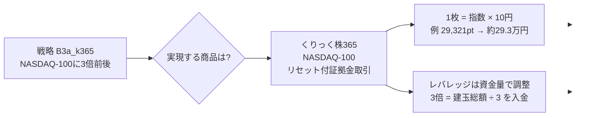
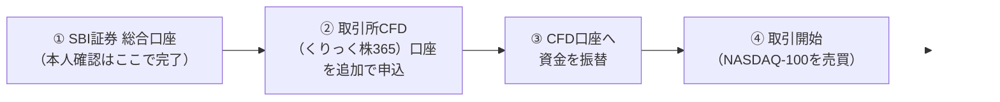
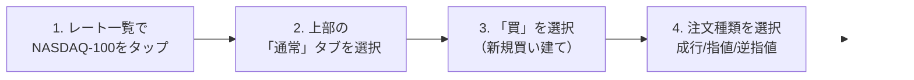
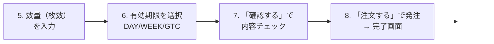
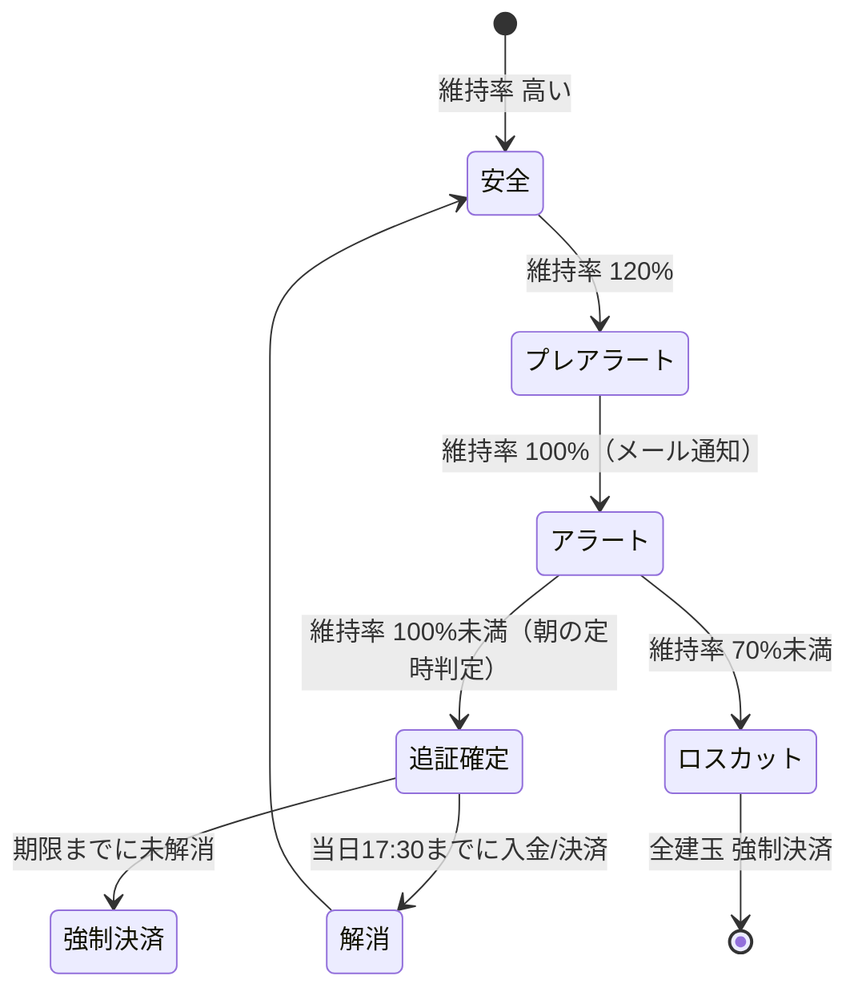
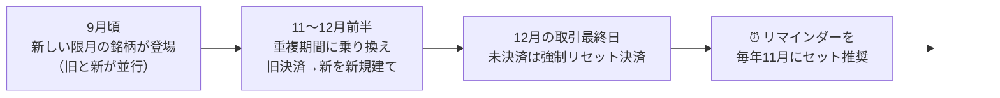

# SBI証券「くりっく株365」でNASDAQレバレッジ商品を売買する完全手順書

作成日: 2026-06-24
最終更新日: 2026-06-24

> **改訂メモ（2026-06-24 同日改訂）**: バックテスト知見との整合チェックを受け、(1) §9-1 の「過去52年で強制ロスカットはゼロ」を**条件付き（実効証拠金8%＋戦略が暴落時にOUT／1975-77には実際に3回清算あり／構造保証でない）**に是正、(2) §8 の元本超過損失の例を**数値整合（−15%では破綻しない・口座資金がマイナスになるのは概ね−34.5%超の動き）**に修正、(3) 「一晩−15%」が史実の最悪単日（約−12.3%）を超える点を注記、(4) 「8%≒12倍」を**12.5倍**に訂正。

調査者：男座員也（Kazuya Oza）
調査手法：並列Webリサーチ（4軸＝口座開設／コスト／証拠金・レバレッジ・ロスカット／発注操作）、公式ソース優先のファクトチェック、別エージェントによる品質チェック・前提の再検証
品質基準：各手順・各数値に【出典URL】と検証マーク（✅実ページ確認 / ⚠️二次情報のみ）を付与。変動する数値は「2026年6月時点の目安・変動する」と明記
対象読者：**社会人1年目でも、この1枚で迷わず操作できること**を目標に執筆

---

> **このレポートのルール（誠実性の宣言）**
> - ✅ = 公式ページ（SBI証券・東京金融取引所TFX・くりっく株365公式）で本文を直接確認できた事実
> - ⚠️ = 二次情報（解説ブローカー・検索要約）でのみ確認。実運用前に公式の最新表示で再確認すべき項目
> - 金額・利率・証拠金・取引時間は**すべて変動します**。本書の数値は2026年6月時点の「例・目安・実績」です。発注前に必ずSBI証券のログイン後画面で最新値を確認してください。

---

## 0. エグゼクティブサマリー（30秒で全体像）

> **結論：** あなたが実現したいNASDAQレバレッジ戦略は、SBI証券の**取引所CFD「くりっく株365」の銘柄「NASDAQ-100リセット付証拠金取引」**で実現できます。①総合口座＋CFD専用口座を開く → ②専用アプリで「NASDAQ-100」を新規買い → ③レバレッジは「口座に入れる資金の量」で自分で決める（3倍なら建玉総額の1/3を入金）→ ④決済（売り返済）で利益確定、という流れです。
>
> **根拠：** くりっく株365のNASDAQ-100は2022-02-28に上場済みで、SBI証券が取扱う株価指数銘柄の1つです 【出典: TFX/SBI公式, 後述】✅。買い保有のコストは「金利相当額 約4.5%/年の支払い − 配当相当額の受取り ≒ 正味年3.5〜4%」＋売買手数料330円/枚（片道）＋年1回12月のリセット乗り換え手数料です。✅
>
> **含意：** 「レバレッジを下げる＝口座にお金を多めに入れる」だけの単純な操作で、3倍前後の戦略を安全圏（ロスカットは維持率70%未満で発動）で運用できます。ただし「安全圏」は「絶対安全」ではなく、急変時には**入金額以上の損失（元本超過損失）**が出ることがあります（§8）。最大の見落としポイントは**年1回12月の「リセット」で建玉が自動決済される**ことです。長期保有には「乗り換え」操作が必須です。

---

## ⚠️ 反直感的な主要発見（ここだけは先に読んでください）

- ⚠️ **「くりっく株365にNASDAQ商品は無い」は誤り（前提の見直し結果）。** NASDAQ-100は2022-02-28にくりっく株365へ上場済みで、SBI証券で取引できます 【出典: [TFX 上場のお知らせ](https://www.tfx.co.jp/newsfile/article/20211203-01)】✅。社内の旧分析（バックテストリポジトリの `G12` 文書）には「くりっく株365にNASDAQ製品は存在しない」という古い前提が残っていましたが、これは陳腐化しています。現行の戦略前提（`product_costs.py`）が正しいことを本調査で確認しました。
- ⚠️ **SBIには「CFD」が2種類あり、混同すると手順も手数料も全部間違える。** 本書の対象は**取引所CFD＝くりっく株365**（東京金融取引所に上場）。もう一つの**店頭CFD＝SBI CFD**（売買手数料無料だが別商品）とはアプリも操作も別物です 【出典: SBI公式, 後述】✅。
- ⚠️ **手数料は「無料」ではない。** くりっく株365のNASDAQ-100は**1枚あたり330円（片道）**の売買手数料がかかります（SBI公式ヘルプの表示値。日経225は156円、NYダウは約30円で、NASDAQ-100はSBIの取扱銘柄の中でも高め）【出典: [SBI証券ヘルプ 商品概要](https://search.sbisec.co.jp/v2/popwin/help/cfd/27_attention_productsum.html)】✅。なお比較サイトには他社で15〜50円という記載もあるため、発注前に最新の実額を必ず確認してください ⚠️。「手数料無料」は別商品（店頭CFD）の話です。
- ⚠️ **年1回12月に建玉が強制的に自動決済される（リセット）。** ほったらかしにすると意図せず利益確定（課税）・ポジション消滅が起きます。長期保有は「乗り換え（旧銘柄決済＋新銘柄新規建て）」が必要で、そのたびに往復手数料が発生します 【出典: [岡三オンライン リセット](https://www.okasan-online.co.jp/kabu365/guide/reset.html)】✅。
- ⚠️ **レバレッジは「コース選択」では変えない。** くりっく株365にFXのようなレバレッジコースはありません。**実質レバレッジ ＝ 建玉総額 ÷ 口座資金**。お金を多く入れれば自動的に低レバレッジになります 【出典: くりっく株365公式/検証, 後述】✅。

---

## 目次

1. [なぜこの商品なのか — 戦略を実現する銘柄の選定](#1-なぜこの商品なのか--戦略を実現する銘柄の選定)
2. [はじめての申し込み — 口座開設](#2-はじめての申し込み--口座開設)
3. [購入する — 新規買い建ての手順](#3-購入する--新規買い建ての手順)
4. [売却する — 決済（売り返済）の手順](#4-売却する--決済売り返済の手順)
5. [現在の所有額を確認する](#5-現在の所有額を確認する)
6. [レバレッジを変更する](#6-レバレッジを変更する)
7. [手数料・コスト発生メカニズム（全コスト網羅）](#7-手数料コスト発生メカニズム全コスト網羅)
8. [リスク管理 — ロスカット・追証・リセット](#8-リスク管理--ロスカット追証リセット)
9. [戦略を実現する具体例 — 3倍で運用する](#9-戦略を実現する具体例--3倍で運用する)
10. [本書の限界・不確実性](#10-本書の限界不確実性)
11. [主要ソース一覧（Tier別・検証マーク付き）](#11-主要ソース一覧tier別検証マーク付き)

---

## 📖 用語ミニ辞典（先に3分で）

初心者がつまずきやすい用語を先にまとめます。本文で出てきたら戻ってきてください。

| 用語 | やさしい意味 |
|---|---|
| **建玉（たてぎょく）** | 今持っている売買ポジションのこと。「買い建玉」＝買って保有中の状態 |
| **証拠金（しょうこきん）** | 取引するために預ける担保のお金。最低ライン＝必要証拠金 |
| **証拠金維持率** | `口座資金 ÷ 必要証拠金 × 100%`。安全度のメーター。**100%を割ると追証、70%未満でロスカット** |
| **実質レバレッジ** | `建玉総額 ÷ 口座資金`。何倍の取引をしているか。低いほど安全 |
| **キャリーコスト** | 持ち続けるだけでかかる費用。ここでは「金利相当額 − 配当相当額」 |
| **リセット** | 年1回12月に建玉が強制的に自動決済される仕組み（NASDAQ-100は「リセット付」銘柄） |
| **限月（げんげつ）／清算価格** | 限月＝取引の期限。清算価格＝決済の基準になる価格 |
| **スプレッド** | 買値と売値の差。約定するたびに実質的な負担になる |
| **ドテン** | 持っているポジションを決済して、同時に反対方向へ建て直すこと（買い→売りへ一気に転換） |
| **追証（おいしょう）** | 維持率が足りなくなったとき追加で求められる証拠金。期限内に入れないと強制決済 |

---

## 1. なぜこの商品なのか — 戦略を実現する銘柄の選定

**このセクションの結論（So What）：** バックテストリポジトリの現行ベスト戦略「B3a_k365」が前提とする「くりっく株365でNASDAQに3倍前後のレバレッジ」を実現する具体的商品は、**くりっく株365の「NASDAQ-100リセット付証拠金取引」一択**です。

### 1-1. 戦略側が求めているもの（リポジトリの正典より）

社内の戦略正典 `CURRENT_BEST_STRATEGY.md`（2026-06-15確定）は、CFD利用可環境のベスト戦略として **B3a_k365** を採用しています。要点：

| 項目 | 内容 |
|---|---|
| 対象指数 | **NASDAQ-100（NDX）** |
| 実効レバレッジ | 基準は3倍前後。日次シグナルで増減し、3倍超となる日が全体の約37.7% |
| 想定商品 | **くりっく株365 NASDAQ-100 CFD**（金利コスト前提 `K365_FINANCING_SPREAD = SOFR + 0.75%`） |
| 税区分 | 特定口座ではなく**申告分離課税20.315%**（CFDは先物等の扱い） |
| 売買頻度 | 年33回程度 |

> ⚠️ 戦略の元設計は「3倍までは米国ETF（TQQQ）、3倍超の超過分だけくりっく株365」というハイブリッドですが、**本手順書はユーザー依頼に沿い「くりっく株365だけでNASDAQレバレッジを実現する」前提**で記述します。くりっく株365は任意倍率を作れるため、3倍前後の戦略を単独でも実現できます（§6・§9参照）。

### 1-2. なぜ「NASDAQ-100リセット付証拠金取引」が答えなのか

- くりっく株365でNASDAQに連動する銘柄は**「NASDAQ-100リセット付証拠金取引」**だけです。2022-02-28に上場しました 【出典: [TFX NASDAQ-100上場のお知らせ](https://www.tfx.co.jp/newsfile/article/20211203-01)】✅。
- SBI証券はくりっく株365で**日経225・NYダウ・NASDAQ-100などの株価指数銘柄**を取扱っており、NASDAQ-100はその1つです（くりっく株365全体の上場銘柄は11。SBIの取扱銘柄数は変動しうるため最新はSBIで確認）【出典: [SBI証券 くりっく株365 LP](https://go.sbisec.co.jp/lp/lp_cfd_210712.html) / [くりっく株365 取扱商品](https://www.clickkabu365.jp/about_cfd/about_cfd14.html)】✅。
- 為替リスクなし（円建て・円決済）、売りからも入れる、ほぼ24時間取引可能、という戦略運用上の利点があります 【出典: [くりっく株365公式](https://www.clickkabu365.jp/sp/contents13.html)】✅。

**1枚（最小取引単位）の大きさ：** NASDAQ-100の取引金額 ＝ **指数値 × 10円**。例えば指数が29,321ポイントなら 1枚 ≒ **293,210円相当** 【出典: [TFX CFD制度概要](https://www.tfx.co.jp/retail/cfd.html)】✅（指数値は変動）。日経225（×100円等）より概ね1桁小さく、少額から始められます（正確な大きさは指数水準で変動します）。



---

## 2. はじめての申し込み — 口座開設

**このセクションの結論（So What）：** くりっく株365は「総合口座（証券口座）」の上に「CFD専用口座」を追加する**2階建て**です。総合口座を持っていればオンラインで最短5分・即日開設も可能です。

### 2-1. 口座の構造（2階建て）



- くりっく株365の取引には、総合取引口座とは別に**「取引所CFD（くりっく株365）口座」の開設が必要**です 【出典: [SBI証券 CFD口座開設の流れ](https://www.sbisec.co.jp/ETGate/?OutSide=on&getFlg=on&_ControlID=WPLETmgR001Control&_PageID=WPLETmgR001Mdtl20&_ActionID=DefaultAID&_DataStoreID=DSWPLETmgR001Control&burl=search_cfd&cat1=cfd&cat2=flow&dir=flow&file=cfd_flow.html)】✅。
- 口座管理手数料は**無料**です 【出典: [SBI証券 くりっく株365 LP](https://go.sbisec.co.jp/lp/lp_cfd_210712.html)】✅。

### 2-2. 手順（ステップ・バイ・ステップ）

| STEP | やること | 補足 |
|---|---|---|
| **1. 総合口座を用意** | まだなら「総合口座開設」を申込（スマホ＋マイナンバーカードが最短）。既にあれば次へ | 本人確認書類・マイナンバーは総合口座開設時に提出済みなら原則追加不要 ⚠️ |
| **2. CFD口座を申込** | ログイン後「お取引・口座開設」→「CFD (くりっく株365)」→「開設」。投資経験・リスク理解の質問に回答し、各確認事項にチェック | 申込フォーム入力は**最短5分** ✅ |
| **3. 審査** | SBIがCFD口座開設審査を実施 | **最短で申込と同時に開設**。75歳以上等は電話ヒアリング審査があり結果通知まで1〜2営業日 ✅ |
| **4. 入金・振替** | 総合口座へ入金（即時入金/銀行振込）→「入出金・振替」→「振替」でCFD口座へ資金を移す | 振替はログイン後画面から ✅ |
| **5. ログインして取引開始** | 取引所CFDの取引システム／専用アプリにログイン | §3へ |

【出典: [SBI証券 CFD口座開設の流れ](https://www.sbisec.co.jp/ETGate/?OutSide=on&getFlg=on&_ControlID=WPLETmgR001Control&_PageID=WPLETmgR001Mdtl20&_ActionID=DefaultAID&_DataStoreID=DSWPLETmgR001Control&burl=search_cfd&cat1=cfd&cat2=flow&dir=flow&file=cfd_flow.html) / [SBI証券 くりっく株365 LP](https://go.sbisec.co.jp/lp/lp_cfd_210712.html)】✅

### 2-3. 開設の前提条件（審査でみられる点）

- **年齢：80歳未満**が基本対象とされます（80歳という上限値はSBI公式静的ページで本調査では裏取りできず ⚠️、申込画面で要確認）。**75歳以上は電話確認**の対象 ✅
- **資力：** 十分な金融資産・**余裕資金**があること ✅
- **理解度：** 値動き・損失可能性・**証拠金／追証のしくみ**を十分理解していること ✅
- 最終的な開設可否はSBI証券の判断によります ✅

【出典: [SBI証券 CFD口座開設のポイント（審査基準）](https://www.sbisec.co.jp/ETGate/WPLETmgR001Control?OutSide=on&getFlg=on&burl=search_cfd&cat1=cfd&cat2=flow&dir=flow&file=cfd_flow_kijun.html)】✅

> ⚠️ **検証メモ：** CFD専用ページには必要書類の個別リストの明記がありません。総合口座保有者は通常追加書類不要ですが、最新の申込画面で確認してください。

### 2-4. 入金と振替の具体手順（ここで詰まる人が多い）

**重要：総合口座に入金しただけでは取引できません。** 「総合口座へ入金」→「CFD口座へ振替」の2段階が必要です。

1. SBI証券にログイン →「入出金・振替」→**「即時入金」**を選ぶ
2. 提携銀行（住信SBIネット銀行・三菱UFJ・三井住友・ゆうちょ 等）のネットバンキングにログインして金額を入力
   - 即時入金は**手数料無料・原則即時**で総合口座に反映 ✅（対応銀行・反映時間は変動。SBIの最新案内で確認）
3. 次に「入出金・振替」→**「振替」**で、総合口座 → **取引所CFD（くりっく株365）口座**へ資金を移す
4. CFD口座に資金が入って初めて、NASDAQ-100の発注ができます

> ⚠️ 即時入金の対応銀行名・反映時間・無料条件はSBI証券共通の入金サービス情報に基づく一般的な記載です（CFD専用ページでの明記は未確認 ⚠️）。最新はSBIの入出金画面で確認してください。

---

## 3. 購入する — 新規買い建ての手順

**このセクションの結論（So What）：** スマホの専用アプリ「SBI証券 取引所CFD アプリ - くりっく株365」で、NASDAQ-100を選び「通常」タブ→「買」→注文種類・枚数を入れて発注、の8ステップです。

### 3-0. 使うツール（最初に入れる）

| ツール | 内容 | 入手 |
|---|---|---|
| **SBI証券 取引所CFD アプリ - くりっく株365**（スマホ） | 新規・決済・ドテン注文、ストリーミング注文、テクニカル12種、レート通知。無料 | [App Store](https://apps.apple.com/jp/app/id1545300927) ✅ / [Google Play](https://play.google.com/store/apps/details?id=jp.co.sbisec.clickkabu365.Android) ✅ |
| 取引所CFD Web取引画面（PC） | ブラウザで発注・チャート分析 | SBI証券サイトのCFDメニュー ✅ |

> ⚠️ **「店頭CFDアプリ」とは別物**です。必ず「取引所CFD（くりっく株365）」のアプリ／画面を使ってください。
>
> 💡 **初回ログイン：** アプリ初回起動時は、**SBI証券の総合口座と同じユーザーネーム・ログインパスワード**でログインします（CFD専用の別IDは不要）。初回はデバイス認証コードの入力を求められる場合があります ⚠️（仕様は変更の可能性あり）。

### 3-1. 新規買いの8ステップ

> 印刷しやすいよう横並びにし、**前半（STEP1〜4）と後半（STEP5〜8）の2段**に分けています。前半の右端（4）まで進んだら、後半の左（5）へ続けてください。

**前半：STEP 1 → 2 → 3 → 4**



**後半：STEP 5 → 6 → 7 → 8（前半に続けて）**



1. プライス（レート）一覧で **NASDAQ-100** をタップ → 注文入力画面へ
2. 画面上部の **「通常」タブ**をタップ
3. **「買」**を選択（新規の買い建て）
4. **注文種類**を選択
   - **成行**＝価格を指定せず早く約定（今すぐ買いたい人向け）
   - **指値**＝「この価格以下なら買う」と有利な価格を指定
   - **逆指値**＝指定価格に到達したら発動（ブレイク狙い・損切り設定に使う）
   - **ストップリミット**＝逆指値の発動後に指値で出す
5. **数量（枚数）**を入力
6. **有効期限**を選択（§3-3）
7. **「確認する」**で注文内容を検証
8. **「注文する」**で発注 → 注文完了画面

> 応用注文として **IFD / OCO / IFDOCO / チャートから注文** も選べます（損切りと利確を同時に仕込みたい人向け）。

【出典: [SBI証券 取引所CFDアプリ 通常注文ガイド](https://search.sbisec.co.jp/v2/popwin/smart/help/help_app_cfd_23.html) / [操作ガイド目次](https://search.sbisec.co.jp/v2/popwin/smart/help/help_app_cfd.html)】✅

### 3-2. 「売り」から入る（ショート）場合の違い

操作はほぼ同じで、ステップ3で**「買」の代わりに「売」を選ぶ**だけです。くりっく株365は信用取引のように**売りから入れる**ため、下落局面で利益を狙えます ✅。決済は逆方向（売り建ては「買い返済」）になります。

### 3-3. 注文の有効期限（3種）

- **DAY**：注文した日の取引終了時間まで
- **WEEK**：その週の週末営業日の取引終了時間まで
- **GTC**：取消すまで無期限（ただし期限付き銘柄は取引最終日まで）

【出典: [SBI証券 決済注文ガイド](https://search.sbisec.co.jp/v2/popwin/smart/help/help_app_cfd_28.html)（DAY/WEEK/GTC表記を実確認）✅ / [SBI FAQ 有効期限](https://faq.sbisec.co.jp/answer/5ee3240f878c430011c18169)⚠️】

### 3-4. 2回目以降の注文（増し玉・追加建玉）

**操作手順は1回目とまったく同じ8ステップ**です（NASDAQ-100 →「通常」→「買」→ 注文種類 → 枚数 → 期限 → 確認 → 注文）。**口座開設や再申込は不要**で、アプリからそのまま発注できます。新しく覚える操作はありません。ただし2回目以降は次の点が変わるので注意します：

- **同じ向き（買い）を追加 ＝「増し玉」。** 既存の建玉に自動合算されず、原則**別の建玉として追加**されます（「建玉照会」に複数行で並ぶ）。決済は §4-2 の方式に従います。
- **発注前に証拠金維持率を必ず確認**（§5「証拠金状況照会」）。建玉を増やすほど必要証拠金が増え、**実質レバレッジが上がって維持率が下がる**＝ロスカット（維持率70%）に近づきます。倍率を保つなら、その分の資金も追加で振替してから発注（§6）。
- **前回の枚数・注文種類が既定値として引き継がれる**ことがあるため、毎回ステップ5の枚数を確認する。
- **反対向き（売り）を出すと、設定により「両建て」か「相殺（決済）」**になります（§4-2）。意図せぬ両建てを避けるため、保有分を減らしたいときは新規ではなく §4 の「決済」フローを使う。

> 💡 まとめ：**2回目以降に変わるのは「操作」ではなく「資金管理」**（維持率・倍率）です。発注ボタンの押し方は同じ、見るべきは維持率です。

---

## 4. 売却する — 決済（売り返済）の手順

**このセクションの結論（So What）：** 「決済/建玉」から保有ポジションをタップ→「決済する」→注文方法・枚数を指定して発注。新規との取り違えが起きないよう、取引区分は「決済」に固定されます。

### 4-1. 決済の7ステップ

1. タブメニューの **「決済/建玉」** → 建玉照会画面へ
2. 決済したい**保有ポジションをタップ**（評価損益・平均約定価格・保有数量を確認）
3. **「決済する」**ボタン → 決済注文画面へ
4. 取引区分は **「決済」固定**（新規買いと混同しない設計）
5. 注文方法を選択：**ストリーミング / 通常 / OCO / 逆指値**
6. 注文種類（成行・指値・逆指値・ストップリミット）と**数量（保有数量内・1枚から）**を指定
7. 有効期限を選択 → **「確認する」→「注文する」**

【出典: [SBI証券 決済注文](https://search.sbisec.co.jp/v2/popwin/smart/help/help_app_cfd_28.html) / [建玉照会](https://search.sbisec.co.jp/v2/popwin/smart/help/help_app_cfd_09.html)】✅

### 4-2. 決済方式の選択（重要）

> 💡 **初心者は初期設定の「建玉指定決済」のままでOK。** 両建て・オートネッティングは慣れてから理解すれば十分です。最初は気にしなくて構いません。

くりっく株365では決済方式を2種類から選べます（取引所CFD共通仕様）：

| 方式 | 内容 | 使いどころ |
|---|---|---|
| **建玉指定決済（仕切り注文）** | 決済する建玉を自分で指定。**初期設定**。これを選ぶと**両建て可能** | 特定のポジションだけ決済したい／両建てしたい |
| **オートネッティング（FIFO/先入先出）** | 反対売買で**古い建玉から自動で順次決済** | 細かく考えず順番に決済したい |

**両建て**（同一銘柄の買い・売りを同時保有）は、建玉指定決済を選んでいるとき可能です。両建て中は売買スプレッドの二重負担がなく、建玉整理の取引所手数料が免除される利点があります 【出典: [くりっく株365公式 両建て](https://www.clickkabu365.jp/about_cfd/about_cfd11.html) / [岡三オンライン 注文・決済方法](https://www.okasan-online.co.jp/kabu365/guide/order.html)】✅。

---

## 5. 現在の所有額を確認する

**このセクションの結論（So What）：** 「建玉照会」で評価損益・保有額、「証拠金状況照会」で証拠金維持率・余力、「約定照会」で確定した損益・手数料を確認します。社会人1年目はまず**この3画面の場所だけ覚えれば十分**です。

| 確認したいもの | 見る場所 | 分かること |
|---|---|---|
| **今いくら持っているか／含み損益** | 「決済/建玉」→ **建玉照会** | 保有数量・平均約定価格・**評価損益**・現在値 ✅ |
| **証拠金は足りているか（安全度）** | 「口座管理」→ **証拠金状況照会** | **証拠金維持率**・必要証拠金・追証額・取引余力 ✅ |
| **確定した損益・手数料・金利配当** | **約定照会** | 約定価格・**決済損益**・金利/配当相当額・手数料（税込） ✅ |

- 専用アプリ「SBI証券 取引所CFD アプリ」でも建玉・評価損益・余力の確認と発注ができます ✅。
- 「現在の所有額」は厳密には、**口座資金（証拠金）＋評価損益**で見ます。CFDは現物の「保有時価」ではなく「証拠金＋含み損益」で資産を把握する点に注意してください。

【出典: [SBI証券 建玉照会](https://search.sbisec.co.jp/v2/popwin/smart/help/help_app_cfd_09.html) / [約定照会](https://search.sbisec.co.jp/v2/popwin/smart/help/help_app_cfd_13.html) / [SBI FAQ 証拠金状況照会・追証](https://faq.sbisec.co.jp/answer/5ec77c838504de0011d61c42/)】✅

---

## 6. レバレッジを変更する

**このセクションの結論（So What）：** くりっく株365に「レバレッジコース選択」はありません。**実質レバレッジ ＝ 建玉総額 ÷ 口座資金**。倍率を下げたいなら口座資金を増やす（または建玉を減らす）、それだけです。

### 6-1. 仕組み

```
実質レバレッジ ＝ 建玉総額 ÷ 口座資金
任意の倍率 L にするための必要資金 ＝ 建玉総額 ÷ L
```

- 証拠金基準額（最低限必要なお金）は**東京金融取引所（TFX）が週次で決定**します。これは「最低ライン」であり、レバレッジ上限は概ね**約25倍**（証拠金基準額が最小水準のとき）です 【出典: [TFX CFD制度概要](https://www.tfx.co.jp/retail/cfd.html) / [くりっく株365 レバレッジ](https://www.clickkabu365.jp/about_cfd/about_cfd04.html)】✅。
- **資金を多めに入れれば、自分でレバレッジを下げられます**（任意倍率に調整可能）✅。

> 💡 **レバレッジと安全度はコインの裏表。** レバレッジを下げる＝口座資金を厚くする＝**証拠金維持率が上がる＝ロスカット（維持率70%）から遠ざかる**、という関係です（維持率は§8で詳説）。

### 6-2. 具体例（指数29,321pt・1枚 ≒ 293,210円相当の場合／数値は変動）

| 目標レバレッジ | 計算 | 1枚あたり入れる口座資金 | 性格 |
|---|---|---|---|
| 1倍（フルカバー） | 293,210 ÷ 1 | 約 **293,210円** | ほぼ現物と同じ、ロスカット遠い |
| **3倍（戦略の基準）** | 293,210 ÷ 3 | 約 **97,737円** | B3a_k365の標準レバレッジ |
| 5倍 | 293,210 ÷ 5 | 約 58,642円 | 攻め。下落耐性は低下 |
| 約25倍（その週の基準額次第の上限目安） | 293,210 ÷ 25 | 約 11,728円（≒証拠金ぎりぎり） | 極めて危険・即ロスカット圏 |

### 6-3. 倍率を「変更」する実務

- **下げる**：CFD口座へ資金を追加振替する（建玉はそのまま、分母＝口座資金が増えるので倍率が下がる）。
- **上げる**：口座資金を出金する、または建玉（枚数）を増やす。
- 戦略の日次シグナルに合わせて倍率を動かす場合は、**枚数の増減（新規建て／一部決済）**で調整するのが実務的です。

> ⚠️ 「証拠金基準額」は変動するため、同じ枚数でも必要最低資金は週次で変わります。倍率は「自分が入れている資金」を基準に管理してください。

---

## 7. 手数料・コスト発生メカニズム（全コスト網羅）

**このセクションの結論（So What）：** NASDAQ-100の買い長期保有で発生するコストは、**①売買手数料330円/枚（片道）②金利相当額 約4.5%/年の支払い（最大要因）③配当相当額の受取りで一部相殺 ④年1回リセットの乗り換え手数料 ⑤スプレッド**。正味のキャリーコストはおおよそ**年3.5〜4%程度**（買い保有・2026年6月時点の試算）です。

### 7-1. コスト一覧

| # | コスト | 内容 | 方向（買い保有） | 検証 |
|---|---|---|---|---|
| ① | **売買手数料** | NASDAQ-100 = **330円/枚（片道）**（SBIヘルプ表示値）。日経225=156円、NYダウ=約30円。他社では15〜50円の例もあり要確認 | 支払い（売買のたび） | ✅/⚠️ [SBIヘルプ](https://search.sbisec.co.jp/v2/popwin/help/cfd/27_attention_productsum.html) |
| ② | **金利相当額** | 約4.5%/年（2026/5適用分でNASDAQ-100 4.38%）。米ドル金利が高いため大きい | **支払い**（買いは払う／売りは受取る） | ✅ [GMOクリック証券](https://www.click-sec.com/corp/guide/ck365/study/02.html) / [くりっく株365公式](https://www.clickkabu365.jp/sp/contents16.html) |
| ③ | **配当相当額** | NASDAQ-100構成銘柄の配当ベース。買いは受取れる | **受取り**（買いは受取る／売りは払う） | ✅ [岡三オンライン 実績](https://www.okasan-online.co.jp/kabu365/feature/past_nasdaq100.html) |
| ④ | **リセット乗り換え** | 年1回12月。継続保有は決済＋新規建てで往復手数料 | 支払い（年1回） | ✅ [岡三オンライン リセット](https://www.okasan-online.co.jp/kabu365/guide/reset.html) |
| ⑤ | **スプレッド** | 買値と売値の差。約定のたびに実質負担 | 支払い | ⚠️ [くりっく株365](https://www.clickkabu365.jp/about_cfd/about_cfd24.html) |

### 7-2. 金利相当額・配当相当額の「方向」（取り違え厳禁・3ソースで確認済み）

| ポジション | 金利相当額 | 配当相当額 |
|---|---|---|
| **買い（ロング）** | **支払う**（−） | **受取る**（＋） |
| **売り（ショート）** | **受取る**（＋） | **支払う**（−） |

【出典: [GMOクリック証券](https://www.click-sec.com/corp/guide/ck365/study/02.html) / [岡三オンライン](https://www.okasan-online.co.jp/kabu365/guide/interest.html)】✅（複数ソースで方向一致）

**金利相当額の計算式（NASDAQ-100）：** `(清算価格 × 10) × 利率 × (日数 ÷ 365)` ✅（方向）／⚠️乗数×10は二次情報

**1枚あたり年間実績（過去・将来非保証）** 【出典: [岡三オンライン NASDAQ-100実績](https://www.okasan-online.co.jp/kabu365/feature/past_nasdaq100.html)】✅：

| 年 | 金利相当額（買いは支払い） | 配当相当額（買いは受取り） |
|---|---|---|
| 2022 | 2,481円 | 919円 |
| 2023 | 7,915円 | 1,225円 |
| 2024 | 11,307円 | 1,521円 |
| 2025 | 10,765円 | 1,631円 |

### 7-3. 正味キャリーコストの試算（買い保有・2026年6月時点）

```
金利相当額の支払い   : 年率 約4.4〜4.5%（最大のコスト）
配当相当額の受取り   : ＋方向（2025年実績1,631円/枚 ≒ 指数水準に対し概ね年0.6〜0.8%）
─────────────────────────────
正味キャリーコスト   ≒ 4.5% − 0.7% ≒ 年率 約3.5〜4%（買い保有）
＋ 売買手数料330円/枚（往復660円）＋ 年1回乗り換え手数料 ＋ スプレッド
```

> ⚠️ これは本調査データからの**試算**であり、SBI公式が単一の年率値として示しているわけではありません。金利・配当は変動します。**売り（ショート）保有なら逆に金利を受取り配当を払う**＝キャリーは概ねプラス方向になります。

### 7-4. 税金

- **申告分離課税 20.315%**（所得税15%＋復興特別所得税0.315%＋住民税5%）。CFDは「先物取引に係る雑所得等」扱い ✅
- **損益通算**：先物・オプション、FX（くりっく365・店頭FX）等の「先物取引に係る雑所得等」と通算可能。**株式の譲渡損益とは通算不可** ✅
- **繰越控除**：控除しきれない損失は**翌年以降3年間**繰越可能（継続した確定申告が必要）✅

> ⚠️ **確定申告は原則あなた自身で行います。** CFDの利益は給与と違い、会社の年末調整や源泉徴収では完結しません。利益が出た年は翌年2〜3月に確定申告します（SBIで年間取引報告書を出力可）。給与以外の所得が年20万円以下なら申告不要となる例外もあるため、自分のケースは国税庁・税務署で確認してください。

【出典: [SBI証券 FAQ 税金](https://faq.sbisec.co.jp/answer/5ee324fb878c430011c1816e/)】✅

---

## 8. リスク管理 — ロスカット・追証・リセット

**このセクションの結論（So What）：** 強制ロスカットは**証拠金維持率70%未満**で発動。追証は**維持率100%割れ**で確定し、当日17:30が入金期限。そして**年1回12月のリセット**で建玉が自動決済されます。この3つを知らないと「気づいたら退場」になります。

> ⚠️⚠️ **最悪、入金額以上を失います（元本超過損失）。** 例えば10万円を入れて3倍で1枚（約29万円相当）持つ場合を考えます。
> - NASDAQが一晩で**−15%**動くと建玉の損失は約**−4.4万円**（29万×15%）。このときは口座資金がまだ約5.6万円残り、**この水準では破綻しません**（ただし維持率は大きく低下し追証・ロスカット圏に入ります）。
> - **口座資金がマイナス（＝追加で支払う義務＝元本超過損失）になるのは、損失が入金額10万円を食い潰すとき**、すなわち建玉に対して概ね**−34.5%超**（29万×34.5%≒10万）の急落がロスカット執行前に起きた場合です。窓開け・流動性枯渇でロスカットが間に合わないと、こうした事態が起こり得ます。
> - 💡 参考：NASDAQの**史実の最悪単日下落は約−12.3%**（2020年COVID）・1987年ブラックマンデー約−11.4%。**「一晩−15%」は過去52年に観測されていない記録外のテール**を例にした最悪想定です（より小さい下落でも、レバを上げ・バッファを薄くすれば破綻し得ます）。
>
> これがレバレッジ取引の怖さです。余裕資金で、低めの倍率から、厚めのバッファで始めてください。

### 8-1. ロスカットと追証（段階）



| 水準 | 何が起きるか |
|---|---|
| 維持率 **120%** | プレアラート ✅ |
| 維持率 **100%** | アラートメール ✅ |
| 維持率 **100%未満** | **追証確定**（判定は毎営業日朝6:55〜7:35頃／夏時間5:55〜6:35頃）。入金期限は**当日17:30**（金曜分は翌週初17:30）✅ |
| 維持率 **70%未満** | **ロスカット**（全建玉を強制決済）✅ |

- 追証発生中は**決済はできるが新規取引は不可** ✅
- ⚠️ 追証判定は「朝の定時」ですが、ロスカット自体は水準到達で対象になり得ます。定時/随時の運用差は口座保有後にSBIの最新告知で最終確認してください。

【出典: [SBI証券 FAQ 追証](https://faq.sbisec.co.jp/answer/5ec77c838504de0011d61c42/) / [SBIヘルプ 証拠金](https://search.sbisec.co.jp/v2/popwin/help/cfd/28_attention_margin.html)】✅

### 8-2. リセット（最重要の「うっかり」ポイント）

- NASDAQ-100は「**リセット付**」銘柄。約15ヶ月の期限付き取引（毎年9月開始→翌年12月リセット）です ✅
- **リセット日（12月の取引最終日）までに決済しなかった建玉は、リセット値で自動決済**されます（両建て含む）。自動ロールオーバーはされません ✅
- 長期保有したい場合は、重複期間中に**旧銘柄を決済 → 新銘柄を新規建て**する「乗り換え」が必要。そのたびに往復の売買手数料（NASDAQ-100は330円×2）が発生します ✅

**年間カレンダー（長期保有者の行動）：**



> 💡 **「12月になったら何もしないと自動決済される」**と覚え、毎年11月にスマホのリマインダーを入れておくと安全です。

【出典: [岡三オンライン リセット](https://www.okasan-online.co.jp/kabu365/guide/reset.html) / [TFX 上場のお知らせ](https://www.tfx.co.jp/newsfile/article/20211203-01)】✅

### 8-3. 取引時間（注文できる時間／すべて日本時間）

> 💡 **下の時刻はすべて日本時間（JST）です。** くりっく株365は日本の取引所（東京金融取引所）の商品で、SBI証券で**円建て・日本時間**で取引します。表の「米国 夏/冬時間」は、米国のサマータイムに連動して**終了時刻が1時間ずれる**ことを示すラベルであり、表示している時刻自体は日本時間です。

| 期間（米国のサマータイム区分） | 取引時間（**日本時間 JST**） |
|---|---|
| **米国標準時間（冬・おおむね11月初〜3月中旬）** | **8:30 〜 翌朝6:00**（日本時間） |
| **米国夏時間（3月第2日曜〜11月第1日曜）** | **8:30 〜 翌朝5:00**（日本時間） |

- 覚え方：**日本時間の朝8:30に始まり、翌朝5〜6時まで**（夏は翌5時・冬は翌6時に終了）。日本の夜間にあたる米国市場の時間帯がメインの値動きです。
- ほぼ24時間。休業は土日・米国市場休場日。日中の終了〜翌開始の間（約2.5〜3.5時間）は取引不可 ✅
- ⚠️ 限月切替・告知で変わることがあるため、確定値はTFX商品仕様を基準に、SBIの取引時間告知も都度確認してください。

【出典: [TFX CFD制度概要](https://www.tfx.co.jp/retail/cfd.html) / [TFX 上場のお知らせ](https://www.tfx.co.jp/newsfile/article/20211203-01)】✅

---

## 9. 戦略を実現する具体例 — 3倍で運用する

**このセクションの結論（So What）：** 戦略B3a_k365の「NASDAQ-100に3倍前後」を、くりっく株365で安全に実現する具体例を示します。3倍は維持率の観点で**ロスカット（70%）から大きく離れた安全圏**です。

### 9-1. 設定例（指数29,321pt・1枚≒293,210円・証拠金基準額8万円/枚と仮定／変動）

| 項目 | 値 | 計算・根拠 |
|---|---|---|
| 建てる枚数 | 1枚 | 例として最小単位 |
| 建玉総額 | 約293,210円 | 指数29,321 × 10円 |
| 目標レバレッジ | **3倍** | 戦略の基準 |
| 入れる口座資金 | 約 **97,737円** | 293,210 ÷ 3 |
| 最低必要証拠金（例） | 約80,000円 | TFX基準額（週次変動） |
| 証拠金維持率（目安） | 約122%（＝97,737÷80,000） | 70%ロスカットから余裕 |

> ⚠️ **社内のマージン耐性検証の正しい読み方（条件付きの結論）**（リポジトリ `MARGIN_CAPACITY_STRESS_RESULTS_20260617.md`）:
> - 実効証拠金**8%**（≒レバレッジ**12.5倍**相当の余裕）を保ち、かつ**戦略のレジーム判定が暴落時にOUT（建玉ゼロ）だった**という条件の下で、**5大危機（1987 / 2000 / 2008 / 2020 COVID / 2022）は強制ロスカット ゼロ**でした（暴落の最悪日には建玉が無かったため）。
> - **ただし「過去52年で完全にゼロ」ではありません。** 運用初期の**1975〜77年には実際に3回の強制清算が発生**しています（各回でAUMの約13〜19%＝3000万円なら約400〜570万円を喪失）。
> - したがってこの「ゼロ」は**史実＋運による結果であって構造保証ではありません**。**高レバレッジで建玉を持っている最中に1987年型の突発単日急落が来れば、トレンド追従の降り遅れ（DH-W1のExitは局所ピークから平均17営業日）で大きな損失を抱える可能性**が残ります。
> - 3倍運用は超過建玉が小さく上記リスクは大幅に軽くなりますが、「**ゼロだから安全**」と読むのは誤りです。**厚めの証拠金バッファ（実効8%以上）と、暴落時に確実にOUTする規律**が前提条件です。

> 💰 **結局いくら入れればいい？（実際の入金目安）**
> 上の「97,737円」は理論値（ぴったり3倍）で、これだけ入れると少しの下落ですぐ追証に怯えることになります。初心者は**緩衝を厚めに**してください。
> - 1枚（約29.3万円相当）を3倍で持つなら、**15〜20万円**入れておくと維持率が約122%→**約190〜260%**に上がり、夜間の値動きでも余裕が出ます。
> - 加えて、年1回の乗り換え手数料（330円×2）・スプレッド・金利相当額（年約4.5%）も口座から差し引かれるので、**当面使わない余裕資金**で始めましょう。

### 9-2. 運用の流れ（戦略シグナルに合わせる）

> 📌 **スコープの明示：** 本書は「シグナルが出た後の**発注操作**」を担当します。IN/OUT（買う・降りる）の**判断シグナルそのものの算出**は、戦略の運用ガイド（GAS連携スプレッドシート: [NASDAQ-strategy-gas](https://github.com/KazuyaMurayama/NASDAQ-strategy-gas)）側の役割です。本書だけで売買タイミングが決まるわけではない点に注意してください。

1. **エントリー**：戦略がIN（強気）→ NASDAQ-100を必要枚数だけ新規買い（§3）。倍率は「口座資金＝建玉総額÷3」で管理（§6）。
2. **増減**：シグナルが倍率を上げる日は枚数を増やす（追加新規買い）／下げる日は一部決済。
3. **OUT（防御）**：戦略がOUT→ 全決済し、現金・ゴールド等の代替へ（くりっく株365の外で運用）。
4. **年1回12月**：リセット前に**乗り換え**（旧銘柄決済→新銘柄新規建て）を忘れない（§8-2）。
5. **税**：年間損益は申告分離20.315%。損失は3年繰越可（§7-4）。

> ⚠️ 戦略の元設計は「3倍まではTQQQ、超過分だけくりっく株365」のハイブリッドでコストを最小化しています。くりっく株365単独で全レバレッジを賄うと、金利相当額（約4.5%/年）の負担が全建玉にかかるため、**コストはハイブリッドよりやや重く**なります。コスト最小化を優先するなら元設計のハイブリッドを、シンプルさ・一元管理を優先するならくりっく株365単独を選んでください（トレードオフ）。

---

## 10. 本書の限界・不確実性

- **数値はすべて変動します。** 証拠金基準額（週次）、指数値、金利・配当相当額、取引時間（夏冬・限月）はその都度変わります。本書の数値は2026年6月時点の例・目安・実績です。
- **一部の公式ページが取得制限（403/404/JSレンダリング）でした。** clickkabu365.jp・tfx.co.jp の一部とSBIの動的ページは直接取得できず、SBIヘルプ静的ページ・FAQ・解説ブローカー（岡三オンライン・GMOクリック証券）で相互裏取りしました。⚠️マーク項目（リセットの細部、振替条件、取引時間の個別告知値、金利計算式の乗数）は**実運用前にSBI公式の最新表示で再確認**してください。
- **アプリ画面はバージョンで変わります。** 操作手順は「画面例」です。ラベルが変わっていれば最新のアプリ内ヘルプを参照してください。
- **本書は投資助言ではありません。** 手順と仕組みの解説であり、売買の推奨ではありません。レバレッジ取引は元本超過損失のリスクがあります。

---

## 11. 主要ソース一覧（Tier別・検証マーク付き）

### Tier1：取引所・運営の公式（東京金融取引所TFX / くりっく株365公式）
- [TFX 取引所CFD（くりっく株365）制度概要](https://www.tfx.co.jp/retail/cfd.html) ✅
- [TFX NASDAQ-100リセット付証拠金取引 上場のお知らせ](https://www.tfx.co.jp/newsfile/article/20211203-01) ✅
- [TFX くりっく株365 過去データ（証拠金基準額）](https://www.tfx.co.jp/historical/cfd/) ✅
- [くりっく株365公式 NASDAQ-100紹介](https://www.clickkabu365.jp/sp/contents13.html) ✅
- [くりっく株365公式 金利相当額（売りで約4.5%受取）](https://www.clickkabu365.jp/sp/contents16.html) ✅
- [くりっく株365公式 両建て](https://www.clickkabu365.jp/about_cfd/about_cfd11.html) ✅
- [くりっく株365公式 レバレッジ](https://www.clickkabu365.jp/about_cfd/about_cfd04.html) ✅

### Tier2：取扱会社の公式（SBI証券）
- [SBI証券 取引所CFD口座開設・お取引までの流れ](https://www.sbisec.co.jp/ETGate/?OutSide=on&getFlg=on&_ControlID=WPLETmgR001Control&_PageID=WPLETmgR001Mdtl20&_ActionID=DefaultAID&_DataStoreID=DSWPLETmgR001Control&burl=search_cfd&cat1=cfd&cat2=flow&dir=flow&file=cfd_flow.html) ✅
- [SBI証券 取引所CFD口座開設のポイント（審査基準）](https://www.sbisec.co.jp/ETGate/WPLETmgR001Control?OutSide=on&getFlg=on&burl=search_cfd&cat1=cfd&cat2=flow&dir=flow&file=cfd_flow_kijun.html) ✅
- [SBI証券 くりっく株365 LP](https://go.sbisec.co.jp/lp/lp_cfd_210712.html) ✅
- [SBI証券ヘルプ 商品概要（手数料330円・税金）](https://search.sbisec.co.jp/v2/popwin/help/cfd/27_attention_productsum.html) ✅
- [SBI証券ヘルプ CFD証拠金について](https://search.sbisec.co.jp/v2/popwin/help/cfd/28_attention_margin.html) ✅
- [SBI証券 FAQ 追証判定・ロスカット](https://faq.sbisec.co.jp/answer/5ec77c838504de0011d61c42/) ✅
- [SBI証券 FAQ 税金（20.315%・損益通算・繰越3年）](https://faq.sbisec.co.jp/answer/5ee324fb878c430011c1816e/) ✅
- [SBI証券 取引所CFDアプリ 操作ガイド目次](https://search.sbisec.co.jp/v2/popwin/smart/help/help_app_cfd.html) ✅
- [SBI証券 通常注文（新規）](https://search.sbisec.co.jp/v2/popwin/smart/help/help_app_cfd_23.html) ✅
- [SBI証券 決済注文](https://search.sbisec.co.jp/v2/popwin/smart/help/help_app_cfd_28.html) ✅
- [SBI証券 建玉照会](https://search.sbisec.co.jp/v2/popwin/smart/help/help_app_cfd_09.html) ✅
- [SBI証券 約定照会](https://search.sbisec.co.jp/v2/popwin/smart/help/help_app_cfd_13.html) ✅
- [App Store: SBI証券 取引所CFDアプリ](https://apps.apple.com/jp/app/id1545300927) ✅
- [Google Play: SBI証券 取引所CFDアプリ](https://play.google.com/store/apps/details?id=jp.co.sbisec.clickkabu365.Android) ✅

### Tier3：補完（取引所CFD共通ルールの解説ブローカー）
- [岡三オンライン NASDAQ-100 金利・配当実績](https://www.okasan-online.co.jp/kabu365/feature/past_nasdaq100.html) ✅
- [岡三オンライン 金利・配当相当額](https://www.okasan-online.co.jp/kabu365/guide/interest.html) ✅
- [岡三オンライン リセットのしくみ](https://www.okasan-online.co.jp/kabu365/guide/reset.html) ✅
- [岡三オンライン 注文・決済方法](https://www.okasan-online.co.jp/kabu365/guide/order.html) ✅
- [GMOクリック証券 金利・配当相当額（受払い方向）](https://www.click-sec.com/corp/guide/ck365/study/02.html) ✅

---

*本手順書は、バックテストリポジトリ（NASDAQ_backtest）の戦略前提とディープリサーチリポジトリ（deep-research）の調査方法論・出力標準に基づき作成。両リポジトリに同一内容で保存されています。*
