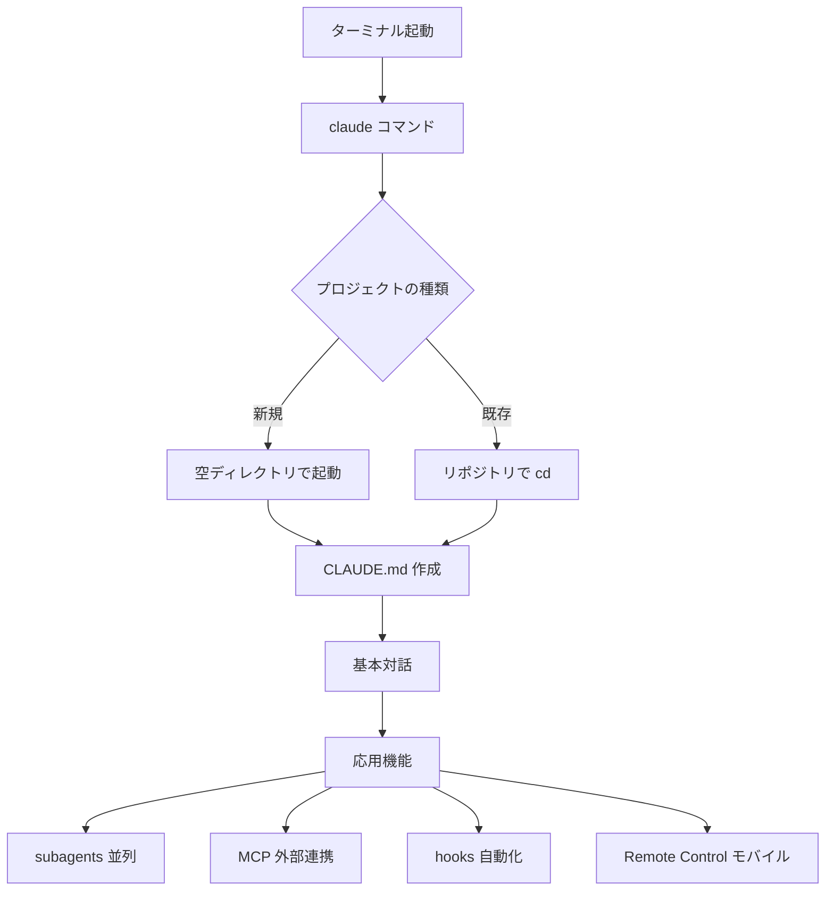

# Claude Code CLI 初心者向け完全マニュアル 2026

> 30分で「Web版でできなかった5つのこと」が手に入る実践ガイド

---

## 🌟 Part 0：はじめに — なぜCLIなのか

### Web版Claude AIではできなかった5つのこと

Web版（claude.ai）は便利ですが、**ローカル開発を本気でやるならCLI一択**です。理由は以下の5つ。

| # | Web版の限界 | CLIで解決する |
|---|-----------|-------------|
| 1 | ローカルファイルを直接編集できない | `Read/Write/Edit` ツールでファイルを直接操作 |
| 2 | 大規模リポジトリの全体を把握できない | プロジェクトディレクトリで起動、CLAUDE.md を読み込み |
| 3 | 並列処理ができない（1セッション1タスク） | **subagents** で複数タスクを同時実行 |
| 4 | 外部ツール（DB・GitHub・Slack）と連携できない | **MCP**（Model Context Protocol）で3,000+のツール接続 |
| 5 | CI/CDに組み込めない | **headless mode**（`--bare`）でスクリプト・GitHub Actions対応 |

### このマニュアルの読み方

- **Part 1-3（必須）**：とりあえず動かす（所要15分）
- **Part 4-7（応用）**：実務で生産性を上げる
- **Part 8-10（玄人）**：CLIの真価を引き出す

> 💡 **公式ドキュメント**：本書の各機能には [code.claude.com/docs](https://code.claude.com/docs/) の該当ページへの直リンクを付けています。最新仕様は必ず公式を確認してください。

### 全体像（Mermaid図）

---
