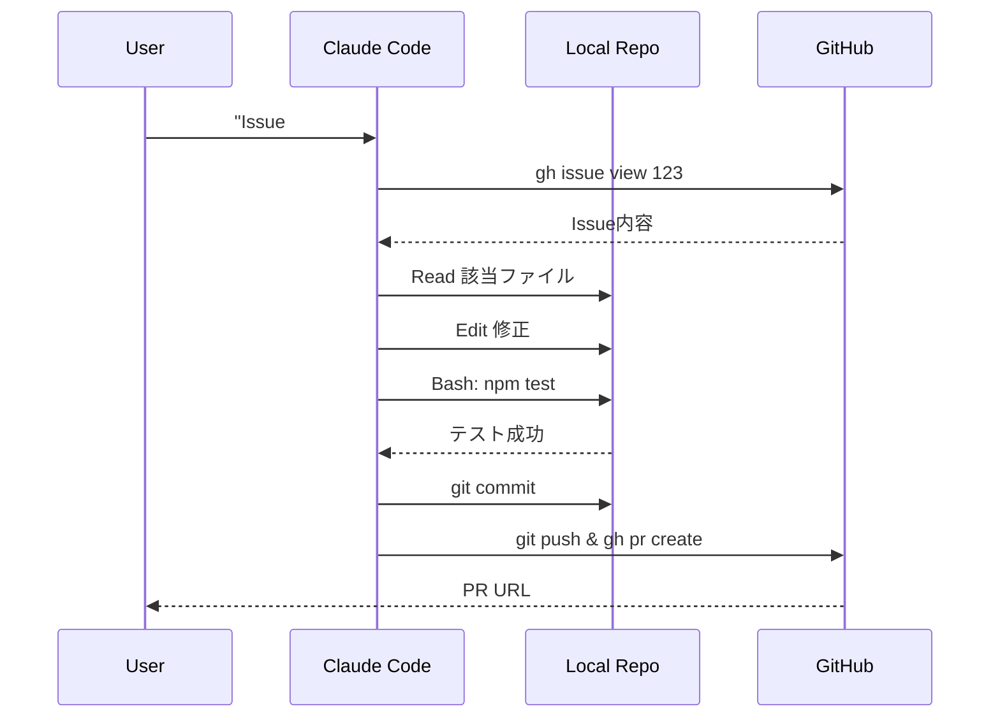

## 🐙 Part 3：GitHubリポジトリと連携してプロジェクトを進める

Web版にできない最大の差は「**実際にコードを変更してPRを出すまで完遂できる**」点です。

### Step 1：gh CLI をインストール（前提）

```bash
# macOS
brew install gh

# Linux/Windows: https://cli.github.com/
gh auth login
```

`gh` がない状態だと、`/pr` や `/fix-pipeline` などの便利コマンドが動きません。

### Step 2：リポジトリでClaude Code起動

```bash
git clone https://github.com/your-org/your-repo.git
cd your-repo
claude
```

### Step 3：自然言語で操作

```
> このIssueを見てバグ修正してPRを出して： #123
```

Claudeは以下を**自動実行**します：
1. `gh issue view 123` でIssue内容を取得
2. 該当ファイルを `Read` で読み込み
3. `Edit` で修正
4. テスト実行（`Bash` で `npm test`）
5. `git add`・`git commit`・`git push -u origin <branch>`
6. `gh pr create` でPR作成

### GitHub MCP Server の活用

より高度なGitHub操作には **MCP server** を使います。

```bash
# Claude Code 起動中
> /plugin add github
```

これでPRレビュー・Issue管理・Action確認が**すべて対話で**できるようになります。

```
> 直近1週間のPRをレビュー漏れがないかチェック
> 失敗中のCIを自動修正してリトライ
> このPRのコメントすべてに対応して
```

### ワークフロー図



### 危険操作からの保護

`hooks` を使って `git push --force` などの危険操作を**事前にブロック**できます（Part 7で詳述）。

📚 公式ドキュメント：[Common Workflows](https://code.claude.com/docs/en/common-workflows)

---
