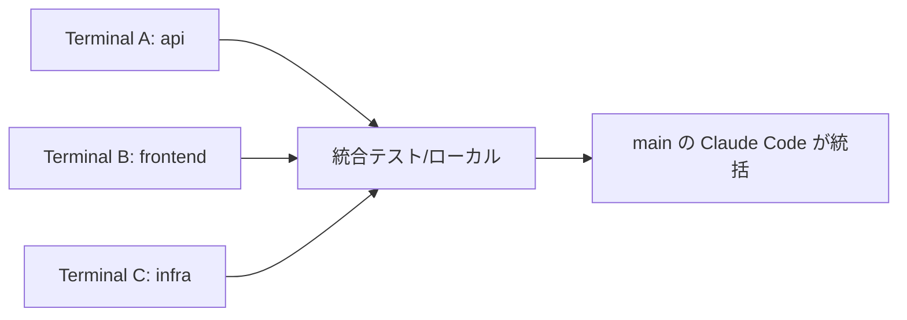

## 📚 Part 4：複数リポジトリを選択・操作する

3つのマイクロサービスを横断する開発、複数の機能ブランチを同時並行で進める作業——CLIなら可能です。

### 方法1：ターミナルを分けて起動

最もシンプル。複数のターミナルウィンドウ／タブで、それぞれ別ディレクトリでClaudeを起動します。

```bash
# Terminal A
cd ~/repos/api && claude

# Terminal B
cd ~/repos/frontend && claude

# Terminal C
cd ~/repos/infra && claude
```

各セッションは**完全に独立**。コンテキストが混ざらないのでクリーンに作業できます。

### 方法2：git worktree で並列セッション（推奨）

同じリポジトリで**複数ブランチを同時に**作業する場合、`git worktree` を使うとClaude Codeが完璧に対応します。

```bash
# Claude Code 起動時に worktree フラグを付ける
claude --worktree

# または
claude -w
```

これで：
- `.claude/worktrees/` 配下に独立した作業ディレクトリが作成される
- 専用ブランチが自動で切られる
- `git stash` 不要、ファイル衝突なし
- ディスクは効率共有（Gitオブジェクトは共有）

### 並列実行の現実的な上限

| 並列数 | 推奨度 | 注意点 |
|-------|-------|--------|
| 1-2 | ◎ | 安定動作 |
| 3-4 | 〇 | 実用的な上限 |
| 5以上 | △ | API rate limit に注意 |
| 10以上 | × | レビュー困難・コスト爆増 |

> 💡 **2-4 並列が黄金比**。あなたが一度に把握できる量に合わせる。

### 終了時の自動クリーンアップ

`--worktree` で開いたセッションを終了すると、Claudeが「ワークツリーを残すか削除するか」を聞いてくれます。
- マージ完了済み → 削除
- 続きをやる → 残す

### 複数リポジトリの統括ワークフロー



**コツ**：1つのClaudeセッションを「司令塔」として、他リポジトリの状態を確認させる運用も可能です。

```
> ../api/src/routes.ts のエンドポイント一覧を読んで、
  この frontend の API呼び出しと整合性をチェックして
```

📚 公式ドキュメント：[Common Workflows](https://code.claude.com/docs/en/common-workflows)

---
