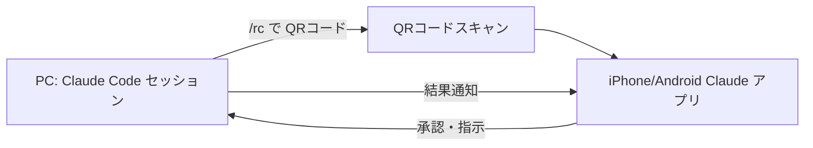

## 📱 Part 5：スマートフォンで進捗確認・遠隔操作

2026年2月以降、Claude Code は **Remote Control** 機能でモバイル対応を強化しました。

### 全体像



**できること**：
- PC上の長時間バッチ処理を外出先から監視
- 承認プロンプトに対してスマホから「Yes」だけ送る
- 出張中の急な修正をスマホ完結で対応

### 必要なもの

| 項目 | 要件 |
|-----|------|
| サブスクリプション | **Claude Max**（$100/月以上）必須 |
| Claude Code バージョン | 2.1.52 以降 |
| モバイルアプリ | iOS / Android Claude アプリ（無料） |
| ネットワーク | モバイル・PC両方 |

### セットアップ手順

#### 1. PC側でCLI起動・Remote Control有効化

```bash
cd ~/your-project
claude
> /rc
```

`/rc` を実行すると、ターミナルにQRコードが表示されます。

#### 2. スマホでスキャン

1. App Store / Google Play から **Claude** アプリをインストール
2. PC と同じアカウントでログイン
3. アプリのカメラ機能でQRコードをスキャン

#### 3. 接続完了

スマホから直接プロンプトを送れるようになります。**同じファイル・同じMCP・同じプロジェクトコンテキスト**を共有しています。

### Channels（チャンネル連携）

2026年3月20日に登場した機能。Claude Code を **Telegram / Discord / iMessage** に接続できます。

```
> /channel telegram
# Bot Token と Chat ID を入力
```

外出中、Telegramのチャットでメッセージを送ると、PC上のClaudeが反応します。

```
[Telegram]
You: "build失敗してたらlogをまとめて"
Claude: "ログを確認しました。3箇所のエラーがあります..."
```

> 💡 **使い分け**：Remote Control は「PCのターミナル代わり」、Channels は「自然言語の通知センター」。両方併用が強力。

### 制約・注意点

- **同時接続は1セッションのみ**：複数デバイスから同じClaude Codeへの接続は不可
- **PC側のターミナル維持必須**：closeすると切断
- **10分ネットワーク切断でタイムアウト**：自動再接続するが、長時間オフラインは要注意
- **セキュリティ**：受信ポート開放なし、Anthropic API経由のTLS通信。盗聴・侵入リスクは最小

📚 公式ドキュメント：[Remote Control](https://code.claude.com/docs/en/remote-control)

### 実用ユースケース

| シーン | 使い方 |
|-------|-------|
| 通勤電車内 | レビュー依頼を見て承認だけ送る |
| 出張先 | 緊急対応をスマホ完結で実行 |
| 深夜の長時間処理 | 寝る前に起動、朝スマホで結果確認 |
| 会議中に相談 | デモ・コード参照をスマホで確認 |

---
