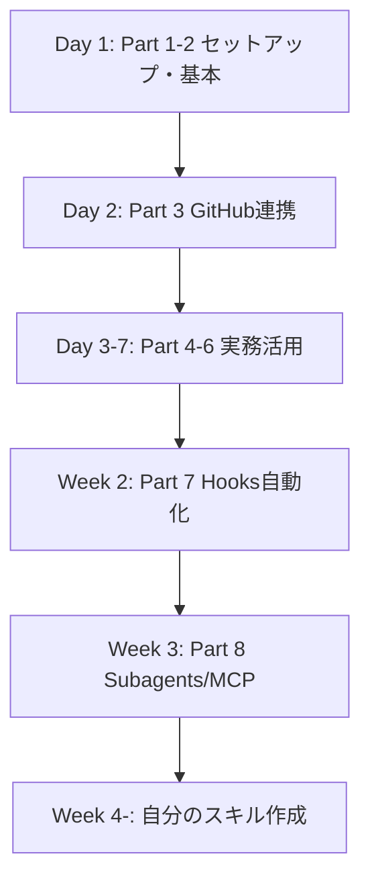

## 📚 Part 10：公式リソースと次のステップ

### 公式ドキュメント直リンク集

| トピック | URL |
|---------|-----|
| トップ | https://code.claude.com/docs/ |
| セットアップ | https://code.claude.com/docs/en/setup |
| 基本ワークフロー | https://code.claude.com/docs/en/common-workflows |
| ベストプラクティス | https://code.claude.com/docs/en/best-practices |
| Hooks リファレンス | https://code.claude.com/docs/en/hooks |
| Remote Control | https://code.claude.com/docs/en/remote-control |
| 更新履歴（What's new） | https://code.claude.com/docs/en/whats-new |
| Changelog | https://code.claude.com/docs/en/changelog |
| VS Code拡張 | https://code.claude.com/docs/en/vs-code |

### コミュニティ・キュレーションリポジトリ

- [hesreallyhim/awesome-claude-code](https://github.com/hesreallyhim/awesome-claude-code) — Skills/Hooks/Plugins/Commandsの総合カタログ
- [ccplugins/awesome-claude-code-plugins](https://github.com/ccplugins/awesome-claude-code-plugins) — プラグイン集
- [qdhenry/Claude-Command-Suite](https://github.com/qdhenry/Claude-Command-Suite) — 216+のスラッシュコマンド集
- [sirmalloc/ccstatusline](https://github.com/sirmalloc/ccstatusline) — 美しい StatusLine
- [disler/claude-code-hooks-mastery](https://github.com/disler/claude-code-hooks-mastery) — Hooks学習用

### 学習ロードマップ

### 次に学ぶべきこと

1. **CLAUDE.md と Skill の使い分け** — プロジェクト規約の一元管理
2. **Hooks による品質ガード** — フォーマット・lint・テスト自動化
3. **MCP サーバー自作** — 自社ツール・社内DBへの接続
4. **GitHub Actions 連携** — `--bare` で自動化を CIに組み込む
5. **チーム展開** — `/team-onboarding` で新人オンボーディング

---

## 🎉 最後に

Claude Code CLI は**毎月のように機能追加**されています。本マニュアルの内容も2026年4月時点のもの。最新は必ず公式ドキュメントを確認してください。

**3行サマリ**：
1. ローカル開発の本気はCLI、Web版は補助
2. Hooksで自動化、MCPで外部接続、subagentsで並列、Remote Controlでモバイル
3. CLAUDE.md は短く、Skillに分離する

Web版で「コピペ往復」していた時代から、**CLIで「コードを動かしたまま対話する」時代**へ。あなたの開発がもう一段階加速しますように。

---

**マニュアル生成モデル：** claude-sonnet-4-6
**生成日：** 2026-04-23
**対象バージョン：** Claude Code 2.1.52 以降
